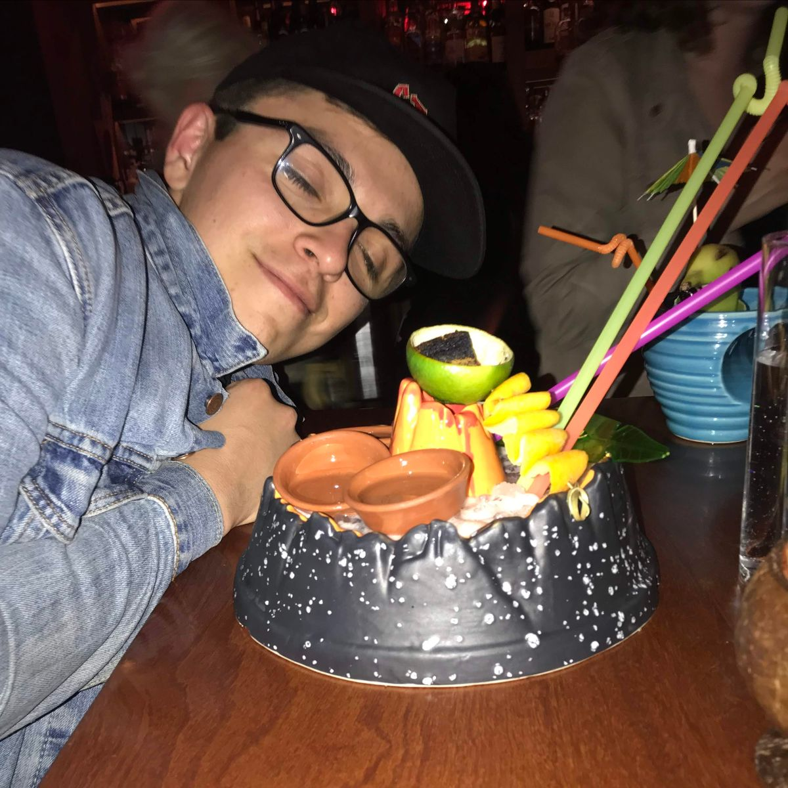
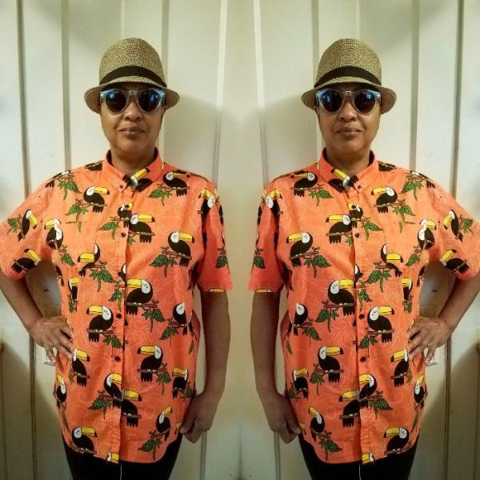
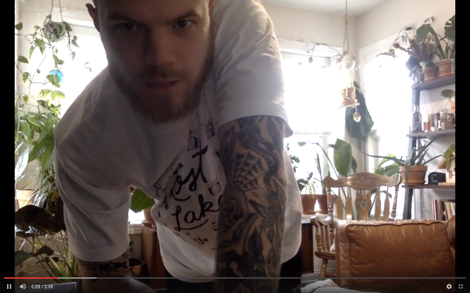
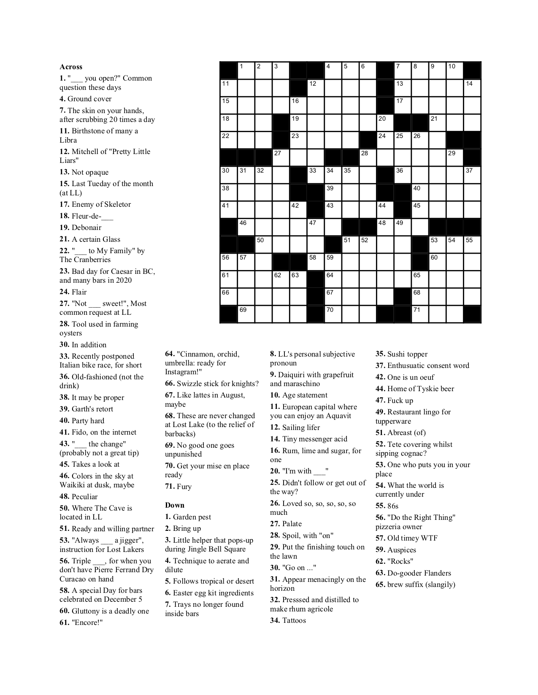
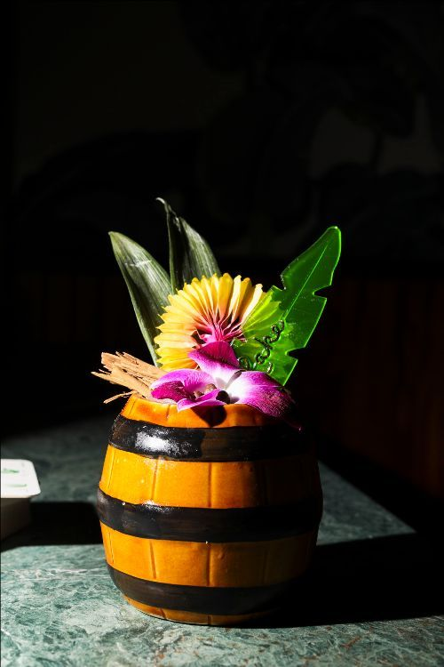

# Welcome to the Lost Lake Community Thread!

*2020-03-20*

Hello, people!

Your financial support means the world to our staff. We hope that this newsletter will serve as a small token of gratitude for your donation — *and* as a cute way to help us stay connected, stay home (when possible), and stay pleasantly occupied until we can meet over daily daiquiris once again.

First things first, we’ve got two recipes in here that require a couple syrups — so, let’s make some syrup!

**Coconut Cream**
1 13.5 ounce can unsweetened coconut milk
2 cups demerara sugar (like Sugar in the Raw!)
Combine the coconut milk and sugar in a small saucepan set over medium-low heat. Whisk until the sugar dissolves and the mixture is smooth, about 5 minutes, then remove from the heat and let cool to room temperature. This recipe makes approximately 22 ounces. You can store in an airtight container in the fridge for about a week. This syrup will separate and that’s okay! Just give it a good shake before using.

**Cinnamon Syrup**
Whip up some simple syrup (equal parts white sugar and water, stirred over heat until all the crystals dissolve) and toss in a bunch of cinnamon sticks. Let it steep for at least 24 hours, strain out cinnamon.

**Coffee Demerara Syrup**
Take some of that demerara sugar left over from making coconut cream, and mix equal parts with brewed coffee over heat until all the crystals dissolve.

## ALAN, THE DUSTY FLAMINGO

Dusty Flamingo + the Hillbilly Lobo is the ‘first’ cocktail I had at Lost Lake. I say ‘first’ because I had visited Lost Lake my first night in Chicago and apparently drank several Feejee Mermaids and don’t remember much. I even pulled a classic rookie move and walked straight past the line outside, barging my way in — only to be sent back outside to line up against the wall like a 5th grader waiting to go back to the classroom after recess. Anyway, we’ve all done it, don’t feel bad.

Today I’m finding myself in a similar situation as I did when I had my first Dusty Flamingo and the Hillbilly Lobo, but this time it’s out of my control — shout out to you, COVID-19. Let me take you back to my first shift at Lost Lake...

Here I am on a Thursday evening walking into my soon-to-be-place of work with my brand new flamingo-print shirt purchased off Amazon. Before finding the manager, I was approached by Hannah and she told me how much she liked my shirt — little did I know that she would do this every time I wore said shirt. (Hannah now owns this flamingo-print shirt; she appreciates it more than I ever could.) After being introduced to everyone, I quickly started training with Liz. This shift is supposed to be comparable to the first week of classes in school, kinda like “syllabus week,” where you are given a bunch of information to remember, but nothing is actually expected of you. Unfortunately, this was not the case for me.

After a couple of hours, Lost Lake was packed with people and Liz was sent down to prep extra garnishes in the basement because we were running out. Liz left me with the instructions to “hold it down.” I knew what she meant, but also this was my first night and I had forgotten everybody’s names as soon they were spoken to me. I really wanted to get this job, so I knew I needed to impress my coworkers. Everybody had kicked it into high gear and was crushing it, so I followed their lead.

Come 10pm, Liz finally re-emerged from the basement and I was invited to have a drink at the bar AKA a “shifty.” I take a seat at the bar, and as I browse through the menu and I’m so distracted by how long the drink names are that I don’t know what to order! Vince rounds the corner and recommends that I order the Dusty Flamingo and the Hillbilly Lobo.

The drink was perfect in both its flavor profile and as a shifty, because I was feeling like a dusty flamingo sitting at the bar at 1am in my flamingo-print shirt from Amazon. The drink is bold and rich to start, but the finish is light and dry — inviting you to take another sip or order another. (As would be my routine for the next month or so.)

Thanks for reminiscing with me and enjoy this photo of my trying my actual first cocktail at Lost Lake.

**Dusty Flamingo and the Hillbilly Lobo**
2 oz tequila
0.25 oz mezcal
0.5 oz fino sherry
1 oz coconut cream
0.75 oz lime
0.25 oz honey

*Combine all ingredients in a cocktail shaker with one cup crushed ice. (You can just bust up a bunch of freezer ice with a rolling pin!) Give it a good shake for about 5 seconds, then pour the entire contents into your cutest glass (we call that a 'dirty dump' lol). Top with more crushed ice, and garnish with tropical things! We like nutmeg and toasted coconut on this one.*

## #OOTD

Tracey has the best tropical ensembles around, and that's an undisputed fact. Has she ever even repeated an outfit?! Since this is a "work from home" lewk, she's dressed up from the waist up (leggings and house shoes not pictured).

"This shirt is a guest and staff favorite. The bright colors, the look of absolute content on Mr. Toucan's face — one can't help but smile. You see this shirt and thoughts of being carefree in warm weather and in front of lush sunsets comes to mind. Go and put on your happy shirt!"

Good advice, Tracey!

## CAN WE TALK FOR A MINUTE?

Now that we're all hangin' out at home for a little while, we have tons of time to talk to our leafy friends! Andy recommends [this jam](https://www.youtube.com/watch?v=aL4Ah6qbdj8) for happy house plants.

## ERIC'S EXISTENTIAL CONGEE HAIKU

**'**Behind!' is the call
Moving fast through your own space
It’s just a reflex

Life comes at you fast, news seems to come even faster. Take the time to slow down and simmer. Put a pot on and whip up a hearty batch of congee, a warm and gratifying rice porridge. Originating in China, congee is now widely enjoyed in 15 countries throughout Asia, each with their own variations. The dish is a blank canvas, subtle flavors just begging to be dressed up with the seasonings you desire. Satisfying all home flavor artists, anyone from the Rothkos to the Pollocks can find a mix they enjoy.

**Eric's End of the World Garlic Ginger Congee**
1 Tbsp vegetable oil
1 cup rice
6-8 cups water or half/half split with any stock you may have on hand
5-6 cloves garlic (or more to taste)
2 inch chunk ginger peeled (more or less to taste)
Pinch of salt

*Mince garlic and ginger. You can use a microplane for this (thank you Chef Fred Noinaj for the pro-tip). Heat oil in a pot over medium high heat. A ceramic coated Dutch oven works great, but your favorite soup pot will do the trick. Add garlic and ginger to the oil and cook until fragrant. Add rice and stir in until the rice is coated and mixed. Add water/stock, bring to boil and reduce to simmer, stirring occasionally to avoid scorching. It will get sticky. Let cook for 45-60 minutes, or longer until it reaches the desired thiccness.

Serving suggestions: Sambal or sriracha or your favorite hot sauce. Soy sauce. Chopped scallions for a bright crunch. Stewed or crispy fried meats or tofu. Sauteed or roasted vegetables (spinach and broccoli work nicely). Pickled vegetables (onions or jalapeños if you’re feeling spicy). Eggs. Soft-boiled are my favorite, but fried or hard boiled eggs will get the job done.*

## WORD UP (AND DOWN) (AND ACROSS)

This crossword was created by crossword enthusiast and Lost Lake Boyfriend's Club member Mike Morell! [Download the puzzle PDF to print at home here](https://drive.google.com/file/d/1LQl5jqyr3H7GoTN6NlF3SvBIgKIWXwxf/view?usp=sharing). Answer key will be in next week's newsletter!

## SOMETHING FROM NOTHING

Making something from nothing is taking on a whole new meaning these days. Here's a bourbon-based fave from last year's cocktail menu!

**SOMETHING FROM NOTHING**
1 oz bourbon
1 oz aged Barbados rum
0.5 oz coconut cream
0.5 oz coffee demerara syrup
1 oz cold brew (or, um, these days cold coffee will surely do)
0.5 oz cinnamon syrup
0.5 oz lemon juice

*Combine all ingredients in a cocktail shaker with one cup crushed ice. (You can just bust up a bunch of freezer ice with a rolling pin!) Give it a good shake for about 5 seconds, then pour the entire contents into your cutest glass (we call that a 'dirty dump' lol). Top with more crushed ice, and garnish with tropical things! We like cinnamon and a swizzle stick on this one.

To make cinnamon syrup: whip up some simple syrup (equal parts sugar and water, stirred over heat until all the crystals dissolve) and toss in some cinnamon sticks. Let it steep for 24 hours, strain out cinnamon.

To make coffee demerara syrup: take some of that demerara sugar left over from making coconut cream, and mix equal parts with coffee over heat until all the crystals dissolve.*

## REQUEST LINE IS OPEN!

Reply to this email or send us a DM on Instagram with your newsletter content requests!
