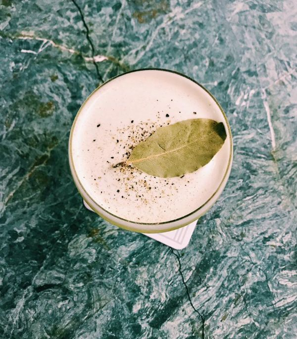
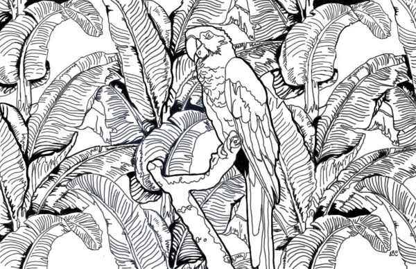
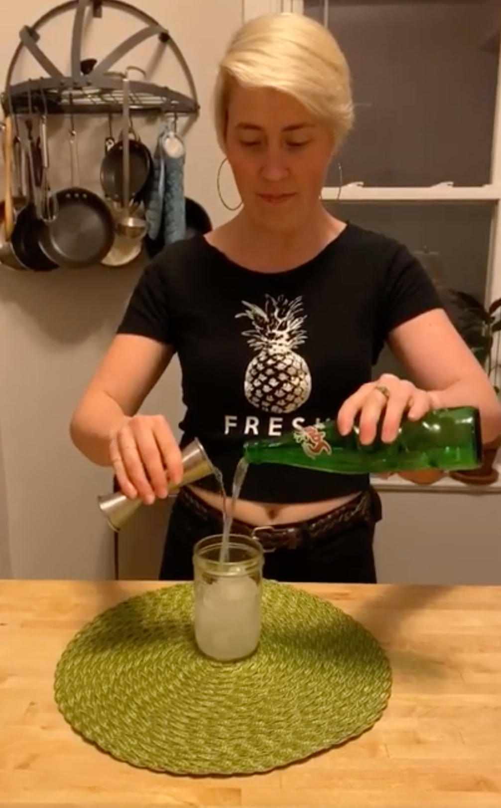
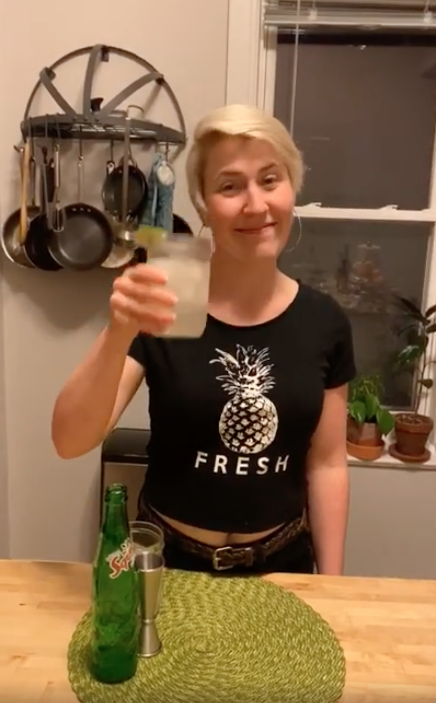
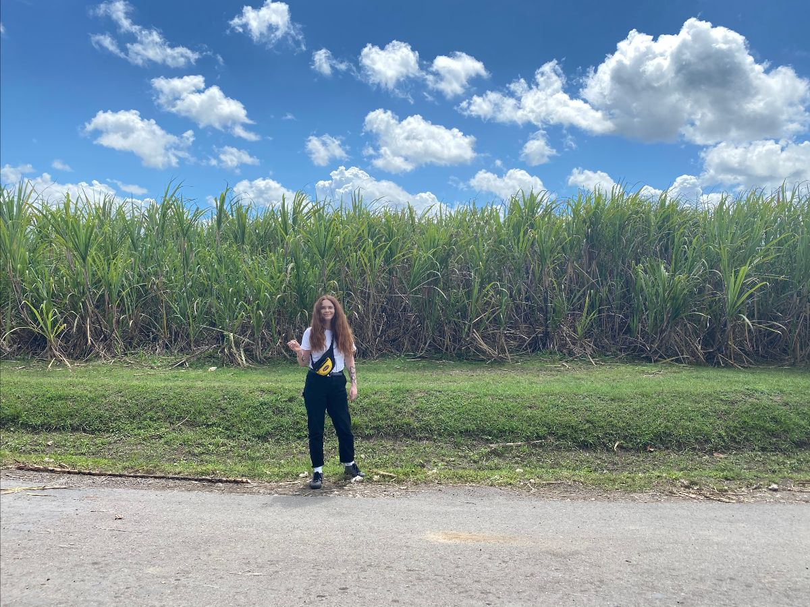
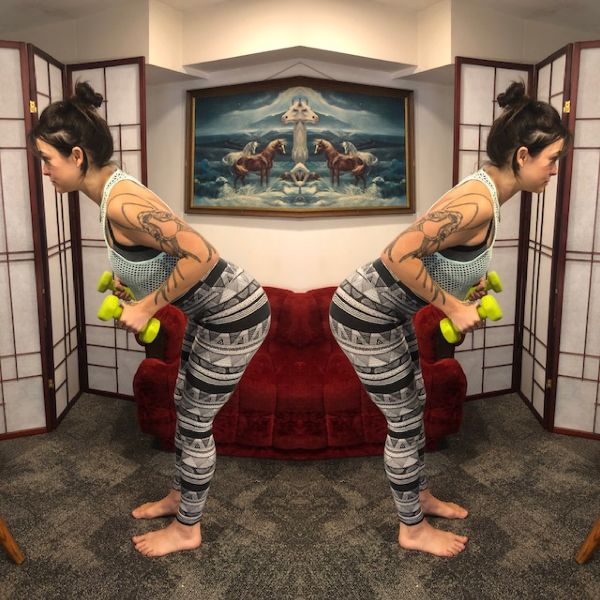
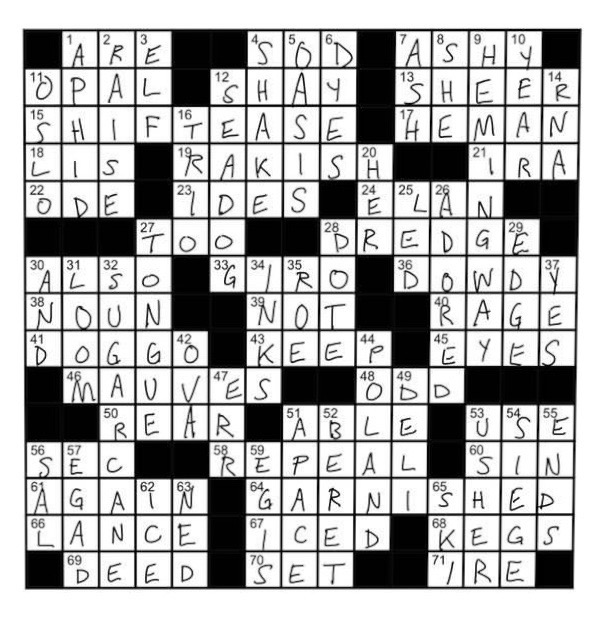

# Lost Lake Community Thread: Volume 2

*2020-03-24*

Hello, and welcome to the second newsletter!

Today we're going to get a highball lesson from Hannah, visit Trelawny Parish with Desira, chill out with some coloring courtesy of Laura, make Demi's avocado daiquiri, and Louise is going to make sure you #earnyourbooze!

Thank you so much for all your support, and please keep tagging @lostlaketiki as you finish your crosswords and make cocktails in your kitchens! And as always, the request line IS OPEN. Reply to this email or DM us on Instagram with your content requests!

## AVOCADO DAIQUIRI

The Avocado Daiquiri is by far one of Lost Lake's most requested recipes. It's the work of former/forever Lost Laker Demi Natoli, created for her Stranger in Paradise pop-up *Violeta's* — an homage to her south-Floridian upbringing that featured an entire menu of savory Cuban cocktails:

*"With every meal we serve an avocado salad — not much in the way of greens, just avocado covered in olive oil, salt and pepper. As I worked on the Avocado Daiquiri, I mirrored the flavors in that dish alongside a syrup made from bay leaves, another staple in the Cuban kitchen.”*

We asked for her permission to print it here, and she kindly obliged! If you want to give Demi a no-contact high five, you can find her on Venmo: [@Demi-Natoli](https://venmo.com/demi-natoli).

What's probably going to blow your mind about this cocktail is that the recipe doesn't call for avocado! The fatty 'cado flavors come from a barspoon of avocado oil. It's a technique we learned from the bartenders at Parisian cocktail bar Glass. They use coconut oil in their Glassquiri, the shaken colada banger you may remember from 2017— we featured it on the same menu as the Avocado Daiquiri.

**Avocado Daiquiri**
1 oz Plantation 3 Stars
1 oz La Favorite Rhum Agricole (any un-aged Martinique Rhum)
.5 oz fino sherry
1 oz pineapple juice (Trader Joe's has the best non-fresh option!)
.75 oz lime
.75 bay leaf simple syrup
.33 dropper Saline Solution
barspoon of avocado oil
*Combine all ingredients in a cocktail shaker. Before you add ice, give it a little whisk or agitate it with a fork. Then add ice and shake that shit really, really, really hard — 'til it's too cold to hold! You need to put some work in to get that nice frothy head. Strain into a coupe glass, garnish with a bay leaf and cracked pepper.*

**Bay Leaf Simple Syrup**
*Mix equal parts white sugar and water over heat until all crystals dissolve. Add a bunch of bay leaves and let steep over low heat for one hour. Pluck out the leaves and let cool.*

**Saline Solution**
*A two-to-one mixture of salt and water. Stir until crystals dissolve, let cool.*

## LAURA'S COLORING PAGE

Lost Laker Laura created this lushy, leafy coloring page for you! [Here's a link to print it out](https://drive.google.com/open?id=1FkFYkQGntPtMdtM5taFaGS4IIUNc8qNL).

*"I’m offering A Parrot In Your Room Supporting You Every Time You Cry for the newsletter to share my coping strategy during this time of weirdness and uncertainty. I have found comfort in art during this anxious and seemingly endless time. It has given me an outlet to create beauty, a new routine, and ultimately a sense of control in a process that does have end."*

## HOW TO HIGHBALL WITH HANNAH

One of the questions I always get asked behind the bar is: “What’s your favorite thing to make at home?” To which I pretty much always respond, with characteristic sass, “a beer” or “a glass of wine.”

But what if you want some different flavors? What if you want a slightly bigger buzz than you might get from that 5% brewskie? What if you actually want to drink some of that strange bottle of booze you bought at the liquor store for that one cocktail you were gonna make for your friends for that party a year and a half ago?

Enter the highball! It’s just as easy as cracking open a bottle or a can, with a touch more creativity.

For those that don’t know, a highball is quite simply booze plus some sort of mixer. These truly run the gamut in terms of flavor. A highball can be as simple as a vodka soda - what I often refer to as a “voddy-soddy” and what Julia Gordon has been known to call “a one-way-ticket to flavor town.” They can alternatively be exceptionally high-class, nuanced cocktails like the Japanese highball: a carefully thought-out combination of Japanese whisky and carbonated water meant to showcase the delicate flavors of the whisky itself.

How do you know what goes together? It really comes down to personal preference. Some folks swear by their whiskey gingers, some never stray from their G&Ts. That said, there are a few key things I think about when messing around with spirits and mixers. Here are a few to consider:

CITRUS IS YOUR FRIEND
Don’t be afraid to squeeze a little citrus into the mix. Whether you prefer a lemon or a lime (or an orange or a grapefruit or a kumquat), a little bit of acid can serve to either highlight notes already present in the spirit or merely balance out some of the sweetness of the mixer. You can also peel your favorite citrus fruit and express the essential oils over the top if you want the sensation of brightness without the pucker!

BIG, BOLD FLAVORS GO WITH BIG, BOLD FLAVORS
Love a spicy rye? Maybe pair it with a spicy ginger beer. Love a funky, overproof Jamaican rum? Match that heat with a cool little cola (and maybe some angostura bitters while you’re at it). If you prefer something a bit more delicate, choose a mixer with lighter flavors so you can still enjoy the base spirit.

THINK SUMMERTIME
I’ve always thought of highballs as summertime go-to’s. They’re things you sip on at the pool, on your porch, at the beach - or in the middle of March in your living room in Chicago when the governor tells you to stay home. So make ‘em something that makes you well and truly happy! And speaking of happy...

JUST HAVE FUN
Seriously, people, it’s just booze. Have a little fun with it!

Some highballin' ideas from Hannah:

**A Walk to the Lake**
2oz tequila or mezcal
Mexican Squirt
half of a lime, quartered
two pinches salt
*Combine booze and squirt in a glass with ice. Add lime and salt to taste. (If you’re feeling fancy, you can put the salt on the rim of the glass instead.)*

**Picnic Ti Punch**
2oz Clement Premiere Canne
sparkling limeade
lime wedge
*Pour rhum over ice. Top with sparkling limeade. Garnish with lime wedge.*

**Not Quite JB**
2oz Rum Bar White Overproof
Mexican coke
2 dashes Angostura Bitters
*Pour rum over ice, top with coke, add bitters, stir to combine.*

**Ode to Mama**
2oz Cynar
Topo Chico
lemon wedge
*Pour over ice, garnish with lemon wedge.*

## DESIRA GOES TO TRELAWNY PARISH

Rum is one of the most diverse spirits in the world. A rum made by the hands of those in Guyana tastes nothing like that of a rum made in Martinique. Neither of which taste anything like a rum from Jamaica. Or Barbados. Or Panama. The list could go on and on. This is one of the things that can make rum both confusing and intriguing. So let’s just take a step back and focus on one geographic location: Jamaica.

Jamaican rum is known for its general overripe flavors and funk. There’s lore of muck pits with decomposing carcasses and any other flora and fauna that got trapped in its hazardous ooze. Open fermentation vats that pose a similar threat to any inkling of life that falls or flies into the tank. The inclusion of a nebulous substance called dunder, which has allegedly been captured after each distillation and recycled over and over for a century or longer. Throw all of this into a pot still and it yields a substance with esters and congeners that translate into flavors of overripe pineapple and banana.

However, as I learned on my recent visit to Jamaica with the Lost Lake team, this isn’t entirely the case. While most Jamaican rums taste incredibly funky to most Western palates, only one region is associated with and responsible for this assertive Jamaican funk: the Trelawny Parish. Muck pits and dunder are specific to this region. While Worthy Park (located in the St. Catherine Parish) had a couple of open fermentation vats that have never been entirely emptied and thus responsible for some flavor, it doesn’t include muck and dunder in its process of distillation. In fact, those in the Trelawny Parish call all other spirits made on the island “silent spirits” because to them, they’re nearly tasteless.

So how did this style of rum develop? Well, I learned, while sitting around a table at the Chill Out Hut awaiting my Miami Vice cocktail, I noticed that the other half of the table all got rum and cokes. The other half being Adrienne, Vivian Wisdom, Yanique, Paul, Guilliam, and Omar; aka the group of people that either work directly or closely with Hampden. They were all passing around a bottle I’ve never seen before called JB Rum. Vivian asked Adrienne if she knew what it meant and she laughed and timidly declined to say. He then went around that half of the table, including our server, and everyone had a similar reaction. After a little bit of begging, Vivian said that it stands for John Crow-Batty. Named after the John Crow vultures native to the island that have stomachs of steel and prefer to eat rotting flesh. Batty kind of referencing Booty. The way I heard them pronounce it sounded closer to Jun-co Bah-tee.

John-Crow Batty was the heads of the rum distillate that illegally found its way to surrounding communities for 200 years. Given Hampden’s process of distillation, the heads is the high octane portion of rum with the most congeners, esters, and pungent aroma. Locals revered this rum for its strength and medicinal qualities. They also used this rum to christen their children and other ceremonial purposes, and to ward off evil spirits. Needless to say, we were each sprayed down with some high ester overproof rum upon our arrival at Hampden. Anyway, the high octane heads were not intended for consumption. After a century or two of smuggling, this potent substance finally made its way to the market after an obvious demand and became a cult icon for Jamaican Rum. Unfortunately, JB is not available in the United States. The next closest thing we have available is Rum Fire, and I highly recommend it as a daiquiri or with Coke and a couple of dashes of Angostura bitters.

Further Reading:

- [**The Days of Dunder: Setting the Record Straight With Jamaica’s Mystery Ingredient**](https://cocktailwonk.com/2016/03/days-of-dunder-setting-the-record-straight-on-jamaican-rums-mystery-ingredient.html)
- [**Beyond Jamaican Funk: Next Level Hogo**](https://cocktailwonk.com/2018/04/beyond-jamaican-funk.html)
- [**Ground Zero of Jamaican Funk: Going Deep at Hampden Estate**](https://cocktailwonk.com/2016/04/ground-zero-of-jamaican-funk-going-deep-at-hampden-estate.html)

## EARN YOUR BOOZE WITH LOUISE

I have been using a daily work out as a way to start my day. I enjoy being in a routine during this time, because it keeps me motivated and doesn’t allow the days to blend together.

Today’s workout is all about isometric holds and a full body ladder! Things you will need:

- A mat or towel
- Weights (or a can of beans!)
Let's get warmed up!

- 12 Walk outs into plank
- 30 seconds jumping jacks
- 30 seconds high knees
Now let's do The Ladder! The idea of a ladder is that you add and then decrease amount of moves without stopping. You're going to do each sequence once, then twice, then three times — all the way up to six times! Then do it five times, then four times, etc etc. Basically, you should feel dead at the end.

The sequence:

- sumo squat (feet more than hips' width apart and feet pointed out)
- regular squat
- feet together squat
- burpee
- push up
You’re done! Shake it off and have some water — and get ready to move onto the next round.

Time for some Isometric Holds! Grab your weights (not too heavy) or cans of beans, and repeat each set twice:

Set one:

- Hold for 30 seconds. Palms up and gripping your weight, arms at a 90 degree angle with elbows at the hips and extended forward like you are ready to do a curl.
- Continue to hold position and [drop one arm down and do curls for 30 seconds](https://drive.google.com/file/d/1hABtt75LD5BrSDor6wuSBGkL2qhF2g36/view?usp=sharing) while still holding the other arm up then switch side of curls. 30 seconds each side.
- 30 seconds controlled slow movement. Rotate your arms still in a 90 degree from the front of your body to the side and back again. [Looks like this](https://drive.google.com/file/d/1nbV_jeTDIXxxOpNjMYpaq5sRVe7BSH71/view?usp=sharing)!
Set two:

- 30 seconds: Assume a bent-over row stance. Hinge at the hips and lean forward and hold.
- 30 seconds each side: Continue holding bent-over row, extend one arm and do full rows while holding the opposite arm static, then switch sides.
- 30 seconds: [Small bent over row pulses](https://drive.google.com/file/d/1cL18oZCrZZc3Jw5nUGON_lnESaJpthsm/view?usp=sharing).
You’re done! Stretch and drink lots of water — then a cocktail.

## CROSSWORD ANSWERS!

Shout out to our Instagram friend Jamie for getting all the right answers AND for having terrific handwriting!

## COMING UP...

In Thursday's newsletter, we're going to play lots of your recipe requests, have an in-depth discussion about ketchup with Fred, make manhattans with Alicia, and get a dealer's choice cocktail from Paul. See you soon!
