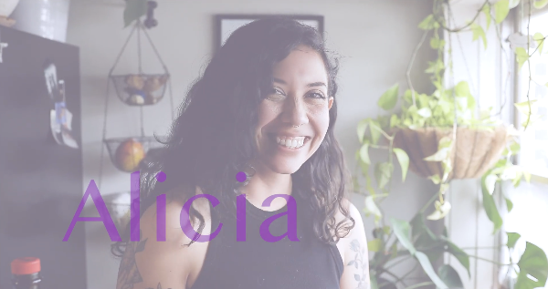
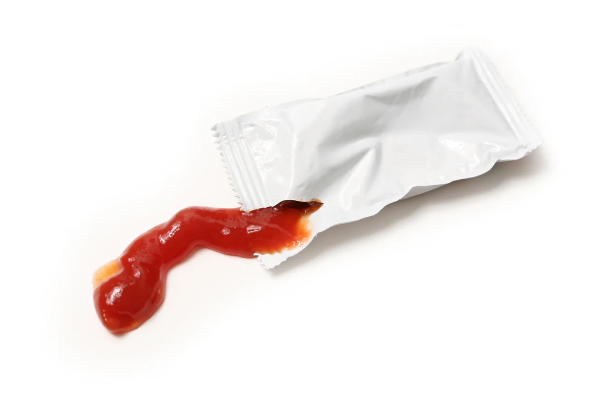
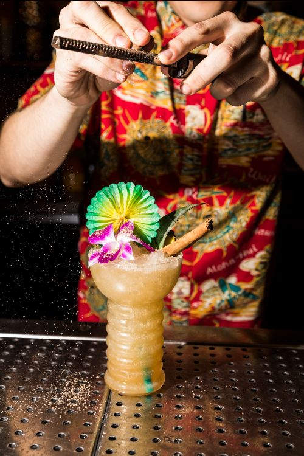
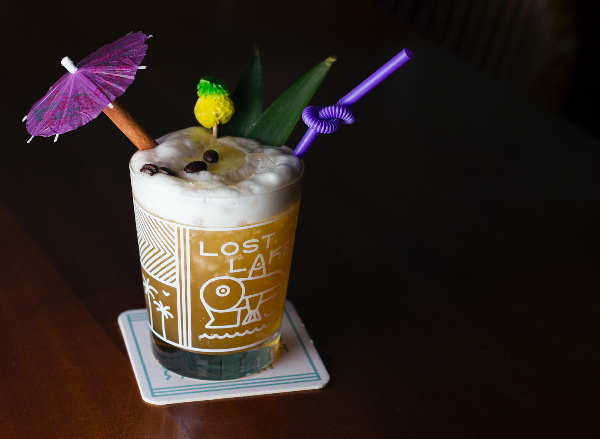
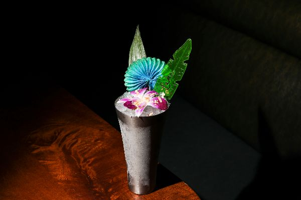
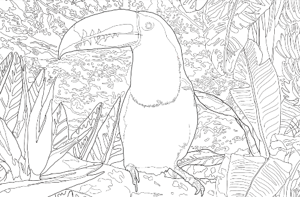

# Lost Lake Community Thread: Volume 3

*2020-03-26*

Hello, and welcome to the third edition of the Lost Lake Community Thread newsletter!

Today we're going to make a manhattan with Alicia, take an in-depth look at ketchup with Fred, get a dealer's choice from Paul, do some coloring with Laura, and answer a couple calls from the request line. Keep tagging [@lostlaketiki](https://www.instagram.com/lostlaketiki/) with your cocktails and coloring pages and crosswords — we miss you all for real!

## MAKING MANHATTANS WITH ALICIA

*click on this cute still to watch the video!*

Lost Lake bar manager Alicia just happens to be quarantined with a videographer — the supremely talented [Moll Nye](https://www.instagram.com/moll_jean/), to be exact. How convenient for all of us missing her sweet face! Together, Alicia and Moll show us why the simple recipes are often the best recipes.

## CHEF FRED OPENS UP THE KETCHUP

Have you ever looked at a bottle of ketchup and noticed that it almost always says "Tomato Ketchup"? It seems pretty redundant, but when you dive into this beloved American pantry staple, one realizes that this sauce is one of the oldest evolving condiments in history and has deep ties to globalization. Its history can be traced back to before 300BC where it is written about in a poem from the warring Chu states in China.

The timelines get a little confusing here because China had already turned inwards and banned sea trade at this point in the 1700s, but Hokkien traders were still doing so illegally on a massive scale. East Asia and Southeast Asia were divided into two condiment regions. The use of fish sauce died out in East Asia (minus small southern coastal regions) and fermented soybean products took its place, leaving fish sauce to reign supreme in Southeast Asia. This shift led to fish sauce that was still being produced in China to be traded to European traders. The Hokkien or Southern Min word for "fish sauce" at this time was "ge jiap" or "ke-tchup". In the 1730s, English recipes for ketchup began to pop up as ways to try and recreate this sauce. Most of them contained fermented walnuts or mushrooms. Many recipes and variations have been documented prior to wide-spread use of the "New World" ingredient, tomatoes.

Long story short, it was not until the early 1800s that tomatoes found their way into ketchup and it wasn't until after the Civil War that sugar was added. So as you can see, the formation of the (British) American colonies for precious metals allowed Europe to buy back into the Asian economy for industrialized goods, and yes, that includes ketchup. It is incredible to think that these little packets of sauce we squeeze out to dip our fries in could be so deeply ingrained into the world.

## DEALER'S CHOICE WITH PAUL

One of our newsletter subscribers (Hi, Austin!) wasn’t quite sure which cocktail he was in the mood for, so we asked him what his usual flavor preferences are. 'I enjoy coconut, cinnamon, passionfruit, and usually order a Jet Pilot, Mai Tai, Zombie, or Bunny’s Banana Daiquiri.' A real classics guy! We tapped Paul for a dealer’s choice suggestion:

"When thinking of combining the flavors of passionfruit and cinnamon, Trader Vic’s Voodoo Grog came to mind. Vic’s Voodoo Grog uses rum, grapefruit, passionfruit, and allspice together with a bit of egg white to give the drink a creamy texture. I decided to use cinnamon syrup in place of the allspice dram and incorporate coconut cream to give the drink some body. For the rum, a dry, lightly aged Jamaican or Martinique rum will do the trick. This is one of the rare examples of tropical fruit flavors and notes of island spice working harmoniously in the same drink — and this recipe also works well with gin! I hope you enjoy!"

**Do What You Gotta Do**
2 oz Jamaican Rum (Plantation Xamayca) or aged Martinique Rhum (Neisson ESB)
1 oz lemon juice
.5 oz Coconut Cream (from [the first newsletter](https://mailchi.mp/f256989da701/bzhtr43sqw)!)
.5 oz passionfruit syrup (we recommend Small Hand Foods or BG Reynolds, both available at Binny's)
.25 oz cinnamon syrup (from [the first newsletter](https://mailchi.mp/f256989da701/bzhtr43sqw)!)
*Combine all ingredients in a cocktail shaker with one cup crushed ice. (You can just bust up a bunch of freezer ice with a rolling pin!) Give it a good shake for about 5 seconds, then pour the entire contents into your cutest glass (we call that a 'dirty dump' lol). Top with more crushed ice, and garnish with tropical things! We like cinnamon and a swizzle stick on this one.*

## ON THE REQUEST LINE

We got a couple different requests that can all be answered with one cocktail: A Lonely Island Lost in The Middle of a Foggy Sea!

This riff on the classic Mr. Bali Ha’i cocktail is from our second menu, and the name comes from a song of a similar name in Rodgers & Hammerstein’s musical *South Pacific*. Bonus: this recipe easily pivots to make a great spirit-free version, too!

One of the best parts about this drink is the ‘lonely island’ garnish: An island (a wedge of pineapple) with a palm tree (a green cocktail umbrella stuck through a cinnamon stick-trunk) and fallen coconuts below (little coffee beans).

**A Lonely Island Lost in the Middle of A Foggy Sea**
1 oz Clement Premiere Canne Martinique Rhum
.75 oz El Dorado 8 Year Rum
.25 oz Cruzan Blackstrap Rum
1 oz pineapple juice (Trader Joe’s makes the best non-fresh!)
.75 oz demerara syrup (from the first newsletter!)
.75 oz lime juice
.5 oz cold brew coffee
*Combine all ingredients in a cocktail shaker with one cup crushed ice. (You can just bust up a bunch of freezer ice with a rolling pin!) Give it a good shake for about 5 seconds, then pour the entire contents into your cutest glass. Top with more crushed ice, and garnish with a ‘lonely island’ + other tropical things!*

**Your Special Island**
2 oz pineapple juice
.75 oz lime juice
.75 oz demerara syrup
.5 oz cold brew coffee
*Combine all ingredients in a cocktail shaker with one cup crushed ice. (You can just bust up a bunch of freezer ice with a rolling pin!) Give it a good shake for about 5 seconds, then pour the entire contents into your cutest glass. Top with more crushed ice, and garnish with a ‘lonely island’ + other tropical things!*

I was really excited to see 'From Pine to Palm / Like Ceremonies of a Pleasant Nature' pop up on the request line! It's kind of a weird cocktail, and it didn't sell very well when it was on our menu last year. It's a drink that's close to my heart, though, because it's a "Shelbin + Elbin" creation — that is, a recipe from me (Shelby) and Erin ([Erin Hayes](https://www.instagram.com/theminxologist/), former Lost Lake bar manager and current partner at Westward Whiskey!)

The name is adapted from Charles H. Baker's 1946 cocktail book *Around the World with Jigger Beaker & Flask*, and felt like a good fit because, to me, this cocktail tastes like an earthy, funky-sweet witch's potion. I hope you like this strange little swizzle as much as I do!

**From Pine to Palm / Like Ceremonies of a Pleasant Nature**
1.5 oz Palo Santo-infused Casa Magdalena Rum
.75 oz lime juice
.5 oz John D. Taylor’s Velvet Falernum
.25 oz fino sherry
.25 oz coconut cream (from the first newsletter!)
.25 oz pandan syrup
*Combine all ingredients in a swizzle cup with one cup crushed ice. This can be a metal swizzle cup (like the photo), or any sturdy collins glass. Grab a bar spoon, a miniature whisk, a milk frother — any skinny kitchen tool that will really agitate it — and give this cocktail a good swizzle! You want to move your swizzle apparatus up and down as you shimmy it, incorporating the ingredients while chilling and diluting the drink, and allowing a nice layer of frost to build up on the outside of the glass. Top with more crushed ice, and garnish tropically!*

**Palo Santo-infused Rum**
Plop one palo santo stick into a 750ml bottle of Casa Magdalena. Wait an hour or two, take it out. Voila!

**Pandan syrup**
Make simple syrup (equal parts white sugar and water, stirred over heat until all crystals dissolve), then add a few pandan leaves and let steep over low low heat for an hour. Pluck out the pandan and let cool. In Chicago, you can find pandan leaves at H Mart or Joong Boo!

## YOUCAN COLOR A TOUCAN

Cheeseburger, the Toucan, in Paradise. [Download a printable version here!](https://drive.google.com/open?id=1hrj4187qSuHCq1n9TraU8lqY8Bly9ksI)

## COMING TO YOUR INBOX TUESDAY...

Vince reminisces on Some Days Last a Long Time, Shannon talks about her favorite brown + stirred cocktail, a dance-like-no-one's-watching playlist from Mia, another crossword from Lost Lake Boyfriend's Club member Mike, and more recipes from the request line! And as always, the request line is open — send us a DM on Instagram. See you Tuesday!
