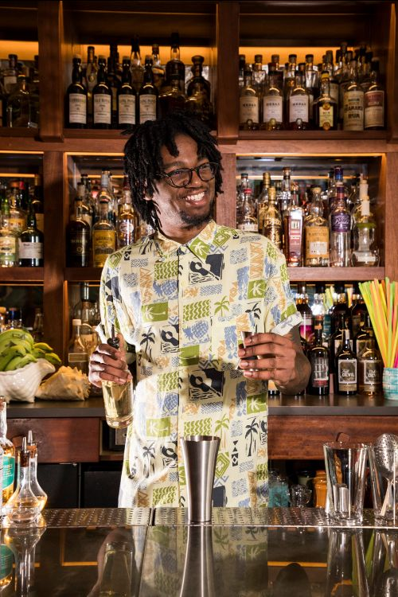
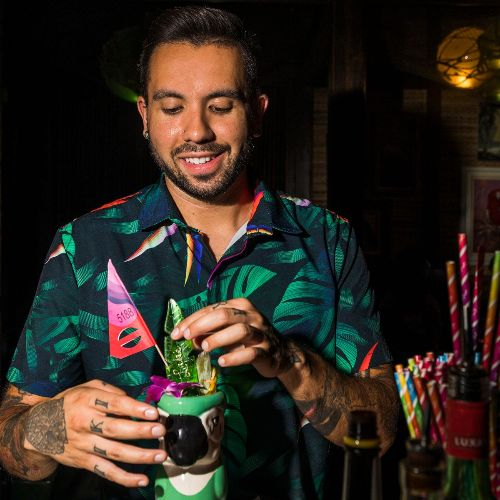
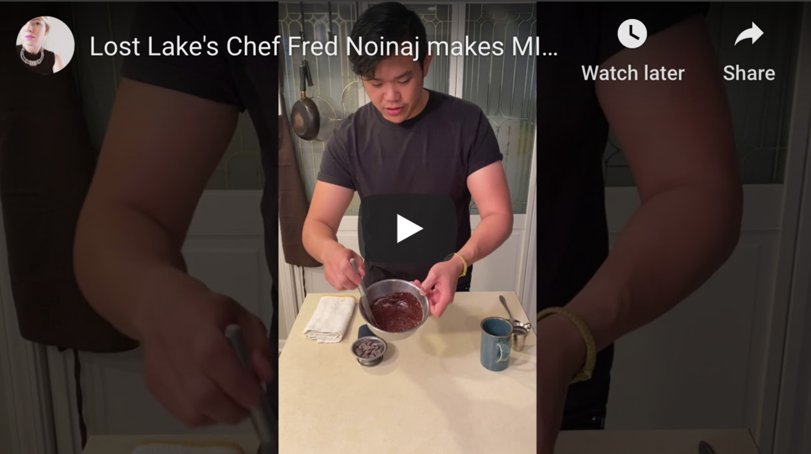
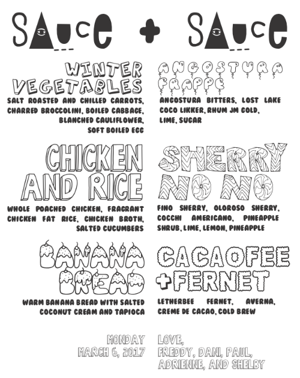
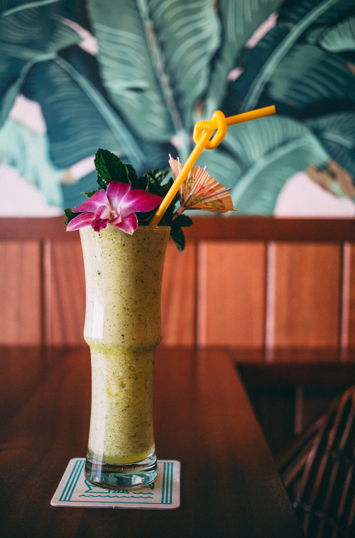
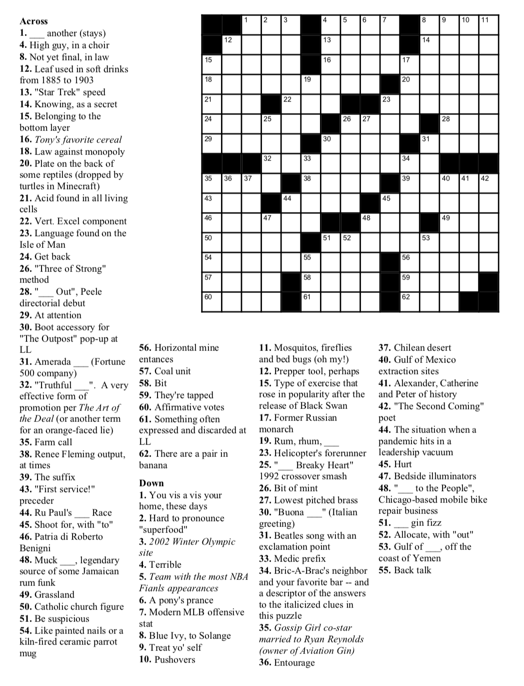
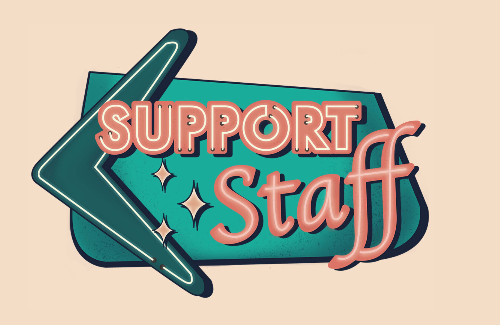

# Lost Lake Community Thread: Volume 4

*2020-03-31*

Hello, and welcome to the newsletter!

Today (Tuesday, March 31st, in case you were wondering), Vince takes us down memory lane with a scotch in hand, Alex shares some cocktail history, Fred tells us that *now* is the time to get to know our microwaves, we answer some calls on the request line, boldly use a pen to do the crossword, and (kind of) celebrate #SHIFTEASE!

Thank you so much for all of your kind messages and hilarious tags on Instagram. It feels great to be connected with you all!

Love,
Shelby

## VINCE: SOME DAYS LAST A LONG TIME

Walking into Lost Lake for the first time is an experience I won’t ever forget. I had heard it was a rum bar and that I should be prepared for extravagance everywhere. The drinks will have a ton of garnish, that crazy banana leaf wallpaper, and a cave with pufferfish lighting. I picked up the menu with hesitation; I knew nothing of rum or tropical cocktails. What was good? Half of these ingredients I had never seen before — how could I be sure it was delicious?

I landed on the “Some Days Last a Long Time”. This had a scotch base, lemon was the only citrus that appeared, and it ended with Letherbee Barrel Aged Absinthe. There was no rum, though, and no pineapple, and it didn’t come on fire. How could this be? This broke every notion I had of what Lost Lake would serve — much how working there broke the mold of what I thought a bar could be.

The choice of Bank Note Scotch Whisky here is an excellent one. The blend of Speyside, Highland, and Lowland whiskies produces a mellow finish with a light fruity aroma. I would later learn scotch has a solid foundation in tiki drinks: the “London Sour” — a Trader Vic original from 1963 — forgoes rum for scotch as the base as it riffs on the classic Mai-Tai. An interesting spin for Some Days Last a Long Time is the inclusion of sherry. Using Oloroso adds a distinct nutty aroma that also imparts flavors of tobacco. Also, in case you are like me, don’t be intimidated by the use of absinthe. We are only using a dash here, and it will give you that essential brightness with a ton of herbal notes like elderflower, anise, and gentian root. The crucial last step is the nutmeg garnish, a little freshly grated on top brings the whole thing together!

**Some Days Last a Long Time**
1.5 oz Bank Note Blended Scotch Whisky
0.5 oz oloroso sherry
1 oz coconut cream (from newsletter #1)
1 oz lemon juice
0.25 oz rich simple syrup (like regular simple syrup, but with two parts sugar to one part water)
2 dashes Lagavulin (or another spendy, smoky scotch)
1 dash absinthe (we use Letherbee Barrel Aged Absinthe)
*Combine all ingredients in a cocktail shaker with one cup crushed ice. (You can just bust up a bunch of freezer ice with a rolling pin!) Give it a good shake for about 5 seconds, then pour the entire contents into your cutest glass. Top with more crushed ice, and garnish with tropical things! We like freshly grated nutmeg on this one.*

## MAI TAI HISTORY LESSON WITH ALEX

When I had returned home to Chicago after graduating college in Iowa, I sat on my parents’ couch YouTubing videos on how to bartend and make cocktails. The very first video I watched explained to me how to prepare a proper Mai Tai. A man named Tim (or Zach, or Steve) stood behind a makeshift thatch roofed bar in front of a green screen. The superimposed backdrop was some beach somewhere. The bartender wore a pastel sky blue button down and faded indigo washed jeans. His hair was spiked, he wore sunglasses, and I was enamored. On the bar top were a couple of Boston shakers, a few plastic juice containers without labels, and one bottle of Meyer’s Dark Jamaican Rum.

“Mom, I know how to make a Mai Tai.”

“Oh?”

“Pour out a few ounces of dark rum, add some orange juice, a little bit of pineapple juice, grenadine and simple syrup. Shake with ice for a few seconds and dump into a glass. You can add a cherry, a lime wedge, or whatever you want for garnish.”

“Very cool. Look up how to make me a Tequila Sunrise.”

I was on it.

It was not until later that summer after having met Shelby Allison and Paul McGee that I learned all of my research and studying was for nothing. “The Mai Tai,” they claimed, “is probably the most bastardized cocktail ever.” Well, shit.

As it turns out, we can thank Victor Bergeron (you might know him as Trader Vic) for the creation of the original Mai Tai in 1944 — but his friend / rival / enemy / fellow tropical enthusiast Don the Beachcomber refuted that claim. Don claimed that Trader Vic had just riffed on one of his cocktail recipes, The QB Cooler. Vic took up the pen shortly thereafter and wrote in his cocktail book *Trader Vic’s Bartender’s Guide*: “anyone who says I didn’t create this drink is a dirty stinker.”

Origin story aside, most cocktail enthusiasts tend to favor the Trader Vic model. Originally, Bergeron created the drink to showcase Wray and Nephew’s 17 year old rum. To that rum he added lime juice, orgeat (almond syrup), orange curacao, and sugar, creating a tropical cocktail with a velvety texture (you can thank the orgeat for that) and notes of citrus and spiced orange. At Lost Lake, we add a hefty bouquet of mint that plays very well with the nuttiness of the orgeat and flavors of the rum.

When Wray and Nephew’s 17 year was no longer available to Bergeron, he substituted the 15 year. It was not until he made his cocktail famous in Hawaii (where he had been hired to work the cocktail menus at a few island hotels) did his cocktail creation start to stray. In the late 50s and early 60s, he added pineapple and orange juices, veering from his original recipe toward a sweeter version.

In his book *Imbibe*, famed cocktail historian David Wondrich states that a popular drink during the golden age of cocktails (we’re talking 1850s and 60s) named The Knickerbocker could be seen as a precursor to the Mai Tai. The Knickerbocker, according to Wondrich, called for Santa Cruz rum, lime or lemon, raspberry syrup, and some curacao. “Similar drink, different island,” says Wondrich. In 2020, however, many cocktail bars the nation over — Lost Lake included — continue to build upon Trader Vic’s original recipe. Here is one for you to make at home.

**Trader Vic's 1944 Mai Tai (or as close as we can get)**
1 oz Neisson Eleve Sous Bois (aged Martinique Rhum)
.5 oz Smith & Cross Overproof Jamaican Rum
.5 oz Appleton Reserve Aged Jamaican Rum
1 oz fresh lime juice
.75 oz orgeat (we like Small Hand Foods, available at Binny’s)
.5 oz Pierre Ferrand Dry Curacao
.25 oz demerara syrup
*Combine all ingredients in a cocktail shaker. After squeezing lime juice, drop one half of the spent hull into the shaker, too. Add cubed ice and shake the living daylights out of this thing. Your motto should be “Too cold to hold!” Dump the entire contents into your cutest double old fashioned glass, and top with some crushed ice (or busted up freezer ice). Garnish with an orange peel and a spanked (fun!) mint bouquet.*

## DESSERT TIME WITH FRED!

*click it! it's a video!*

One of my best friends has been hyping up microwaved mug cakes for a while and she totally swears by them. I finally gave it a shot — and for not being a sweets person (besides ice cream, which would be excellent on this), I really enjoyed the outcome. I cook for a living so when I do cook for myself at home I keep it simple. Mug cakes are so easy, versatile, and really remind me of playing with an Easy Bake Oven as a kid. They are a perfect treat after a long day at work or if you randomly have a craving for something sweet. Anyone who cooks at home at all will have a majority of these items in their pantry. You can easily swap out the olive oil for butter, coconut oil, or other cooking oils. You can experiment with different amounts and kinds of sugar and milk too. It is a fun way to quickly make a satisfying dessert.

Pro tip: Make a double batch of the mug cake and save the second one to make cake shakes!!! I used half a mug cake and big scoop of mint chip with some milk in the blender.

**Vegan Chocolate Mug Cake**
2 1/2 tbsp all purpose flour
2 tbsp sugar
1 1/2 tbs cocoa powder
1/4 tsp baking soda
1/8 tsp salt

1 tbs olive oil or coconut oil
3 tbs oat milk or almond milk
1 tbs chocolate chips

Equipment
12-14 oz ceramic mug
spoon or fork

Directions
- In the mug, add all your dry ingredients and mix.
- Add the oil and oat milk, mix well
- Top with chocolate chips
- Microwave on high for 50 seconds, then check the consistency. Since I like mine only a *little* bit gooey, I go close to 55-60 seconds. It depends on your microwave, so play around with it — now is the time!

## REQUEST LINE: SHERRY NO-NO

This cocktail came through on the request line and I was so happy to see it! We created this cocktail to serve at the first pop-up we did with Chef Fred, before he started as our executive chef. There had been a fire at the bar the spring prior, and though it would eventually take over a year to resume food service, I had asked Fred to join our team very early on in the recovery process. A little *too* early. So early, in fact, that he spent more than a few months hanging out in the kitchen of Chicago Athletic Association while I told him "Next month, for sure!" about six times in a row. During that wait, we hosted a pop-up together called SAUCE + SAUCE! It was all backwards dishes and upside down cocktails. That's where Fred first shared his ketchup research with me (and with you in last Thursday's newsletter!) and when I realized what a thoughtful chef he was. I'm so glad he waited around for us!

The name of this cocktail kind of comes from Dawn Penn's "[You Don't Love Me (No, No, No)](https://open.spotify.com/track/4g4tjYyDbZx4k2rnAJmJlH?si=CKIveLItQT2G0P4oyxoDMw)." And because the cocktail was supposed to be a backwards cocktail, we loaded her up with modifiers and just skipped the base spirit. This cocktail is available for endless experimentation — you just need a blend of sherries that speak to you (manzanilla! amontillado!), some bright fruit, crunchy sugar, and a straw! It's also a great cocktail to make at home because you can have a few without getting blasted and then having to spend the rest of the night tossing around with weird quarantine dreams.

**Sherry No-No**
1.5 oz fino sherry
0.5 oz oloroso sherry
1 oz Cocchi Americano
0.25 oz Pok Pok Pineapple Shrub (you can [make your own](https://cooking.nytimes.com/recipes/1017410-summer-fruit-shrub) pineapple shrub aka vinegar!)
0.5 oz lime juice
½ tbsp sugar mix (equal parts raw sugar and white sugar)
½ cup pineapple chunks (real ripe ones are best)
2 lemon wedges, trimmed
*Add the pineapple chunks first, then sugar, then the liquid ingredients. Reeeeally gently (like seriously), press the fruit with a muddler (or wooden spoon) and incorporate the ingredients a little. You don't want to pulverize the pineapple, and you don't want to splash yourself in the face. Then add some crushed ice, grab your swizzle stick (or milk frother or long skinny spoon or baby whisk) and get to swizzlin'! Keep adding ice as you go, swizzling until you see a nice later of frost forming on the outside of the glass. Garnish with a bouquet of mint for aromatics! Like a great mojito, you want to get a little crunchy sugar in each sip.*

## REQUEST LINE: SPINNING IN INFINITY

Spinning in Infinity is a very beloved cocktail and an off-menu favorite at Lost Lake, so I wasn't surprised to get more than one request for this old girl! This recipe is a riff on the classic "Missionary's Downfall," and the name comes from a Paul Simon lyric: *angels in the architecture, spinning in infinity*. Seems like a fitting title for a host of reasons to me ¯\_(ツ)_/¯

**Spinning in Infinity**
1 oz Letherbee Gin
.5 oz Smith and Cross Overproof Jamaican Rum
.5 oz Appleton Signature Blend
1 oz honey
.5 oz lime juice
.5 oz peach liqueur
1 cup pineapple chunks
6 mint leaves
*Combine all ingredients in a blender with one cup crushed ice. Blend until smooth. Garnish with a big bouquet of mint.*

Also makes a great spirit-free cocktail!

**No Spins**
1 oz passionfruit syrup (we like Small Hand Foods, available at Binny's)
1 oz honey
1 oz lime juice
1 oz pineapple juice
1 cup pineapple chunks
6 mint leaves
*Combine all ingredients in a blender with one cup crushed ice. Blend until smooth. Garnish with a big bouquet of mint.*

## CROSSWORD TIME

Another excellent grid from Lost Lake Lovers Club member Mike Morell, and this one has a cute twist. "Have at it!" he says. [Download the puzzle here](https://drive.google.com/file/d/1Vl-NwSjrV5sZiUe97xJwidFnXPprXpRu/view?usp=sharing), and look for answers in Thursday's puzzle!

## #SHIFTEASE

So, today is supposed to be [#SHIFTEASE](https://www.instagram.com/explore/tags/shiftease/). That's our monthly charitable party that we've hosted on the last Tuesday of every month since the early 2017. We just kicked off the fourth year of the event, and we were getting close to having raised $30k for organizations fighting for gender, racial, and economic justice right here in Chicago. Though our luck is down right now (luck is down in general, I guess), we know that there are still ways in which we can try to help our neighbors. And since we can't make cocktails and donate real money, we are leveraging our platform to raise awareness for a cause that we believe in! Later tonight we'll be in our Instagram Stories posting some easy lil "shifties" you can make at home and share more information about this month's organization: [Support Staff](https://www.instagram.com/pleasehustleresponsibly/)!

[*Support Staff*](https://linktr.ee/pleasehustleresponsibly)*is collective of hospitality professionals and community builders working alongside mental health professionals to change the landscape of Chicago's hospitality industry. In partnership with Pilot Light Chefs and a variety of community advocates + non profits we are launching Comp Tab Relief Fund.

Comp Tab is a community-based relief fund created by and for hospitality professionals, with sources of financial aid and alternative resources for those in the Chicago Metropolitan Area immediately affected by statewide closures.

To learn more about Support Staff's mission, donate, and spread the word,*[*click here*](https://linktr.ee/pleasehustleresponsibly)*.*
