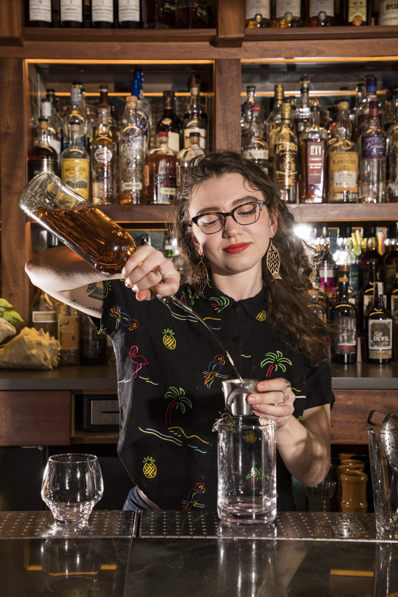
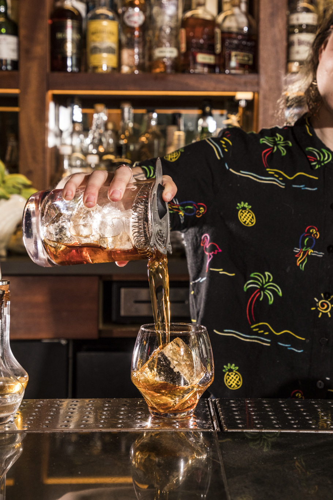
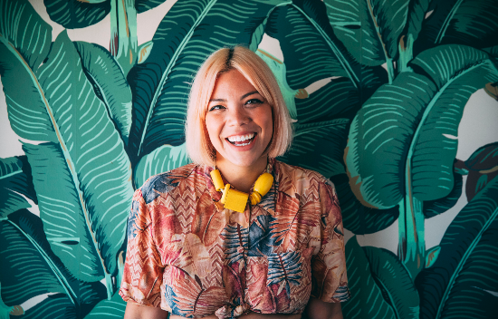
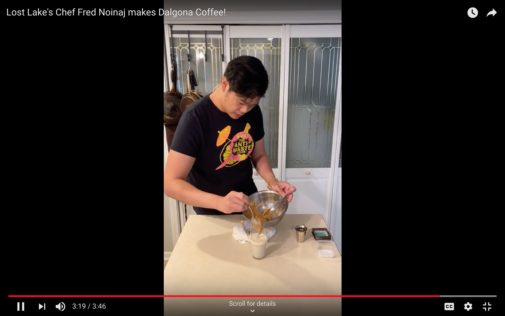
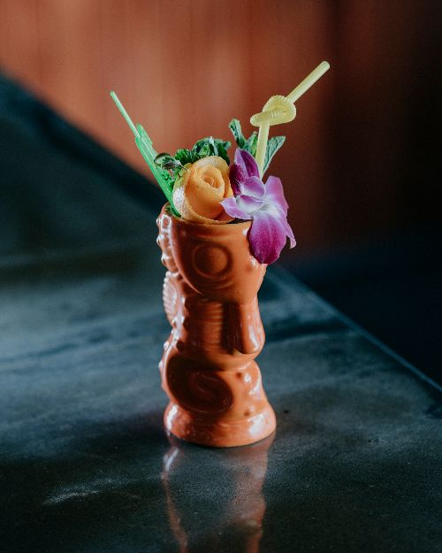
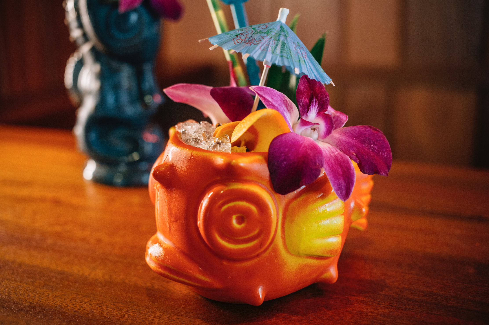

# Lost Lake Community Thread: Volume 5

*2020-04-02*

Hello, subscribers!

I'm pleased to present you with our fifth newsletter! This one is really good: you've got three (THREE!) brown n' stirreds from Shannon, a very sweaty playlist from Mia, fluffy coffee by Fred, and two calls coming in on the request line.

Please keep tagging us on Instagram with your creations, questions, and requests. We can't wait to get back to the bar with you!

Love,
Shelby

## SHANNON'S GO-TO BROWN N' STIRREDS

“It’s not the most festive looking cocktail on the menu, but…” is a frequent phrase I use when a guest asks about our brown-and-stirred options. In a space filled with color and decor (have you seen our garnish station??), it feels only right to give folks a little warning that they won’t get an umbrella in their Corn N’ Oil. However, not all buts are bad; more often than not, I finish that sentence with “it’s my favorite on the menu.”

One of my favorite things about brown-and-stirreds at Lost Lake especially is that they’re a little enigmatic, not unlike our bar itself. People who come in for the first time have said that they walk by us all the time and had no idea what what was going on inside. When a guest sees another get a cocktail with only a big rock (shout out to Just Ice for keeping our cubes clear and cute!) as its ornamentation, I think they’re similarly confused.

What isn’t obvious to the eye is that a lot of our stirred cocktails absolutely maintain a tropical flavor profile without the use of juice or syrups. Rum/rhum, with its very few rules for production, offers a great range of flavors that can veer fruity or spice-forward and can have those qualities gracefully amplified with other spirits. For example, our Plantation Pineapple Kingston Negroni does just that. While the base spirit is clearly pineapple forward, the Campari contributes a beautiful bright and bitter orange flavor with the vermouth running interference with its delicate richness and dried stone fruit notes.

Let’s stir up some drinks to keep from getting to stir-crazy, shall we?

**Three of Strong**
*This cocktail was one of my first favorites when I first started having shifties at Lost Lake. The bourbon and aged agricole give this drink a decidedly oak-forward backbone but each of their nuances shine: the American oak that holds aging bourbon gives it a little vanilla and coconut; and, the French oak which houses the agricole lends its self to a more tannic, tea-like hint. The sherries bring a bit of richness and raisin, making this a fruit forward but meticulously balanced bevvy.*
1oz Evan Williams Bourbon
1 oz Clement Select Barrel
.5 oz Pedro Ximenez Sherry
.5 oz Palo Cortado Sherry
Combine spirits in mixing glass, stir with ice for around five to seven seconds (depending on your ice), strain into a tumbler with fresh ice. Express orange peel over the tumbler and discard.

**Art of Choke**
*An original of our neighbors down Milwaukee Avenue (hi, Violet Hour!), this pleasantly medicinal drink has some of my favorite components: Cynar, Green Chartreuse, and of course, rum! The combination of Cynar and Green Chartreuse gives off a lovely, darkly floral element with a savory undertone. The multi-island rum we use for it at Lost Lake, Banks 5, suits this cocktail perfectly. Its balance of five very different regions of rum making lends a funk that stands quite nicely with the drink’s other herbaceous ingredients.*
1 oz Cynar
1 oz Banks 5 Rum
.25 oz Green Chartreuse
bar spoon lime juice
bar spoon demerara syrup
4 mint leaves (I’ve used a couple of dashes of mint extract before instead)
Combine all ingredients (including mint leaves) into a mixing glass and stir. Strain over fresh ice.

**Old-Fashioned**
*I love getting dealer’s choices for a rum old-fashioned! It’s like being given a list of enabling constraints. This one right here is one I like to make for myself but I feel like an old-fashioned should be a little bit of choose-your-own-adventure.*
1 oz Smith and Cross
.5 oz Plantation Original Dark
.5 oz Cynar
2 dashes orange bitters
1 d Angostura bitters
Combine all in a mixing glass, mix with ice and strain over fresh ice. Express orange and discard peel.
Stir and sip safely and soundly, friends!

## MIA DANCES LIKE ONLY MIA'S WATCHING

*Click that bright pink "move it or lose it" button to hear Mia's mix!*

I’ve never been a work-out-at-home kinda gal, but desperate times...

About 3 days into self isolation, all my pent-up energy was turning into anxiety and restlessness. I was bored out of my mind, literally scrubbing a light switch while listening to Robyn, when I was suddenly possessed. I flew down my basement stairs, locked the door, and hooked up the bluetooth speaker; I decided that didn’t really matter how I moved my body, as long as I was moving it. I proceeded to dance my damn face off. The sweet, sweet release was such a game changer that I started gifting myself 45 minutes a day of moving it. It’s extremely helpful because it’s the only meditative thing that works for me other than puzzles, and I’m out of those.

## CHEF FRED MAKES DALGONA COFFEE

*I'm a video! Click me!*

A lot of us have morning routines that have been affected by the need to quarantine and shelter-in-place orders. Some of us go to the gym, go for a run, hit up the farmers market, or just grab a coffee on the way to work. As someone whole loves caffeine, coffee, and just the overall routine of dropping by my local coffee shop in the morning, I felt the need to change up the french press (using questionable coffee) I have been making every morning for the last few weeks.

Dalgona coffee has been making waves on the internet since South Korea began its coronavirus lockdown. It is a deceptively simple coffee preparation with high aesthetic rewards and caffeine content. The name was coined by South Koreans because of its close color and appearance to a very popular street vendor snack called Dalgona candy, which is similar to honeycomb candy, angel food candy, karume-yaki in Japan, or seafoam candy in parts of the US.

I normally drink black coffee, but its nice to change it up every once in a while. It takes just about the same amount of time to prepare a normal cup of coffee and with warm weather coming up soon, iced coffee season is just around the corner. Give it a shot, get creative! There's a lot of variations that make it suitable for all caf-fiends!

**Dalgona coffee** (one serving)
1 tbsp instant coffee
1 tbsp granulated sugar
1 tbsp very hot water
8-10 oz chilled oat milk, almond milk, or soy milk in a glass

**Optional**
Ice
pinch of salt

**Equipment**
Mixing bowl
Whisk
Spoon
Kitchen towel

**Directions (if whisking by hand)**
-Take the kitchen towel by transverse corners, roll and loosely tie to form a round base to set your bowl on. Add the coffee, sugar and hot water to a mixing bowl. Start by slowly stirring the contents to dissolve and gradually increasing speed.

-Once the mixture starts to lighten in color and foam up, add a pinch of salt(optional). Continue to whisk until medium peaks are formed(2-3 more minutes depending on whisking speed).
-Spoon the whipped coffee on top, give a little stir and enjoy!

NOTE: This entire process can be done in a stand mixer with a whisk attachment as well.

## REQUEST LINE: NO BYE/NO ALOHA

This is an oldie, but a very good goodie! It's not *not* a Fogcutter, but you'll forget all comparisons if you mix this up while letting The Breeder's [No Aloha](https://open.spotify.com/track/0CBB4ZgkW6qQ9Cesr9VO6r?si=bGTvxX7BRiCGllB13mr4_w) blast on repeat.

**No Bye/No Aloha**
1.5 oz Fords Gin
.5 oz Dr Bird Jamaican Rum
.5 oz oloroso sherry
.25 oz orgeat (we like Small Hand Foods, available at Binny's!)
.5 oz passionfruit syrup (we like Small Hand Foods, available at Binny's!)
1 oz lemon juice
.25 oz ginger (try BG Reynold's, available at Binny's!)
.25 oz John Taylor Velvet Falernum
2 dashes Angostura Bitters
1 dash absinthe
*Combine all ingredients in a cocktail shaker with one cup crushed ice. (You can just bust up a bunch of freezer ice with a rolling pin!) Give it a good shake for about 5 seconds, then pour the entire contents into your cutest glass (we call that a 'dirty dump' lol). Top with more crushed ice, and garnish with tropical things!*

## REQUEST LINE: PAINKILLER

Are we all self-medicating by now? Okay, good. Glad we're on the same page.

This is a classic tropical cocktail from the Soggy Dollar Bar on Jost Van Dyke in the British Virgin Islands. The bar gets its name from the sopping wet currency guests arrive with after having to wade through waist-deep water to get to the bar — and they've got a sign that reads 'A Sunny Place for Shady People.'

The original Painkiller is made with Pusser's Rum and orange juice — but we never, *ever* use orange juice in our cocktails. If a classic recipe calls for orange juice, we generally modify the build with lime and orange curaçao to achieve those bright orange flavors. In this case, however, we took the call for orange juice in a different direction: passionfruit!

**Painkiller #3**
1 oz Real McCoy 5 Year Rum
1 oz Coruba Dark Rum
1.5 oz coconut cream (newsletter #1!)
.75 oz passionfruit syrup
.75 oz pineapple juice
.75 oz half n' half
*Combine all ingredients in a cocktail shaker with one cup crushed ice. (You can just bust up a bunch of freezer ice with a rolling pin!) Give it a good shake for about 5 seconds, then pour the entire contents into your cutest glass (we call that a 'dirty dump' lol). Top with more crushed ice, and garnish with tropical things!*

## THANK YOU!

Thank you, thank you, thank you. Thank you!
