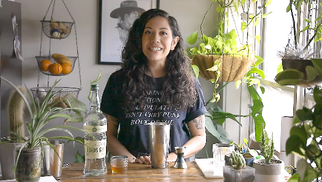
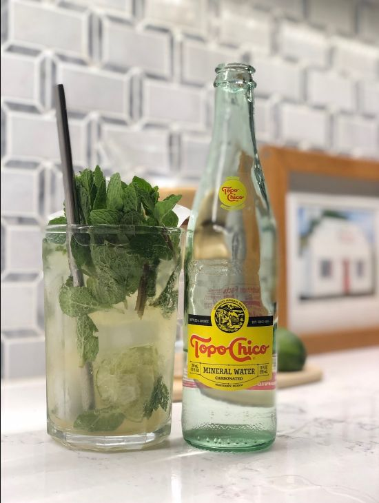
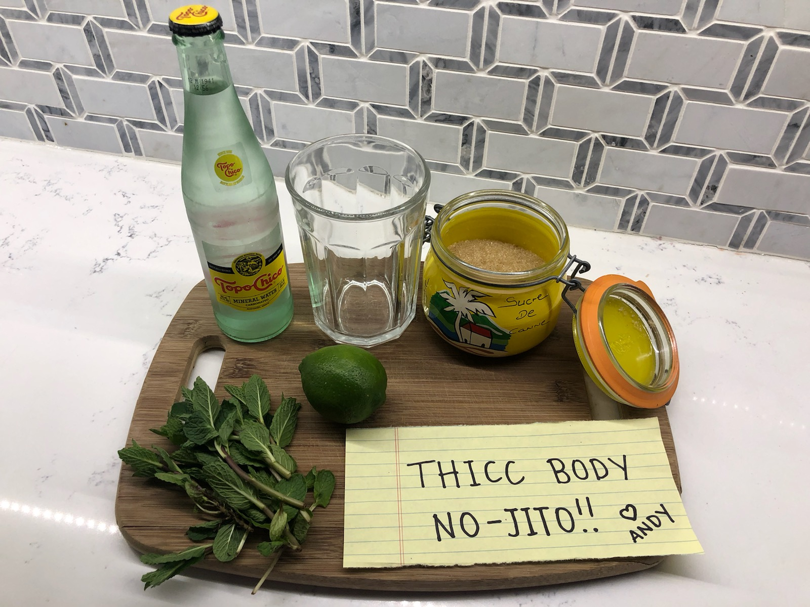
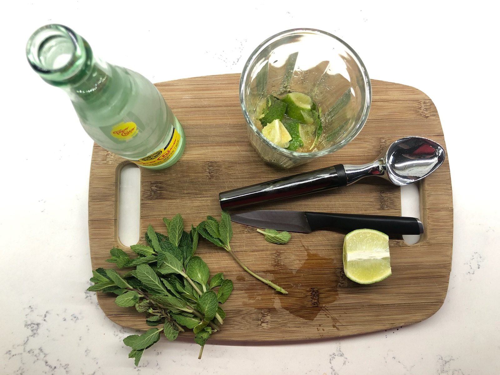
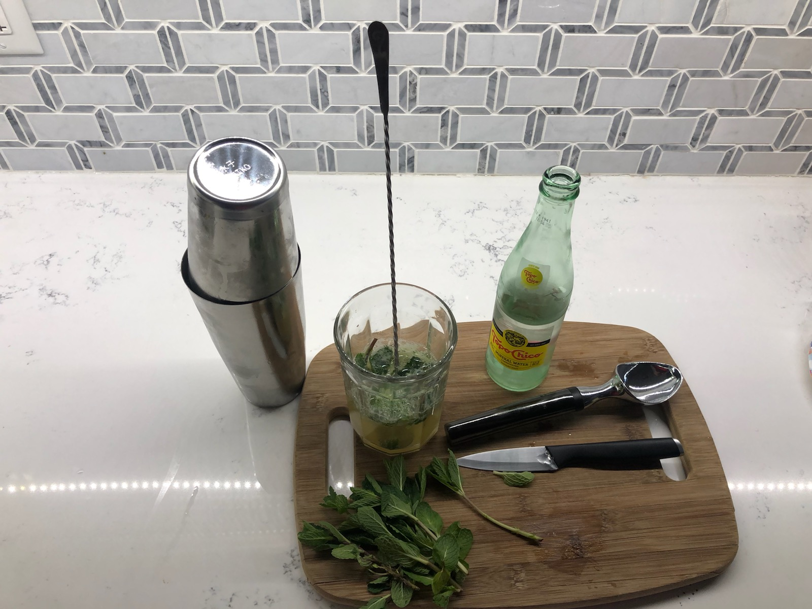
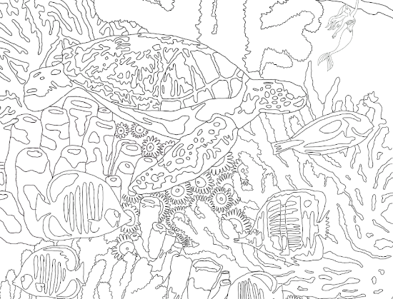
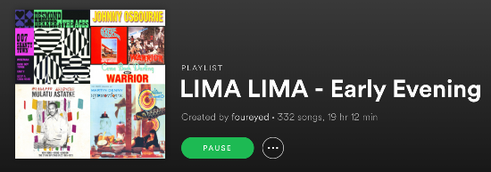
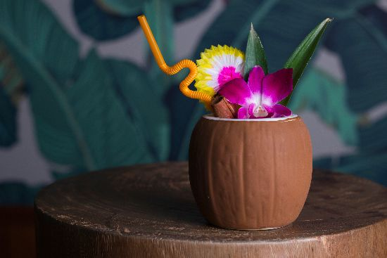
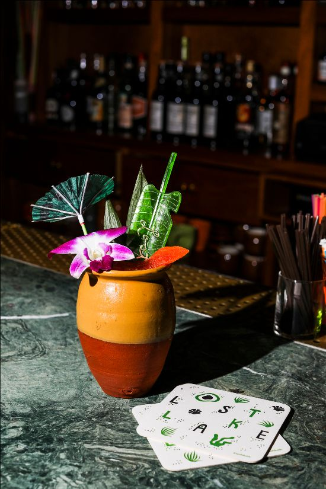
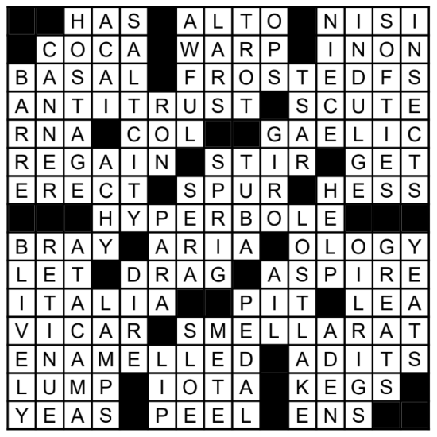

# Lost Lake Community Thread: Volume 6

*2020-04-07*

Hello, friends!

Welcome to the sixth edition of the newsletter! Today we're shakin' up a classic with Alicia, muddlin' a spirit-free with Andy, colorin' with Laura, and pickin' up some calls on the request line!

We're in the fourth week of Lost Lake's closure, and it's looking like another four weeks ahead (at least). Your kind notes, tags on Instagram, and newsletter requests are keeping us all engaged in our work and connected to one another — and to you. A light in the dark! Thank you, thank you, thank you.

love,
Shelby

## ALICIA IS THE BEE'S KNEES

click me! i'm a video!

You're all making your favorite cocktails (and making them over and over and over and over...) and so are we! Here's Alicia making a Bee's Knees — Mollie's go-to order and a recipe you can use as a base for endless experimentation.

Thanks for the cute video, Alicia and [Moll](https://www.instagram.com/moll_jean/)! Love love love seeing your faces.

## ANDY'S NO-JITO

The Mojito is one of the best cocktails we make at Lost Lake. For me, as of April 14th of last year, it is THEEEEEEEE best cocktail at Lost Lake. (I quit boozing on that date... I was way too good at it 🤷🏼‍♂️😂S/O to former Lost Laker and my big brother John “Big Ging” Allison for the inspiration.) However, we are going to call this one the No-Jito. It’s a certified 'Spirit-Free Banger.' The glass we use for this drink at Lost Lake is referred to as a 'Fat Bottom' amongst the staff because of its thick glass base. I’m stuck at home right now and don’t have a 'Fat Bottom' soooo enter the 'Thicc - Body.'

You will need fresh mint, lime, soda water (Topo Chico is my favorite because ima bad bitch), and something to muddle with — in my case it is the end of an ice cream scoop.

Step 1: Spank that mint and drop it in the glass first. Cut two lime wedges (half of a lime) and drop those in, too. I cut my lime half into quarters.... idk why. Add one tablespoon of demerara sugar. I’m using the sugar I brought back from the Neisson Distillery in Martinique. RIP to me drinking Ti Punch — the actual best cocktail to ever be invented .

Step 2: Muddle!!! Make sure the mint is under the limes so it doesn't get totally pulverized, and let some of the sugar stay crunchy.

Step 3: Free pour yourself an ounce or two of soda water and give it a little stir. Now you will need to crush some ice — I used ice out of my freezer in a shaker tin. If you don’t have a tin you’re gonna have to get creative.

Step 4: Add the crushed ice and top it with more Soda Water. Another quick stir and throw the rest of the mint up top for the garnish. Booooom! You now have yourself a Patio Pounder as I like to call it. Great for any occasion.

## LAURA WANTS TO BE WHERE THE PEOPLE ARE

Laura's got another adorable (and adorably named: *I Want to be Where the People Are*) coloring page for us! Click [here](https://drive.google.com/file/d/1Sg-okZRwRKG8V391Mm-0cXw67URutAFm/view?usp=sharing) to download and print the page, and tag us with your finished version!

## REQUEST LINE: LOST LAKE PLAYLIST

We got a request for a Lost Lake playlist! When we opened Lost Lake in 2015, I started [this playlist](https://open.spotify.com/user/foureyed/playlist/5UjwA5lvZNfpsvQ09ZdG7R?si=ibEZQL67TOep_phsMlgsRA) and just kept adding more and more songs as the years passed. At the end of the 2019, my staff lovingly (if threat of mutiny can be loving) let me know that they would not listen to it for one. more. moment. I have a hunch that if they had the choice to A) be stuck inside alone for two months while the world roils in a viral pandemic or B) listen to this playlist again, they'd unanimously choose A.

But! You haven't listened to these songs for five straight years of your work life, so please feel free to enjoy without danger of slipping over the edge of sanity.

## REQUEST LINE: STRANGER IN PARADISE

This cocktail is from our second menu, and continues to be an off-menu favorite amongst Lost Lakers. It's no wonder: funky rhum agricole and spicy falernum take a ride on a fluffy cloud of pineapple juice, and a little lightning bolt of absinthe electrifies the whole thing. Dang!

Something I've learned over the last few years is that this little rum bar's guests *really* like tequila! Good thing they go together so well.

**Stranger in Paradise**
1 oz Corazon Reposado Tequila
1 oz Clement Premiere Canne Rhum Agricole
0.5 oz John Taylor Velvet Falernum
0.5 oz cinnamon syrup ([newsletter #1](https://mailchi.mp/f256989da701/bzhtr43sqw))
0.75 oz lime juice
0.5 oz pineapple juice
3 dashes St. Elizabeth Allspice Dram
2 dashes Angostura Bitters
2 dashes absinthe
*Combine all ingredients in a cocktail shaker with one cup crushed ice. (You can just bust up a bunch of freezer ice with a rolling pin!) Give it a good shake for about 5 seconds, then pour the entire contents into your cutest glass (we call that a 'dirty dump' lol). Top with more crushed ice, and garnish with tropical things! We like a cinnamon stick (snapped in half to release those good smells) on this one.*

## REQUEST LINE: LIKE THE SUN IN SOLUTION

Another [Shelbin + Elbin](https://mailchi.mp/edaa8f6fd856/nn9p9xulrk) cocktail on the request line! This was from our 2019 menu, and it (like that entire menu, really) was real departure from our usual Lost Lake style. Using corn (CORN!) and pandan syrup, the resulting flavor profile is a wacky and wonderful combination of savory + earthy + nutty. I borrowed the name from a Tom Robbins line about tequila, but this recipe doesn't have any tequila sooo ¯\_(ツ)_/¯ Sometimes it just feels right and you go with it anyway!

For all recipes that call for mango puree, we use the Perfect Puree brand at the bar — but (and maybe this is because I'm quarantined with a seven month old) you could try baby food??! Or just get a real mango and put it in the blender.

**LIKE THE SUN IN SOLUTION**
1 oz El Dorado 5 Year Rum
.5 oz Botran Reserva Rum
.5 oz Coruba Dark Rum
1 oz corn-coconut milk
1 oz mango puree
.75 oz pineapple juice
.5 oz lime juice
.5 oz pandan syrup ([newsletter #3](https://mailchi.mp/edaa8f6fd856/nn9p9xulrk)!)
.25 amontillado sherry
*Combine all ingredients in a cocktail shaker with one cup crushed ice. (You can just bust up a bunch of freezer ice with a rolling pin!) Give it a good shake for about 5 seconds, then pour the entire contents into your cutest glass (we call that a 'dirty dump' lol). Top with more crushed ice, and garnish with tropical things! We like a cinnamon stick (snapped in half to release those good smells) on this one.*

**Corn-Coconut Milk**
It's fuckin' weird, but it's fuckin' good. Just get yourself a can of corn and a quarter can of full-fat coconut milk, toss them in the blender and *voilà*! Corn-coconut milk!

## CROSSWORD KEY

Oops! Forgot to include this in Thursday's newsletter. Thanks to Lost Lake Lovers Club member Mike for another VERY DIFFICULT puzzle!

