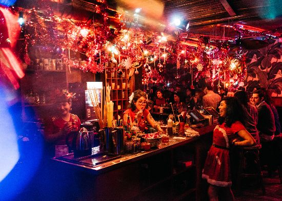
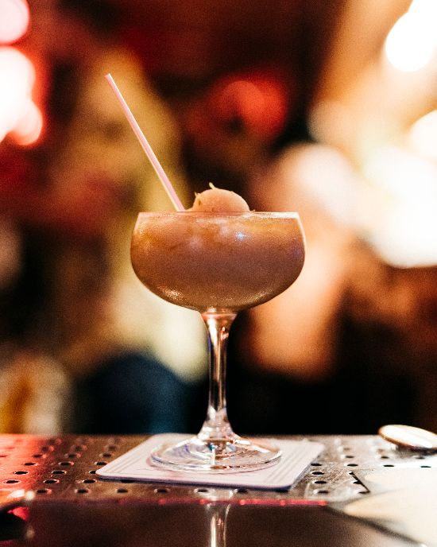
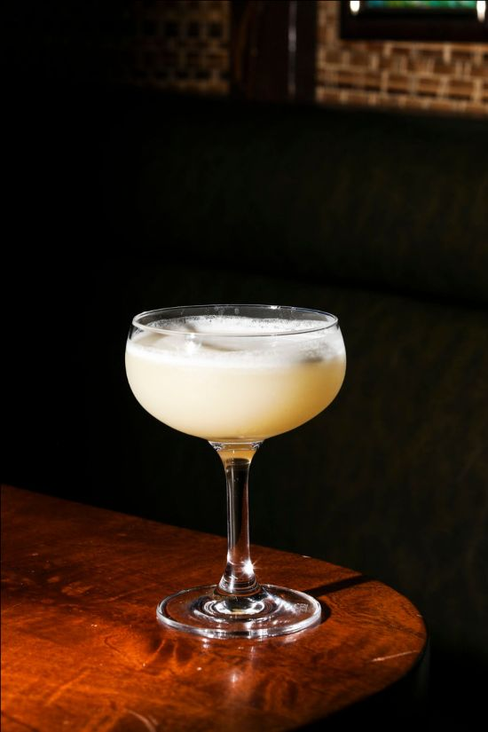
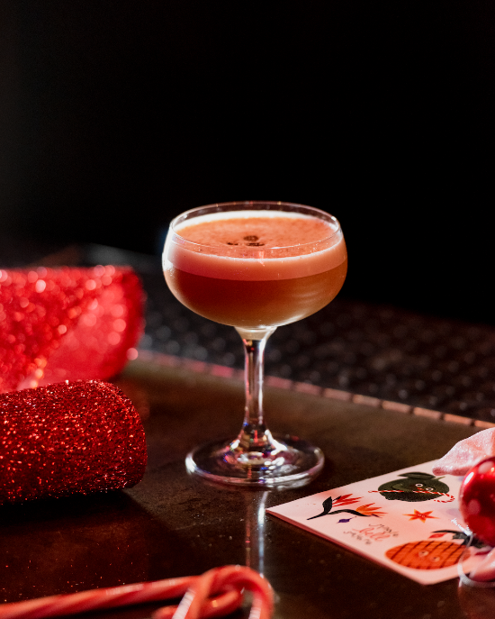
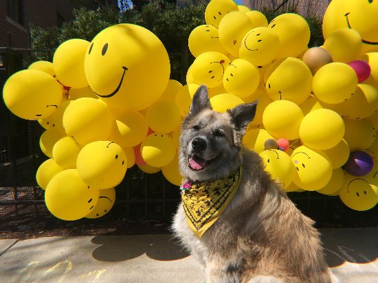

# Lost Lake Community Thread: Volume 7

*2020-04-09*

Hello, subscribers!

Welcome to the seventh edition of the newsletter! This weekend is gonna be all about cocktails in coupes. (Really surprised it took me this long to lean into an "all couped up" joke.) Louise is Dancin' and Prancin', Alan shares his fave warm weather blender drink, Alex answers a call on the request line for a smoky mezcal cocktail — and each recipe is served on a stem!

And remember, always handle your stemmed glassware by the stem! (Hey, if we don't have time to really focus on our pet peeves now, when will we ever?! ¯\_(ツ)_/¯)

love,
Shelby

## DANCIN' AND PRANCIN' WITH LOUISE

As soon as I was hired in September at Lost Lake, I started to hear about Jingle Bell Square, and the excitement it generated. Despite hosting and attending holiday pop ups in the past, nothing could quite prepare me for the magnitude of this one. All other places' decorations pale in comparison with the tinsel-elf-explosion that is Lost Lake in December! Every visible surface of the bar is adorned in holiday cheer and dripping with merriment.

The task of transforming the space is a labor of love, as every staff member comes in to help decorate. As a person who was spending their first Christmas away from their hometown in North Carolina, this decorating process made me feel a sense of unity and family.

No detail was left out during the event, from the decorations to the personalized holiday outfits each staff member chose. A big shout out to Village Discount for supplying me with not only a perfect elf dress, but also a LED light up sweater. The music was a holiday curated playlist that spanned from Madonna to Nat King Cole. We also featured a limited holiday menu with thematically named drinks, such as the Dancin' and Prancin', which balanced out its tequila base with ginger, hibiscus, lemon and a splash of bubbles.

It is great to work in a space where the labor put into an event is appreciated by the guest. Each night the bar was packed with eager faces. My roommates came in so many times, they almost died from egg nog consumption!

I look forward to being with the Lost Lake family again soon. Until then, I'll be home drinking Dancin' and Prancin's!

**Dancin' and Prancin'**
.75 oz Luna Azul Blanco Tequila
.74 oz JM Blanc Rhum Agricole
.5 oz lemon juice
.5 oz ginger syrup
.5 oz Appel Hibiscus Grenadine
2 oz sparkling wine
*Add all ingredients except sparkling wine to a cocktail shaker with ice. Shake it hard! Strain into cocktail coupe and top with sparkling wine. Merry merry!*

**Ginger Syrup**
We make a very spicy ginger syrup by juicing a shitload of fresh ginger and making a simple syrup with equal parts ginger juice and sugar — stir over heat until all crystals dissolve.

**Appel's Hibiscus Grenadine**
This is a rare recipe for Lost Lake in that we buy in the syrup — usually we (and by we, I mean our prep boss Mikesha) make everything in house. You could make a simple syrup with a strong hibiscus tea in lieu of plain water, or you could follow [Todd Appel](https://www.instagram.com/toddappelbar/?hl=en) and see if he's got any available for delivery!

## ALAN'S FAVE: COCO FRAPPÉ

The Coco Frappe is my favorite cocktail to have at Lost Lake during the spring and summer time. It’s basically a frozen coconut daiquiri, but with some Lost Lake finesse. I know some of you can have frozen drinks year-round, but this is a seasonal cocktail for your boy from Arizona. Luckily, we’ve been blessed with some warm weather this week which means it’s time to bring back the Coco Frappe! This cocktail is simple to make, and chances are you have all the ingredients and equipment to do so at home. The only special ingredient you will need to prepare is our coconut cream from our first newsletter, so I hope you’ve been keeping up!

To prepare the cocktail get your tools ready. You will need a blender, zester, and a measuring device. As far as ingredients go, you’re going to need rum (preferably an unaged or lightly aged rum/rum blend) — in house we use El Dorado 3 Year. You will also need lime, dry sugar, coconut cream, and crushed ice. Personally, I don’t have El Do 3 at home, so I’ve been using Royal Standard — which does just fine but the perfect rum for this cocktail is the El Do 3 so try to get your hands on some.

Building this drink is super simple, just add all the ingredients to a blender and blend for about 10-15 seconds. The trick is to blend it until it’s smooth; if you blend for too long it’ll be too frozen and hard to sip, too short and it’ll be too runny. The best part about this cocktail is that you can make more than one at a time. Cheers!

**Coco Frappe**
2 oz El Dorado 3 Year Rum
1 oz coconut cream (newsletter #1)
.75 oz Lime
.5 tbsp granulated sugar
.5 tbsp demerara sugar
~1tsp lime zest
1.5 cups crushed ice
*Combine everything in your blender and blend until smooth! Top with a little freshly grated lime zest.*

## REQUEST LINE: ALEX ANSWERS A CALL FOR A SMOKY MEZCAL COCKTAIL

This past winter, the Lost Lake family was very fortunate to participate in a mezcal tasting to expand the options on our back bar for guests (and staff) that were fans of this particular agave spirit. One of the names that received the most votes of the staff to claim a coveted spot on our spirit’s list was that of Alipus. Alipus began in 1999 as a side project of Distileria Los Danzantes in San Juan del Rio. Today, it is a flourishing artisanal program led by numerous mezcaleros all over Oaxaca, along with Craft Distillers to help push their wonderful product into other markets, which began in 2012.

Alipus has several mezcals to choose from, but our choice would be Alipus: San Andres Ensamble headed by Don Valente Angel and Don Atanasio Aragon Martinez. Be careful, there are two San Andres’s bottles. One is made with 100% Espadin, while the Ensamble is made with Espadin and Bicuishe. The Ensamble has just the right amount of smoke, but leaves room for pepper and, perhaps, some buttered pecans on the palate. On the nose you’ll find some vanilla, dry stone, and some good old fashioned tropical fruit (you can see why the Lost Lakers chose it). San Andres clocks in at 44% ABV, is made with Espadin (80%) and Bicuishe (20%).

For fun, try the Ensamble side by side with the San Andres 100% Espadin to smell and taste the differences! You’ll find that the 100% Espadin has much more minerality to its finish. If you’d like to read up more on Mezcal, I would suggest picking Emma Janzen’s [Mezcal: The History, Craft & Cocktails of the World’s Ultimate Artisanal Spirit](https://www.emmajanzen.com/mezcal-book/) for a great read on a great spirit!

An often overlooked classic mezcal cocktail is the Jusho! Though not as old as many classics, the Jusho as all of the makings of a delicious mezcal gimlet.

**Jusho**
2 oz mezcal
1 oz lime
.75 oz honey syrup
*Add all ingredients into a shaker tin, hard shake for ten seconds, and double strain into a coupe or your favorite martini glass.*

## REQUEST LINE: WORLD'S BEST CUP OF COFFEE

More like World's Best COUPE of Coffee, amiright?! This call on the request line is from our 2018 Jingle Bell Square menu, and the name comes from [Elf](https://www.youtube.com/watch?v=DOzR9yt3XBw) (duh). Do you have any coffee demerara syrup left from [newsletter one](https://us19.campaign-archive.com/home/?u=e437b38f3870b08a9e1545937&id=763d0cd695)? Let's put it to use!

**World's Best Cup of Coffee**
1 oz Pierre Ferrand 1840 Cognac
.5 oz Coruba Rum
.5 oz Smith & Cross Overproof Jamaican Rum
.25 oz Averna
.25 oz cold brew
.25 oz coffee demerara
.25 oz orgeat (Small Hand Foods from Binny's!)
2 dashes Fee Walnut Bitters
1 whole egg
*Combine everything in a cocktail shaker without ice, and shake the living bejesus out of it. You want this egg to puff up so big and fluffy before you add ice and shake it again (remember: too cold to hold!) Strain into — you guessed it — a cocktail coupe! Garnish with a little freshly grated coffee bean.*

## LOST LAKE PET PARADE

*It's the world's slowest pet parade, where you get to meet one Lost Lake pet per newsletter — and we guess what they'd drink if they were human beings.*

Meet Alicia's dog Vita!

[@dailydoseofvita](https://www.instagram.com/dailydoseofvita/?hl=en), 8 yrs old.

Likes chasing tennis balls but never returning them, road trips (has been to the west coast twice), naps, walks and belly rubs.

Her favorite drink now is a shot of coconut cream so we’d guess her favorite drink would be a piña colada while on a beach, enjoying the sun and the view.
