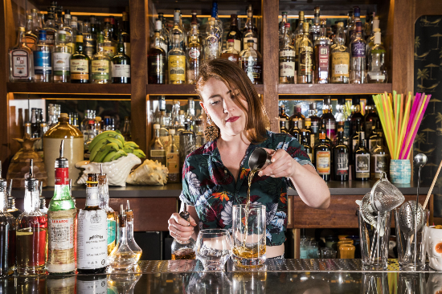
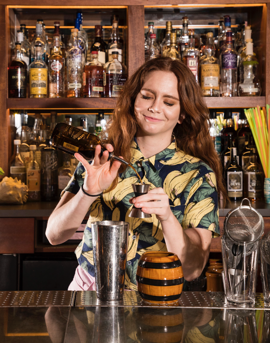
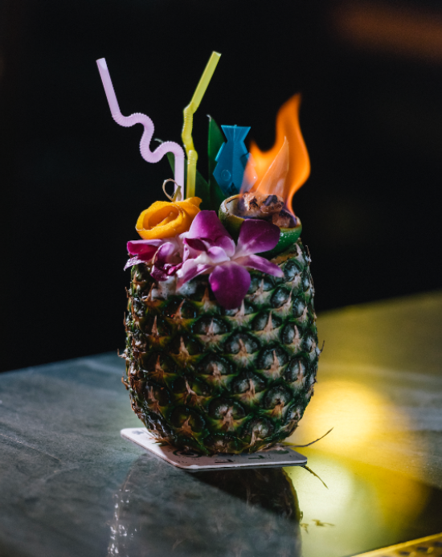
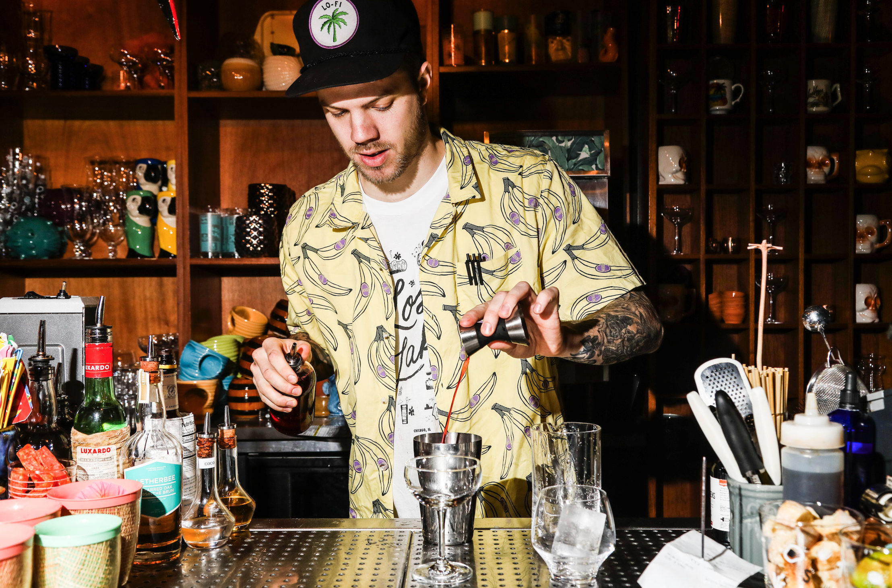
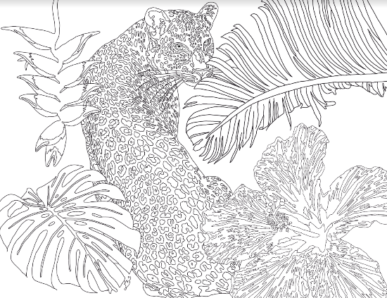
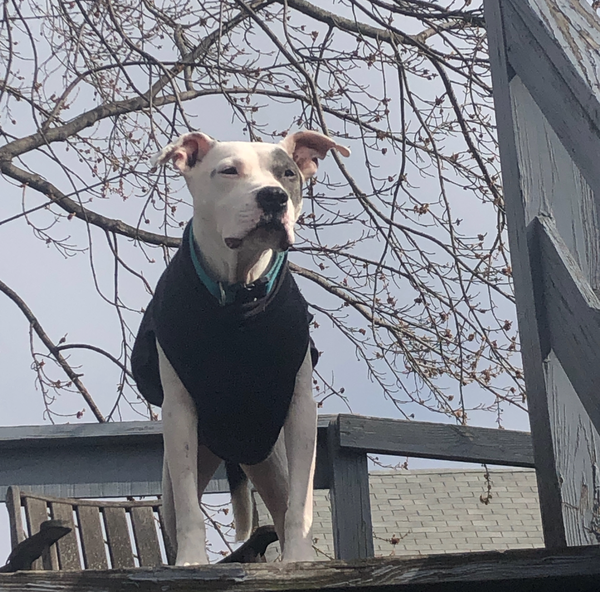

# Lost Lake Community Thread: Volume 8

*2020-04-14*

Welcome to the eighth edition of our newsletter!

Today, Hannah helps you curate your rum/rhum/ron selection, geology major Desira tells us about Martinique mud slides (spoiler: you can't drink them), Laura gives us a Jaguar Queen that needs coloring, and we answer two calls on the request line: Bahama Mama and Coconaut!

On Thursday, we'll have a cute vid from Alicia, an extra special delicious recipe *and* playlist from Fred in honor of Songkran (Thai New Year!) — and maybe another crossword if my baby keeps taking long naps. As always, the request line is open!

Thank you for your on-going support!! You're keeping our team spirit high, for real, and we're anxiously awaiting the moment we can be behind the bar together again.

love,
Shelby

## HANNAH'S FOUR-BOTTLE RUM BAR

Heyyyyy party people! Glad to see you’re still sticking with us in these newsletters :). We’ve received a couple requests for a “curated rum list” — a handful of must-haves for the home bar. You could ask this question to all 10 Lost Lake bartenders and you would likely get 10 different answers. But those that know me know that I always have an opinion, so here’s my humble list!

First, everyone should have a solid unaged rum. This is often used in light, bright cocktails: daiquiris, mojitos, coco-frappes (shout out to Alan in last week’s newsletter!), etc. **El Dorado 3 Year** might be as easy-going as it gets: delicate and delicious. If you prefer something with a little more punch, try **Royal Standard Dry White Rum** (a blend of rums from Trinidad, Barbados and Jamaica) or **Probitas** from the Foursquare distillery in Barbados.

Next is a go-to with some age. I really like **Real McCoy 5 Year** for its approachability. Almost bourbon-like in taste, it works in a tropical cocktail and flourishes in a “brown and stirred.” It’s also a great gateway rum for your whiskey drinking friends! **El Dorado 5 Year** is perfect for those that like some richness in a rum and goes beautifully with tropical fruits. If you’re open to a little more funk, I highly recommend **Plantation Xaymaca**. This is a tried and true Lost Lake staple — so much so that we use it in our namesake cocktail. (My love for this spirit was cemented pool-side on our recent trip to Jamaica!)

It wouldn’t really be a complete LL list without mentioning some agricole. Agricole rhum, for those that don’t know, is a style of rum under French designation that’s made from fresh-pressed sugar cane juice instead of molasses. The flavor profile of an agricole is bright, grassy, and often a little salty. While this zing might be a bit intense for newer rum drinkers, it’s an acquired taste I’ve come to love. It’s also really fun to layer in cocktails to add depth — much like a cook would add acid to a dish. Two personal favorites: **Neisson Blanc** (ideal for daiquiris, tropical cocktails, and a classic Ti' Punch) and **Neisson Elevé Sous Bois** (aged for 18 months in French oak vats; great on its own, layered in spirit-forward cocktails, or in a Punch Vieux).

And last but not least, I would be remiss if I didn’t include **Plantation Stiggin’s Fancy Pineapple Rum**. It’s one of my favorites, plain and simple! Perfect in a daiquiri, perfect in an old fashioned, perfect over ice - there’s not much this little bottle can’t do.

## DESIRA'S BRIEF HISTORY OF VOLCANOLOGY ON MARTINIQUE

Martinique. Have you heard of it? It’s a beautiful island south east of Puerto Rico and north east of South America. Rum from Martinique is one of my favorite styles of rum. I don’t want to speak for everyone, but it’s also probably the overall staff favorite. This style of rum is distilled with fresh pressed sugar cane juice (as opposed to cane syrup or molasses) and under strict regulations of the French AOC. Rums from Martinique are distinctly grassy and earthy. I have a distinct memory of learning all this at rum class and someone mentioning Martinique having had a devastating volcanic eruption that killed all but 1 person (which isn’t true, many people survived). I also remember Clement and/or Rhum JM touting growing their sugar cane on volcanic soil. Volcanic soil is all the rage in spirits and wine. I think that’s partly because it's mysterious, born out of a fiery eruption from the underworld — and partly because it’s porous and allows for good drainage as well as a high mineral content, which allegedly yields pleasant yet distinct characteristics such as minerality. But I don’t know much about that.

Martinique is part of the Lesser Antilles Volcanic Arc. The arc is formed from the North American Plate subducting beneath the Caribbean Plate. Plate subduction essentially provides the material (magma) for volcanoes. Mount Pelèe is a stratovolcano and is located on the northern part of the island. A stratovolcano exhibits a few hazardous volcanic features: pyroclastic flows and thick viscous lava. Pyroclastic flows are hot gas and volcanic matter that travel anywhere between 60 and 430 miles per hour away from the volcanic vent upon eruption. Unfortunately, scientists didn’t have a great understanding of volcanos around the 1900s, and at that time believed that Mount Pelèe was extinct. This is in part why the eruption was so destructive.

In April of 1902 Mount Pelèe showed subtle signs of an impending eruption: sulfurous scents wafting in the air and a couple of small tremors that shook the neighboring town of St. Pierre. A few days later the summit spewed fire and other volcanic material. The next day locals noticed dead birds encrusted in ash and fish were belly up in the ocean. A few days later, a lahar (volcanic mud slide) broke through the crater of Mount Pelèe and a thick slurry of hot volcanic mud rushed down the Rivière Blanche at a 100 miles an hour, killing dozens of people and destroying a sugar mill. The mudslide continued until it hit the ocean; a tsunami of boiling mud that inundated St. Pierre.

All these events disturbed the flora and fauna that lived on the volcano as well. Gigantic centipedes and deadly 2-meter long pit vipers found their way into the streets of St. Pierre, killing around 50 people and even more livestock. On May 6th, the volcano sputtered blue flames and a lava dome poked out of the crater. Locals had been anxious about an impending eruption for days. Despite all the signs, the governor and his appointed commission members assured the public there was no danger. On May 8th, Mount Pelèe erupted in a fiery blast of pyroclastic flows that immediately annihilated the town of St. Pierre and resulted in a death toll of nearly 30,000 people. It was the deadliest volcanic disaster of the 20th century and the 3rd deadliest in recorded history.

The devastating amount of destruction was in part because of the fact scientists had only a rudimentary understanding of volcanos at the time, and didn't recognize the signs that should have required an immediate evacuation. The eruption of Mount Pelèe was the first of its kind in recorded history and thus marked the beginning modern volcanology, as well as the analysis and definition of the deadly pyroclastic flows. It continues to be one of the most monitored volcanoes in the world.

And now, let's make the national drink of Martinique! On the island, Ti Punch is served DIY-style, or c*hacun prepare sa propre mort* (“each prepares his own death”). A bottle of agricole, a bowl of limes, a jar of sugar, and a glass — no ice! We like some ice to tame the agricole a bit, so here's how we make Ti' Punch at Lost Lake:

**Ti’ Punch**
1 lime disk
1 barspoon Martinique cane syrup (or a rich 2:1 simple syrup)
2 ounces Neisson L’Esprit Rhum Agricole Blanc
*Cut a quarter-size disk of lime, making sure to include a small amount of flesh. Squeeze the lime disk over an old-fashioned glass and drop it into the glass. Add the cane syrup and, using a barspoon, press against the lime to release its oils and integrate them with the syrup. Add a large ice cube and pour in the rum. Give it a quick stir to dilute and cool down.*

## REQUEST LINE: BAHAMA MAMA

This is one of those cocktails that Lost Lakers love to make for off-menu requests — and I'm always perplexed by that, because it's such a dumb drink, right? But then I'll have a sip and be quickly reminded that even a (supposedly) silly pool drink like the Bahama Mama can be really complex and gorgeous when crafted with a little tender loving care. So I guess I shouldn't be so surprised that we've received more than one call on the request line for this lady!

**Bahama Mama**
1 oz Plantation 3 Star (unaged rum)
1 oz Coruba (aged Jamaican rum)
1 oz fresh pineapple juice (if you can't do fresh, Trader Joe's is next best!)
1 oz fresh lemon juice
0.5 oz coconut cream ([newsletter #1](https://us19.campaign-archive.com/home/?u=e437b38f3870b08a9e1545937&id=763d0cd695))
0.5 oz pomegranate grenadine (a simple syrup with pomegranate juice instead of water)
0.25 oz Pierre Ferrand Dry Curaçao
0.25 oz Giffard Crème de Banane
*Combine all ingredients in a cocktail shaker with one cup crushed ice. (You can just bust up a bunch of freezer ice with a rolling pin!) Give it a good shake for about 5 seconds, then pour the entire contents into your cutest glass (we call that a 'dirty dump' lol). Top with more crushed ice, and garnish with tropical things!*

## REQUEST LINE: COCONAUT

*Lost Laker Andy on*[*Jeff "Beachbum" Berry*](https://beachbumberry.com/)*'s three ingredient banger the Coconaut:*

"We get a lot of people in Lost Lake who love coconut-forward drinks. They'll start off with a Bunny's Banana Daiquiri and a Tic-Tac-Taxi, maybe move on to a [coco-frappé](https://us19.campaign-archive.com/?u=e437b38f3870b08a9e1545937&id=8d31ba2d72) or a [Painkiller](https://us19.campaign-archive.com/?u=e437b38f3870b08a9e1545937&id=788827bf6b) — but when their eyes still say NEED. MORE. COCONUT., I pull out the heavy hittin' Coconaut. It's equal parts Jamaican rum and our house made coconut liqueur, with a splash of lime. We serve ours in a glossy ceramic coconut, but you can gloss your own coconut at home with this delicious neo-classic from the Beachbum himself."

**Coconaut**
2 oz Plantation Xamayca (funky aged Jamaican rum)
2 oz coconut cream
1 oz fresh lime juice
*Combine all ingredients in a cocktail shaker with one cup crushed ice. (You can just bust up a bunch of freezer ice with a rolling pin!) Give it a good shake for about 5 seconds, then pour the entire contents into your cutest glass (we call that a 'dirty dump' lol). Top with more crushed ice, and garnish with tropical things!*

## LAURA SAYS HEY THERE ALL YOU COOL CATS AND KITTENS

Download Laura's jaguar queen coloring page [here](https://drive.google.com/file/d/1A11LG_3bnmX0HYsmGSEfZi0CqS3EO4SA/view?usp=sharing)!

## LOST LAKE PET PARADE

This is Atlas, canine roomie of Louise! He’s a grumpy 11 year old man who has a bad habit of snoring, but provides great snuggles. If he were a human he’d probably be a Rusty Nail-drinker.
