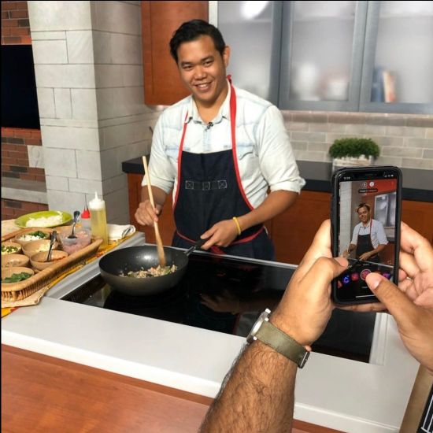
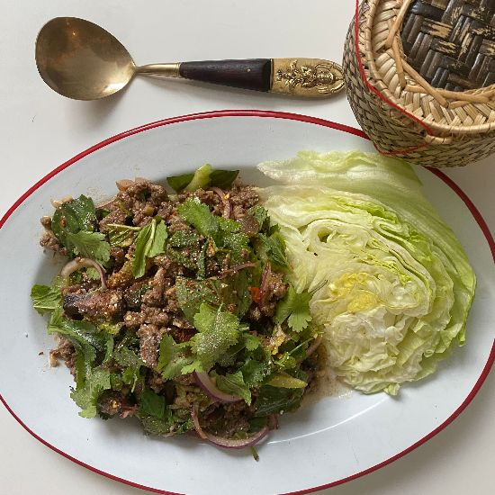
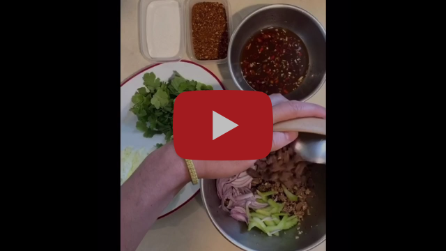
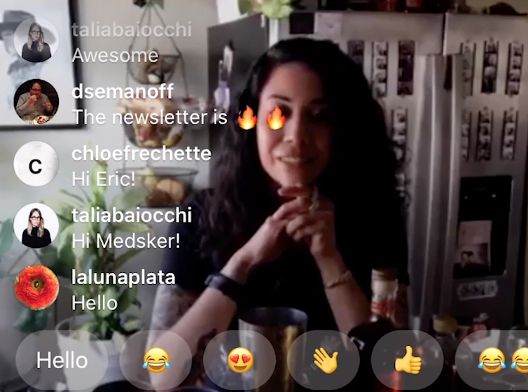
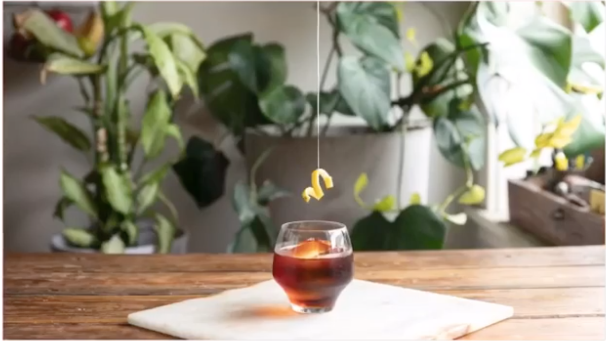
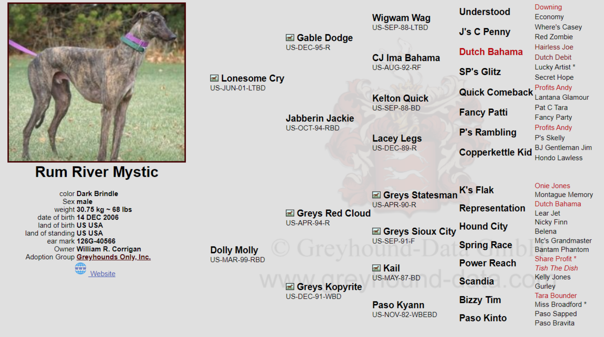

# Lost Lake Community Thread: Volume 8

*2020-04-16*

Hello and welcome to the ninth edition of the newsletter!

It's Thursday, April 16th — the sad/weird one-month anniversary of the day we closed for service. But also a happy date: my sister-in-law Ashley's birthday! She founded an incredible organization called [Chicago Period Project](https://www.chicagoperiodproject.org/), and their work is now more important than ever. In honor of her birthday, and of all the orgs continuing their vital community work here in Chicago, consider [syncin' your cycle](https://charity.gofundme.com/o/en/donate-widget/6707) with Chicago Period Project!

Okay, that's my promotional plug of the day. Let's get on with the good stuff: Fred celebrates Songkran with some DELICIOUS laab and a terrific playlist, Alex muses on the different types of bitterness this time has brought, Alicia makes two cocktails, and we answer a very personal call on the request line!

Until next week!

love,
Shelby

## HAPPY 2563! FRED HELPS US CELEBRATE SONGKRAN

Songkran — also known as the Thai New Year — is April 13th, but is typically celebrated April 13th-15th to allow time for people to travel back home and celebrate with loved ones. The word comes from Sanskrit and translates to an “astrological passage.” It is borrowed from "Makar Sankranti," the Hindu harvest festival celebrating the arrival of spring in India during January. In modern times, Thais celebrate Songkran through a couple of different festivals. One of the main ones is a water festival which represents the washing away of one's bad luck and misfortunes. Songkran is also a festival of unity for all people to come together and pay reverence to those who have made sacrifices, ancestors, and loved ones who have passed. It is now year 2563!

As a former East Asian Anthropology major, I still find myself tracking down why certain dishes came to be. One of the coolest discoveries I love to share is about Laap (aka larb), the bright, herbal and spicy minced meat "salad" a lot of us have come to love. It is often eaten during Songkran as well! According to York University Department of Anthropology and Stanford Linguistics professor Dan Jurafsky, Marco Polo had written extensively about his 24 years of travels throughout Asia and, in 1298 while he was sitting in captivity after returning home to Venice, unknowingly documented laap. His account stated that he was in Southern China, Yunnan, or Nanzhao — the borders were loosely established depending on the year and who you asked. It is likely he was in or near the outskirts of what was part of Burma or the Khmer Empire, and is now part of Thailand/Laos.

Polo wrote: *For the poor men go to the butchery and take and buy the raw liver as soon as it is drawn out of the animal and chop it small. And then he puts it in salt and in garlic sauce made with hot water and spices and eats it immediately.* Since chilies were not introduced into this area at this point in time, it is likely that indigenous spicy herbs, roots, alliums (both raw and cooked), peppercorns, and dried spices were used from spice trades to make this dish. If you Google image search "Thai larb lu," you can find a very close depiction of that dish, which is an herbal Northern Thai dish of minced meat, offal, and blood.

**History lesson**: The Republic of Venice and the Republic of Genoa had a series of wars over the dominance of the Mediterranean Sea between 1256-1381 which ended up being inconclusive. These wars were directly correlated to the Silk Road trade routes which Marco Polo's merchant father was a part of. There were four significant wars total with decades of peace in between each war. In 1295, Marco Polo had returned to his home in Venice and right into the second Venetian-Genoese war — the War of Curzola, 1295-1299 — which did not have much significance, but had the most casualties. Needless to say, Venice lost to Genoa, hence Marco Polo's imprisonment.

As Songkran comes to an end, and as I pay reverence to my ancestors and those who share my culture, I have written a recipe that is based on the first documented version of Laap (minus the blood part.) It is a thoroughly indigenous dish — hyper-regional, seasonal, and a huge staple in many Southeast Asian cuisines. There are so many different renditions and variations of this recipe, and because these are quarantine times, I used what I had in my pantry to put this together.

**Laap (2-4 servings)**
1 lbs lean ground beef (lean chicken, pork, or lamb works well too)
1/2 cup beef or chicken broth (water works too)
3 cloves garlic, minced
1 Tbs fish sauce
1 tsp chili flakes
1/2 tsp ground cumin(use more cumin if using lamb)
1/2 tsp ground coriander
1/2 tsp ground white pepper
1/2 tsp ground black pepper
1/2 tsp salt

For the dressing
zest from one lime
1/4 cup lime juice
1/4 cup Tbs white or rice wine vinegar
1/4 cup fish sauce (I prefer Squid brand or MegaChef brand if you can find it)
1 Tbs sugar(I used honey and brown sugar for a more nuanced sweetness)
5 cloves of garlic, minced
1-10 Thai chilies(you decide how spicy you want it), minced
pinch of Thai chili flake(optional)
-whisk all of this together until sugar is fully dissolved, taste and adjust to your liking. Refrigerate until you need it.

For the salad
3-5 sprigs of mint(10-15 leaves), torn
5 sprigs of cilantro with the stem on, chopped
1/4 of red onion, thinly sliced
Greens(I like to use whatever lettuce I have and some roughly chopped green cabbage)
1 Tbs Toasted jasmine rice powder
Large pinch of Fried shallots

-Start the [Songkran playlist](https://open.spotify.com/playlist/1ttMUQTQeayMxPn8feRmUF)!
-In a large saute pan heated over medium heat, add a Tbs of neutral oil and your ground meat. Use a spatula or wooden spoon to break up any large clumps of meat. Cook for 2-3 minutes, should still be fairly undercooked.
-Add all the spices, garlic and seasonings. continue to cook for one minute. You are not looking to get much browning on the meat, just cooking it more and breaking up clumps.
-Add your fish sauce and broth or water. Turn the heat up to high and continue to cook until the liquid is almost evaporated. The meat should be fully cooked at this point. Turn off the heat and transfer to a large mixing bowl. Let cool for 5 minutes.
-Add 1/2 cup of the dressing to the meat and stir in. Taste it for seasoning, add more if you'd like.
-Stir in the mint, cilantro, onion, and cabbage; transfer to a serving plate or bowl and garnish with fried shallots and rice powder. Eat with steamed rice, sticky rice or lettuce cups!

Pro tip: if you have leftover grilled or roasted meats you want to use up, make extra dressing and toss it together with the salad portion.

## ALICIA ON THE TINY SCREENS

*Click to play: Alicia making a classic Hotel Nacional Special on*[*Punch's Tip Your Bartender*](https://punchdrink.com/articles/tip-your-bartender/)*series!*

*Click to play: Alicia and Moll make the world's cutest stop-motion cocktail video — plus a recipe that will leave your tongue lollin'!*

## REQUEST LINE: ALEX IS BITTER

The time given to me by being in quarantine has led to many hours of introspection and self-reflection. Only recently, though, have I begun to write my thoughts down. As of right now, my thoughts on the world (the one we left behind and the one we may step into post-quarantine), politics, and the hospitality industry (what it was and what it could be) have all been a bit bitter, if I am being honest. Much like the flattening of the curve, though, I do see outliers: little pieces of positivity and future productiveness that pepper the bitter portions of my paragraphs. And perhaps those words will one day find a home on our lovely Lost Lake newsletter. But today I wanted to share something bitter that many of our readers might like a tad better than my musings, and that is a couple of cocktails using a staple stay-at-home-bartender ingredient: Campari.

This first cocktail is named Ruby Mae’s Second Surfing Bird. You can find this delicious gem on Lost Lake’s *Whisper Menu*. Is there a Rube Mae’s (first) Surfing Bird? Yes, there is. Is that cocktail a riff on a classic Jungle Bird? Yes, it is. So, safe to say the second bird is a riff on a riff — equally tropical and flavorful. This cocktail can be buzzed, blended, or shaken to work with however you’re able to make cocktails at home. This one is also a little sizeable, so feel free to share with your quarantine buddy!

**Ruby Mae’s Second Surfing Bird**
1.75 oz reposado tequila
.75 oz mezcal
.75 oz Campari
.75 oz ruby port
1.5 oz pineapple juice
1 oz lime
.75 oz passionfruit syrup (we like Small Hand Foods from Binny's!)
.5 oz simple syrup
*Combine all of these ingredients into a shaker tin, buzz for three seconds with one cup of crushed ice, and pour over fresh ice into your favorite tropical mug!*

The next drink on our crushable Campari cocktail compendium (this is more of a booze-forward sipper, actually) is the Kingston Negroni. Much like its predecessor, the Kingston Negroni utilizes only three ingredients for this cocktail: rum, Campari, and sweet vermouth. Lost Lake being Lost Lake, though, we use two Jamaican rums in this cocktail that play very well with the other two ingredients, making this cocktail way more than the sum of its parts.

**Kingston Negroni**
1.5 oz Appleton Signature Blend (aged Jamaican rum)
.5 oz Smith and Cross (funky overproof Jamaican rum)
.75 oz Cocchi di Torino sweet vermouth
.75 oz Campari
*Combine all of these ingredients into a mixing glass. Fill the mixing glass near half way with Kold Draft ice, and stir for ten seconds. Strain your cocktail into a tumbler or rocks glass over one large cube of ice or a few fresh cubes. Express a bit of orange peel over the top and have at it!*

## REQUEST LINE: RUM RIVER MYSTIC

This drink is a really special one and has been in rotation for a while — predating Lost Lake, even! Rum River Mystic takes its name from the beloved greyhound of Lost Lake BFF (and investor!), Molly Marcucci. Upon his rescue by Greyhounds Only, Rum River Mystic was renamed Mr. Marmol — but his racing name lives on with this delicious stirred cocktail.

Now, this is definitely a recipe with some esoteric ingredients. But! When I find a recipe I love, I go the distance with it — and this is definitely one of those builds, which I think makes investing in some not oft-used bottles pretty worth it. You can batch it up and keep it bottled in your fridge, too — just wait to add the bitters until you're ready to enjoy!

Molly herself is more of a daiquiri frappé girl, but she's been known to (pretend) to sip one of these every now and then. Cheers to Mr. Marmol and his human soulmate Molly! Molly, next time I name a cocktail after something special of yours, I promise it will be a drink you love.

**Rum River Mystic**
1 oz Don Pancho 8 (aged Panamanian rum)
1 oz Rittenhouse Rye
.75 oz Byrrh Quinquina
.25 oz Benedictine
2 dash Angostura Bitters
4 drops Bittermen's Elemakule Bitters
*Combine all ingredients except Elemakule Bitters in a mixing glass, add cubed ice and stir for 10 seconds. Keep the back of your spoon against the wall of the glass and try to just "spin" the drink — your aim is to chill and dilute, not agitate or aerate. Strain into a rocks glass over a big ice cube, and add 4 drops of Elemakule Bitters to the top of the ice cube. If you can, make fresh ice the night before! The fresher the ice, less time it has to absorb your weird freezer aromas.*

## LOST LAKE PET PARADE

Hannah's purr-baby Sancho Panza!

3yrs old (ish)

Favorite pastimes:
- sprinting back and forth in the house
- destroying blinds and screens
- tucking his face under his paw when he sleeps
- meowing at the door like he wants to go outside but then chickening out and backing away when the door opens

His cocktail? Probably a vodka soda. Three limes. Grey goose. (Cause it’s a bird.)
