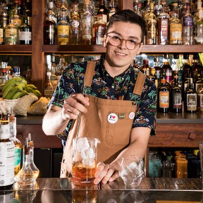
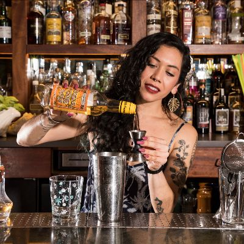
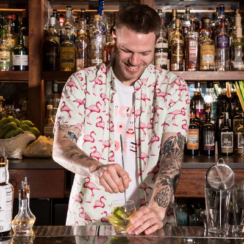
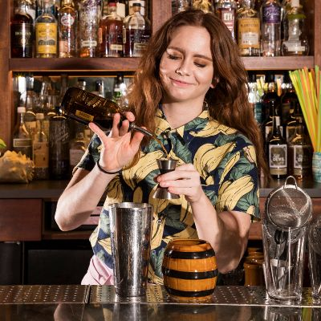
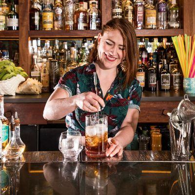
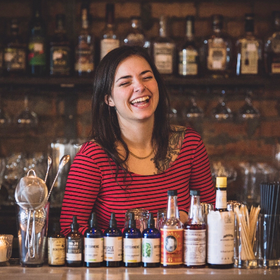
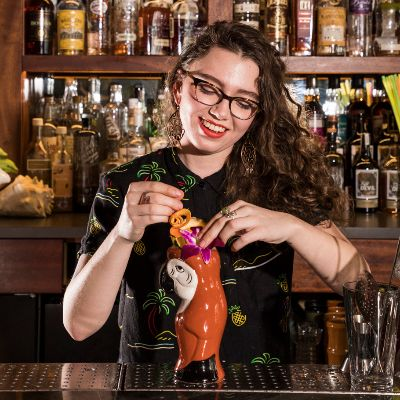
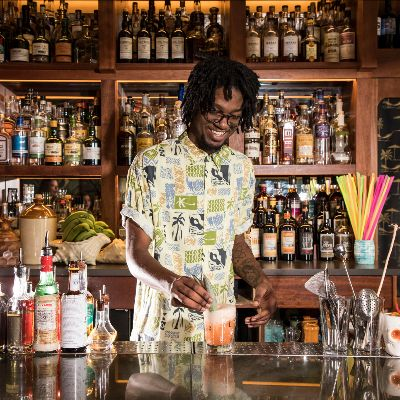

# Lost Lake Community Thread: Volume 10

*2020-04-21*

Hello, and welcome to the tenth (TENTH!) edition of the newsletter! Can you believe it? I sure didn’t think we’d still be all-the-way-closed closed, writing newsletters in the middle of April. You know what feels like a million miles away from here? Busy bars.

You guys, we miss work! Even the stuff we used to complain about, like being totally slammed on the weekends. It's making us pine for weird moments... For example: that special feeling that comes with being totally weeded in the service bar on a Saturday night and then seeing a ticket come up for all shaken and stirred drinks (aka, drinks with no garnish). They’re usually just three or four ingredients, giving you a break from the avalanche of tickets stacked with eight-touch cocktails.

So, let us share that feeling with you! Yes, this is a long ass service ticket — but look at those builds! It’s a favorite three ingredient cocktail from each of the nine Lost Lake bartenders. This is the order you’ve been looking forward to since twelve Fogcutters ago.

love,
Shelby

## ALAN

Gimlet! They're delicious and their flavor is heavily influenced by the type of gin you pick. I feel like the gimlet has a huge range — you can go for something lighter and more floral to something super-dry and almost bitter, and also like everywhere in between. I love Hayman's Old Tom Gin.

**Gimlet**
2 oz Hayman's Old Tom Gin
.75 oz fresh lime juice
.5 oz simple syrup
*Add all ingredients to a cocktail shaker along with half of the spent lime hull and ice cubes. Shake it as hard as you can for ten seconds (your mantra: too cold to hold!) Strain into a chilled cocktail glass. Bonus points if you have a fine mesh strainer to "double strain" through — capturing those little ice chips before they end up floating in your cocktail will save it from further dilution as you sip.*

## ALEX

Queen’s Park Swizzle! 1. You get to show off that lele* skill; 2. Mint is still an underrated garnish/ingredient; 3. Delicious cocktail with an 'Ango Halo'.

*Bois Lele: those wooden swizzle sticks we use at Lost Lake. You can order one [here](https://www.cocktailkingdom.com/swizzle-stick)!

**Queen's Park Swizzle**
1.5 oz El Dorado 5 Year Rum
.75 oz lime
.75 oz simple syrup
*Lightly press six mint leaves and drop into glass. Add all ingredients, then a cup of crushed ice. Using your , swizzle that drink!

How to Swizzle: Jiggle your swizzling tool (bois lele, bar spoon, milk frother, kabob stick, etc) down into the ice where all the liquid ingredients are. Hold the swizzle stick between your palms and quickly rotate the stick by rubbing your palms together. As you rotate, move the stick up and down, so the ingredients and ice become incorporated, and a nice layer of frost begins to form on the outside of the glass. This chills, aerates, and properly dilutes the drink. Remove the swizzle, top with more crushed ice and pack it down with your cupped palm.

To garnish with an Ango Halo: Dash Angostura Bitters on the top of the packed crushed ice so that just the top half inch of ice is red.

Finish with a big bouquet of spanked mint. Place your straw right in the middle of that mint and take a big sniff with every sip!*

## ALICIA

Daiquiri! A refreshing drink that is easy and versatile. Change the rum, change the drinks flavor profile — though, I'll usually land on a white rum. El Dorado 3 Year if I'm looking for something more tropical, Probitas if I'm vibing something more dry, and Neisson 100 if I'm wanting something more vegetal.

**Daiquiri**
2 oz El Dorado 3 Year
1 oz fresh lime juice
.75 oz Dubois Petite Cane Syrup (or a rich simple syrup, 2:1 sugar:water)
*Add all ingredients to a cocktail shaker along with half of the spent lime hull and ice cubes. Shake it as hard as you can for ten seconds (your mantra: too cold to hold!) Strain into a chilled cocktail glass. Bonus points if you have a fine mesh strainer to "double strain" through — capturing those little ice chips before they end up floating in your cocktail will save it from further dilution as you sip.*

## ANDY

Topo-Ti Punch! I love it because it truly makes me feel like I’m drinking. There aren’t too many spiritfree cocktails that you can sip and enjoy over a nice big rock.

**Topo-Ti Punch**
3 oz Topo Chico (chilled)
barspoon Dubois Petite Cane Syrup (or a rich simple syrup, 2:1 sugar:water)
lime coin
Vince’s Pro Tip: a pinch of salt
*Cut a quarter-size disk of lime, making sure to include a small amount of flesh. Squeeze the lime disk over an old-fashioned glass and drop it into the glass. Add the cane syrup and, using a barspoon, press against the lime to release its oils and integrate them with the syrup. Add a large ice cube, pinch of salt (if using), and pour in the Topo Chico. Give it a quick stir to dilute and cool down.*

## DESIRA

Fino-Agricole Daiquiri! I found that bartenders that don’t usually like cocktails are partial to a fino/rhum daiquiri — Desira’s no exception!

**Fino-Agricole Daiquiri**
1 oz fino sherry (or manzanilla!)
1 oz Clement Premiere Canne Rhum Agricole
.75 oz fresh lime juice
.5 oz Dubois Petite Cane Syrup (or a rich simple syrup, 2:1 sugar:water)
*Add all ingredients to a cocktail shaker along with half of the spent lime hull and ice cubes. Shake it as hard as you can for ten seconds (your mantra: too cold to hold!) Strain into a chilled cocktail glass. Bonus points if you have a fine mesh strainer to "double strain" through — capturing those little ice chips before they end up floating in your cocktail will save it from further dilution as you sip.*

## HANNAH

Negroni Sbagliato! It’s the perfect balance of bitter and bright — with some bubbles to boot! I like it best with Cocchi di Torino sweet vermouth, or a total divergence from the classic with Alessio Bianco.

**Negroni Sbagliato**
1.5 oz Cocchi di Torino Sweet Vermouth
.5 oz Campari
sparkling wine
*Build this cocktail in a wine glass! Add vermouth and Campari, fill glass 3/4 with ice. Top with sparkling wine and give a little stir. Garnish with a looooooong orange peel (my grandma calls them horse's necks!) expressed, and then rolled into a rosette and nestled in the ice.*

## LOUISE

Martini! I’ve been drinking a lot of martinis in quarantine. Much like Alicia and her Manhattan, the martini was the first cocktail I had that made me realize cocktails are important. The martini is also where my love for vermouth began. When making a martini I keep it clean and simple and make sure that my vermouth is quality and fresh. Always always refrigerate vermouth after opening it!

**Louise's Martini**
2 oz gin (I prefer a London dry gin like Plymouth)
.75 oz dry vermouth ( I’m partial to Yzaguirre extra dry or Bordiga extra dry)
*Stir over cracked ice for about ten seconds. I like to place one finger on my mixing glass and when the ice just starts to create condensation, I know there is the correct dilution. If you are using a navy strength gin, you may want to stir longer. Strain into a chilled glass. I like to garnish with a lemon twist and a castelvetrano olive. If I’m really trying to dress it up, I’ll put a dot of olive oil on the top.*

## SHANNON

Toronto! It's a recent favorite of mine that we’ve had on our #Shiftease menus recently. A brown-and-stirred, the combination of rye or Canadian whiskey with Fernet and a little sugar is lovely and herbaceous.

**Toronto**
2.5 oz Rye Whiskey or Canadian Whiskey
.25 oz demerara syrup
Barspoon Fernet Branca
*Combine all ingredients in a mixing glass, add cubed ice and stir for 10 seconds. Keep the back of your spoon against the wall of the glass and try to just "spin" the drink — your aim is to chill and dilute, not agitate or aerate. Strain into a chilled cocktail coupe.*

## VINCE

Remember the Alimony! I love Cynar and this is a great negroni riff.

**Remember the Alimony**
1 oz London dry gin
1 oz fino sherry
1 oz Cynar
*Combine all ingredients except Elemakule Bitters in a mixing glass, add cubed ice and stir for 10 seconds. Keep the back of your spoon against the wall of the glass and try to just "spin" the drink — your aim is to chill and dilute, not agitate or aerate. Strain into a chilled cocktail coupe.*
