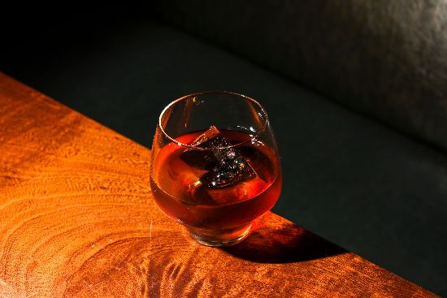
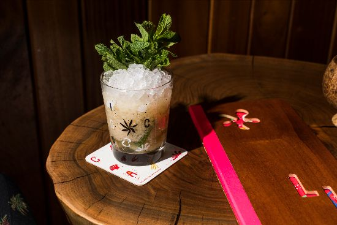
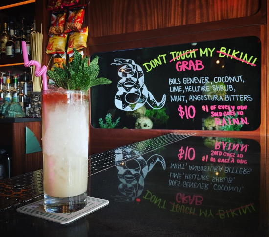
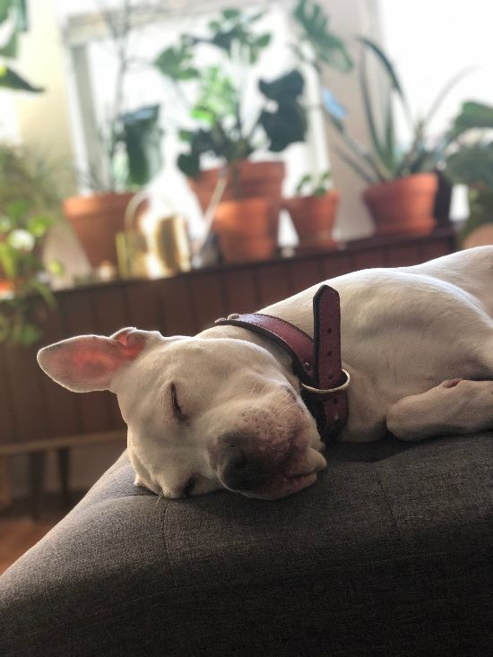

# Lost Lake Community Thread: Volume 11

*2020-04-23*

Hello to all y'all and welcome to the eleventh edition of the newsletter!

Today, Thursday, April 23rd, we're going to swing that pendulum about as far as we can from Tuesday's easy three-ingredient cocktails! You guys sick of making banana bread? Let's do a little at-home-sous-vide with all those overripe bananas on the counter you've been trying to ignore. We'll also make some orgeat, answer a call on the request line, and meet another Lost Lake pet —plus make her favorite bourbon cocktail!

We really, really appreciate all the kind notes and Instagram tags of your at-home-bartending adventures! Keep 'em coming — and don't forget you can dial up the request line by replying to this email.

Happy weekend!!

love,
Shelby

## PAUL ANSWERS THE QUESTION: WHO INVENTED THE BANANA BOULEVARDIER?

The Lost Lake version of the Banana Boulevardier (named 'Who Invented the Banana Boulevardier?') is inspired by both Terry Williams's version served at one of my favorite bars, [Anvil Bar and Refuge](https://www.instagram.com/anvilhouston/) in Houston (shout out to my hometown!), and Austin Hennelly's version served at [Majordomo](https://www.instagram.com/majordomola/) in Los Angeles. Terry started off by combining Campari and Giffard Banane de Brazil as a [house shot](https://punchdrink.com/articles/everyone-invented-bananavardier-banana-boulevardier-cocktail-recipe/) that quickly turned into a delicious Boulevardier riff using bourbon, sweet vermouth, Campari, and the banana liqueur. Austin, taking what he learned at Booker and Dax in NYC, decided to infuse Japanese whiskey with cooked bananas and clarified the mixture using a centrifuge.

I decided to borrow a bit from both techniques in this version — it's a bit easier to prepare and is still so delicious. Of course, I had to add a bit of funky Jamaican rum to the mix, which further enhances the banana flavor and adds a bit of complexity.

**Who Invented the Banana Boulevardier?**
*(makes 3-4 servings)*
4 oz Four Roses Single Barrel Bourbon
2 oz Velier Hampden 46 Jamaican Rum
3 oz Cocchi di Torino Sweet Vermouth
1.5 oz Tempus Fugit Creme de Banana
1 oz Campari

To infuse (using a sous vide wand, ya fancy home chefs):

- Using a sealable bag and a vacuum bag sealer, seal the bottom of the bag (really make sure that bottom is sealed!)
- Add Boulevardier batch and 1 ripe/overripe banana
- Using the vacuum bag sealer, seal the top of the bag (again, make triple sure the top is sealed.)
- Grab a pot and the Anova Sous Vide machine.
- Fill the pot with hot water ¾ of the way to the top
- Attach the Anova wand and set for 140 degrees and timer for 2 hours
- Press start. When the temperature reaches 140 degrees, submerge the bag into the pot. When Timer goes off, remove the Anova wand, dump the hot water and fill with ice and cold water.
- Place the sealed bag in the ice water for 5 minutes.
- Cut the top corner of the bag and strain into a bottle or decanter and place in refrigerator.

Don't have a sous vide at home? (lol) Here's how to infuse using a modified technique:

- Add Boulevardier batch and one really ripe banana to a large ziplock bag and seal — squeezing out as much air as possible.
- Fill the pot with hot water ¾ of the way to the top and bring to 140 degrees. Submerge the bag until all of the batch is in the hot water and use a clothes pin to clip the top of the bag to the side of the pot.
- Simmer for 2 hours
- When timer goes off, remove the bag, dump the hot water and fill the pot with ice and water.
- Place the sealed bag in the ice water for 5 minutes.
- Unlock the top corner of the bag and strain into a bottle or decanter and place in refrigerator.

To serve:
Pour 4 oz of batch into a mixing glass with ice and stir for 5 seconds. Strain over a big rock in an old fashioned glass. Garnish with expressions from lemon and orange peels, discard the peels.

## LET'S MAKE ORGEAT!

Many of the recipes we've shared in our lil newsletter here have featured orgeat. It's fatty, nutty, floral, delightfully sweet — what more could you ask for in a syrup?

It's true that our favorite brand of shelf-stable, store-bought orgeat to recommend is from [Small Hand Foods](https://smallhandfoods.com/). (If you snag a bottle of anything Jennifer Colliau is making, you're in for a treat!) But when it comes to making your own orgeat, there are a few schools of thought.

At Lost Lake — when it comes to all of our house-made syrups —we usually keep things pretty simple, letting each ingredient really shine. For our orgeat, we forgo commonly used additions like orange flower or rose water, and opt instead to look for floral notes in [fancy expensive Italian Pizzuta almonds](https://www.gustiamo.com/peeled-pizzuta-almonds/), instead.

Another reason why orgeat is so wonderful: you can make so many different kinds! Our current menu features three: almond, pistachio, and macadamia. Bascially, just...go nuts! (Sorry.)

**Lost Lake Orgeat**
You'll need:

- 1 pound of raw almonds (skinless is preferred, but it's also okay if not!)
- white sugar
- cheesecloth or nut milk bag
Soak the almonds in water for 24 hours, using just enough water to cover the nuts — and making sure not to soak longer than 24 hours. Strain the water from the soaked nuts and add equal amount of fresh water by weight to the weight of the soaked almonds. Pour into nuts and fresh water into a blender and blend until smooth. Press blended mixture through a nut bag or cheesecloth to get your almond milk!

Add almond milk and an equal amount of sugar by volume to a pot over medium heat. Stir until all sugar crystals have dissolved. Cool before using. That's it! So simple — but everything depends on the quality of those almonds (or other nut). This orgeat will keep in your fridge for two weeks.

## REQUEST LINE: DON'T TOUCH MY BIKINI

[*ugh remember 2016*](https://www.instagram.com/p/BLW28NBhmoh/)

Don't Touch My Bikini is a really wonderful and deceptively simple cocktail — but the whole thing hinges on the spirit: malty, earthy, Dutch 'gin' called genever. (If you're curious, you can find more than you probably ever wanted to know about the spirit [here](https://www.diffordsguide.com/beer-wine-spirits/category/413/genever/jenever).)

The name comes from the [Halo Bender's song](https://open.spotify.com/track/1fcZq96QZkAkEHcC1FlH9l?si=4iG1zraAQg2fe5t58sBSFw) of the same name — and if you listen closely you'll probably hear other cocktail names on that album. What can I say, I love to borrow Halo Benders lyrics ¯\_(ツ)_/¯

But the best thing about this cocktail is that she has a spiritfree sibling, developed by Lost Lake's former 'mocktologist' (and MY sibling) [John Allison](https://www.instagram.com/p/BRl3NmgFs1U/)! Remember him? He's the best. John's a UPS driver now — send him some virus-repelling vibes while you enjoy his no tipple sipper!

**Don't Touch My Bikini**
1.5 oz genever gin
.75 oz fresh lime juice
.75 oz coconut cream
0.5 oz cane syrup or rich simple syrup
five drops Bittermens Hellfire Shrub
Angostura Bitters halo
mint bouquet
*Add all ingredients (except Angostura Bitters and mint) right into your drinking vessel along with one cup of crushed ice. Using your swizzle tool, swizzle that drink!

How to Swizzle: Jiggle your swizzling tool (bois lele, bar spoon, milk frother, kabob stick, etc) down into the ice where all the liquid ingredients are. Hold the swizzle stick between your palms and quickly rotate the stick by rubbing your palms together. As you rotate, move the stick up and down, so the ingredients and ice become incorporated, and a nice layer of frost begins to form on the outside of the glass. This chills, aerates, and properly dilutes the drink. Remove the swizzle, top with more crushed ice and pack it down with your cupped palm.

To garnish with an Ango Halo: Dash Angostura Bitters on the top of the packed crushed ice so that just the top half inch of ice is red.

Finish with a big bouquet of spanked mint. Place your straw right in the middle of that mint and take a big sniff with every sip!*

**Don’t Touch My Car Keys**
1.5 oz coconut syrup
0.75 oz lime
3 oz Topo Chico (chilled)
Halo of Fee Brothers Old Fashioned Aromatic Bitters
mint bouquet
*Same preparation technique as Don't Touch My Bikini!*

## LOST LAKE PET PARADE

*Meet Andy's dog Brella!*

This is Umbrella Allison aka Brella aka Duddies Marie — her Pilsen name from my sister-in-law's mom, Yoli! (Brella comes from [Rihanna](https://open.spotify.com/track/49FYlytm3dAAraYgpoJZux?si=IXdBCnTKTA6CMxUcHTqtaQ), obviously.)

We think she is 10 years old. She was born totally deaf and is the laziest and most loving cuddle-buddy. When my brother John worked at Ravenswood Elementary a teacher brought baby Brella in to see if anyone would adopt her — the teach had dog-napped her from the next door neighbor who allegedly used pit bulls in dog fights.

I used to “dog-sit” Brella for days and weeks at a time when John and I lived down the hall from each other. When my sister-in-law Ashley was pregnant with their first baby, and I told them that Brella is now officially *my* daughter.

Brella has been living with me for almost 8 years, but officially mine for 6. She would most likely drink the Hazy Lazy, Like, Kinda Crazy because that fits her personality to a T. She is the laziest 'person' I have ever encountered — but she also has crazy spurts of energy where she'll drop her ass low and sprint from one end of the house to the other.

**Hazy Lazy, Like, Kinda Crazy**
2 oz bourbon
1 oz fresh lemon juice
.5 oz mango puree
.5 oz vanilla syrup ([here's a good one](https://bgreynolds.com/products/divine-vanilla) available at Binny's!)
.5 oz ginger syrup ([newsletter #7](https://us19.campaign-archive.com/?u=e437b38f3870b08a9e1545937&id=8d31ba2d72)!)
2 dashes Angostura Bitters
*Combine all ingredients in a cocktail shaker with one cup crushed ice. (You can just bust up a bunch of freezer ice with a rolling pin!) Give it a good shake for about 5 seconds, then pour the entire contents into your cutest glass (we call that a 'dirty dump' lol). Top with more crushed ice, and garnish with tropical things! We like a cinnamon stick (snapped in half to release those good smells) on this one.*
