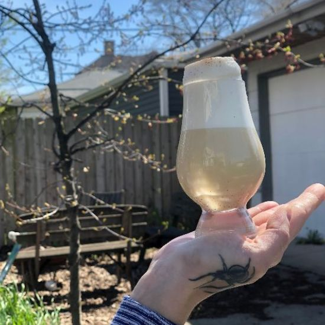
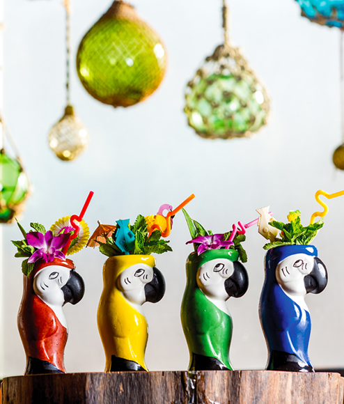
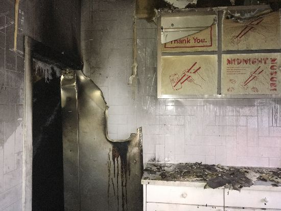
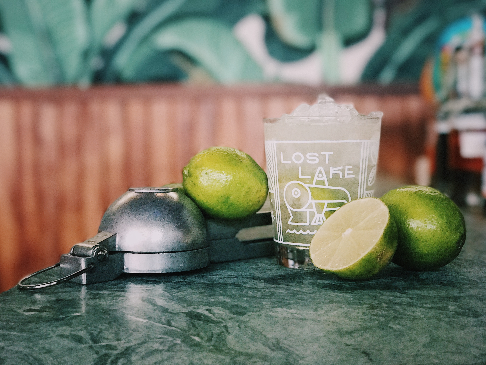

# Lost Lake Community Thread: Volume 12

*2020-04-28*

Hello, friends!

Today is Tuesday, April 28th — the last Tuesday of the month aka #SHIFTEASE! #Shiftease is a special night on our calendar because we wear Lost Lake t-shirts instead of full tropical regalia and listen to our favorite non-tropical tunes. (If I were working tonight I'd definitely pull rank and torture everyone by putting Fiona Apple's new album on repeat.)

In today's newsletter you'll learn about the origins of #shiftease and make one of our favorite shifty cocktails — plus Louise has a drink to keep your shaking muscles conditioned and Shannon answers a call on the request line.

See you Thursday!

Love,
Shelby

## LOUISE'S SHAKE WEIGHT FIZZ

As a bartender, the call for a Ramos Gin Fizz can sometimes be a dreaded one — but now with unlimited free time and no tickets stacking up around me, I find myself craving a difficult build. I also have had haunted visions of my first night back behind the Lost Lake bar, crying because I’ve lost all of my shake muscles, my arms turned to noodles while I helplessly slosh a daiquiri. An egg white drink that can require up to twelve full minutes of shaking seems like the perfect way to stay in practice!

The original Ramos Gin Fizz was invented in 1888 in New Orleans at the Imperial Cabinet Saloon by Henry C. Ramos. The Ramos boasted a decadent mix of heavy cream, egg white, sugar, gin, citrus, and orange blossom water — plus a hefty dose of elbow grease to emulsify the mixture. This luxurious velvet concoction became wildly popular and to this day remains a classic of the cocktail canon.

After several sad gray rainy days, the sun finally came out yesterday and I thought it was the perfect time to play with Ramos variations to imbibe in my backyard. I came up with a fun little jammer that I am calling Louise's Shake Weight Fizz. Now get your biceps ready and let’s shake!

**Louise's Shake Weight Fizz**
2 oz Plantation Xaymaca (funky Jamaican rum)
1 oz Jarritos grapefruit soda
.75 oz lime
.75 oz ginger syrup
.5 oz heavy cream
1 egg white
1 dash angostura
Ground cinnamon for garnish
*Pour soda into the base of a Collins or snifter glass. Combine all ingredients except cream and soda in a tin and add one ice cube. Now if you want a little extra help with fluffing up your egg white, remove the spring from a hawthorn strainer and drop that into the tin as well, the spring will act as a whisk while you shake and add that extra whip for the ultimate egg white foam. Tightly seal your tin and shake shake shake shake until the ice cube has disappeared and the mixture feels fluffy and aerated, like you’re shaking a large cotton ball. Then add cream and enough ice to fill the tin and shake hard (read: HARD!) for ten seconds. Double strain into your glass over the soda. Once the mixture reaches the rim of the glass, allow it to settle and release its major air bubbles. Once the cocktail has settled sloooowly pour the remainder of the tin directly into the center of your drink. I sometimes like to use a straw or bar spoon to poke a hole down to the base of my drink and then pour into that hole — this will make the head of the drink rise up like a beautiful cloud. Dust with cinnamon for garnish and enjoy!*

## SHANNON ANSWERS THE REQUEST LINE: HEAVEN IS A PLACE/THIS IS THE PLACE

Much like the Belinda Carlisle song where this cocktail got part of its name, Heaven is a Place/This is the Place is a well-beloved jam. Whether enjoying it alone or at full volume in a ceramic conch shell with friends, this gin-based banger carries a bright, decidedly tropical tune over a lovely helping of crushed ice. Honey, allspice dram and falernum work together to bring an earthy, tropically spiced note, while the lime juice and curaçao provide the zest. Though I’m not much of a gin drinker myself (thank you, New Years 2011), I absolutely love the herbaceous backbone of it in this cocktail, as it gracefully amplifies the nuttiness of the allspice dram, the floralness of the honey and curaçao, and the tartness of the lime.

**Heaven is a Place/This is the Place**
2 oz London dry gin
1 oz lime
0.5 oz Pierre Ferrand Dry Curacao
0.5 oz Velvet Falernum
0.5 oz honey syrup
0.25 oz St. Elizabeth Allspice Dram
3 dashes Angostura Bitters
*Combine all ingredients in a cocktail shaker with one cup crushed ice. (You can just bust up a bunch of freezer ice with a rolling pin!) Give it a good shake for about 5 seconds, then pour the entire contents into your cutest glass (we call that a 'dirty dump' lol). Top with more crushed ice, and garnish with tropical things!*

## WHAT IS #SHIFTEASE?

Today is the last Tuesday of the month, which means it's time for #SHFITEASE at Lost Lake! We usually explain the inspiration behind #shiftease in a short little paragraph on the evening's menus — but now that we have the time, why don't I give you the full, ten minute version?

A couple years ago, I was asked to write a piece for the story telling series [Between Bites](http://www.between-bites.com/). The theme was "From the Ashes," and I was lucky enough to read alongside the inimitable Chicago chef (and my pal!) John Manion. You can listen to our stories in podcast form [right here](http://www.between-bites.com/between-bites-podcast/2019/5/27/from-the-ashes-somerset-pt-2), and my #SHIFTEASE story starts at 10:28.

In the spirit of #SHIFTEASE, your friends of Lost Lake ask you to consider making a contribution — donate money, raise awareness, commit to volunteer in the future, whatever works for you — to a local, grassroots organization fighting for gender, racial, or economic justice in Chicago (or wherever you live!)

Need inspiration? [Chicago Period Project](http://chicagoperiodproject.org) and [Support Staff's Comp Tab Relief Fund](https://www.pleasehustleresponsibly.org/) are both great orgs doing vital work right now.

## A FAVORITE SHIFTY: MARGARITA!

One thing you might not know about Lost Lake is that we make one of the best margaritas in Chicago. We've got more limes than we know what to do with (jk we know what to do with them), a not-too-shabby selection of agave spirits, and a daiquiri build that transitions very easily to a *most excellent* margarita. The key to this recipe is in the technique: we shake the cocktail with the spent lime hull (this is how we catch you using those fake plastic limes for juice) to impart a magical amount of that bright, beautiful lime oil.

In honor of #SHIFTEASE, it is our pleasure to introduce you to your new favorite at-home shifty:

**MARGARITA!**
2 oz blanco tequila
1 oz fresh lime juice
.5 oz Pierre Ferrand Dry Curaçao
.5 oz rich simple syrup
*Add all ingredients to a cocktail shaker with cubed ice and one half of the spent lime hull. Shake, shake, shake, repeating your now-familiar cocktail shaking mantra: Too cold to hold! When that frost has started to form on the outside of the shaker and you can hear the ice has begin to break up, dump the entire contents into your cutest margarita glass (salt the rim before if that's your jam!) and top with crushed ice. At Lost Lake, we call any cocktail that's been dirty dumped and topped with crushed ice "Party Boy Style."*
