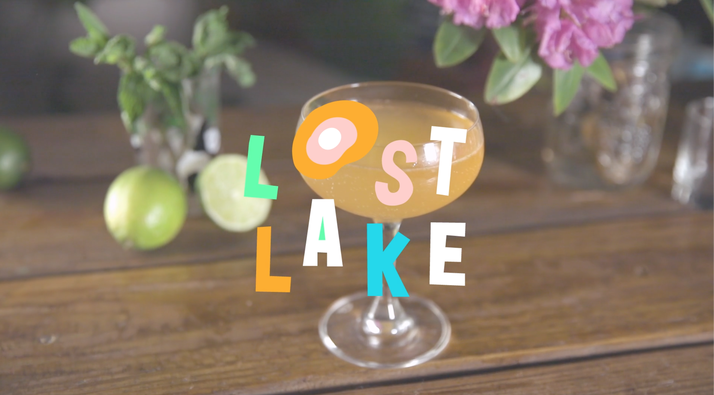
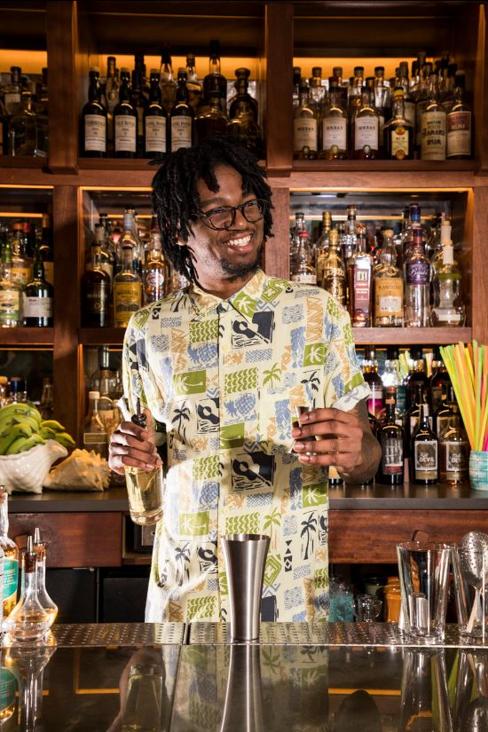
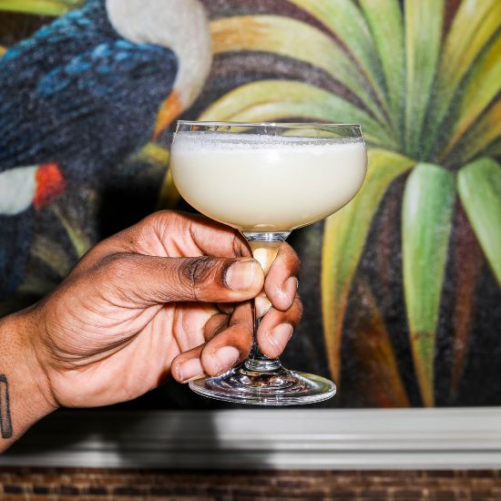

# Lost Lake Community Thread: Volume 12

*2020-04-30*

Hello, readers —

Thank you for tuning in to another episode of The Newsletter! Today, we get to visit with Alicia as she makes us the fancy cocktail we didn't even know we needed (but definitely deserve), celebrate Vince's very cool new title, and make Glassquiris on AM radio!

See you again on Tuesday when it will be May! 🤯

Love,
Shelby

## ALICIA MAKES AN OLD CUBAN

*click me i'm a very cute video!*

Because looking at a third calendar page of Life in Pajamas is tough on the ol' morale, Alicia is here to encourage us all to put on our nice soft pants (you know the ones) and pop the cork on some sparkling wine. Let's get fancy with an Old Cuban!

Video by Alicia's partner-in-quarantine, the very talented [Moll Nye](https://www.instagram.com/moll_jean/)!

## VINCE IS ONE OF PUNCH'S BARTENDERS IN RESIDENCE!

We are so proud of our own Vincent Bright, who was just selected as one of [Punch's Bartenders in Residence](https://punchdrink.com/articles/the-bartender-in-residence-relief-effort-fever-tree/)! STAND UP AND CLAP!!! VINCE! VINCE! VIIIIINCE!!!

Usually, being named a Bartender in Residence by Punch involves traveling to New York and hosting a big cocktail party to show off your skills — but that was in the beforetimes. Punch has pivoted to meet the current reality, and now being a Bartender in Residence means staying in your residence and generating a $1000 donation to a cause of your choosing. Vince chose Support Staff's Comp Tab Relief Fund:

*For his charity, Lost Lake bartender Vincent Bright selected*[*Support Staff*](https://seal-soybean-bs3f.squarespace.com/)*. Their community-based*[*Comp Tab Relief Fund*](https://seal-soybean-bs3f.squarespace.com/comp-tab)*was launched by an alliance of hospitality professionals to offer financial support to greater metropolitan Chicago hospitality workers affected by closures related to COVID-19. “There’s very little attention or assistance for the undocumented workers with whom we share this industry, and without whom this industry would not be able to function,” says Bright. “Support Staff is specifically extending financial assistance to those without existing support systems.” Bright, who grew up in a single-parent household on the South Side of Chicago, never forgets how hard his mother had to work every day to support her family. “My mom didn’t have access to the same resources I am able to tap, and I’m grateful to be able to raise awareness.”*

Since we can't all crowd around the bar with Vince, let's make one of his recipes at home: Lowtide Lifesaver!

**Lowtide Lifesaver**
2 oz Seedlip Spice
.75 oz pomegranate grenadine
.5 oz mint tea syrup
1 oz lemon juice
Fever Tree Ginger Beer
*Add all ingredients to a cocktail shaker except ginger beer. Shake with ice for five seconds, strain into a collins glass over fresh cubes of ice. Top with ginger beer.*

Vince makes his mint tea syrup with Intelligentsia's Moroccan Mint Tea. He steeps 25g of tea in 2 cups of water for 10 minutes. Strain the tea leaves, then use the tea to make a 1:1 simple syrup with white sugar.

You can make pomegranate grenadine using pure pomegranate juice (we use POM Wonderful at Lost Lake) and sugar in a 1:1 mixture.

This cocktail is also great with an ounce of London Dry Gin, if you need a little tipple in your tropical cocktail!

## GLASSQUIRIS ON THE RADIO

On Friday night, I called in to join one of [my very favorite people](https://www.instagram.com/oh_em_ji/) on her radio show — and make her a birthday cocktail!

Ji is the most excellent party girl, and she deserves a most excellent birthday cocktail. One of my favorite drinks ever is one I had in Paris several years ago (remember traveling??) at the the wonderful Pigalle cocktail bar [Glass](https://www.quixotic-projects.com/). After one sip, I asked the bartender to repeat the ingredients because I thought for sure when he said "coconut oil" that something must have been lost in translation.

Back in Chicago, an attempted recreation of the recipe with straight up coconut oil confirmed that yes — it was the very same coconut oil you cook your veggies in and massage on your sunburn and rub into your split ends. It was so effective at fluffing up an already very fluffy pineapple drink that we put it in a dasher bottle and now coconut oil is a staple on the Lost Lake bar. We even tried different oils in different drinks, like Demi's Avocado Daiquiri!

Anyway, this deceptively simple and delightfully crushable recipe is perfect for my bday bud Ji. Plus, it's a versatile recipe that can accommodate tequila and vodka lovers, too!

**Glassquiri (from Glass, Paris 2015)**
2 oz light rum (we use Plantation 3 Star or El Dorado 3 Year), but you can also use an unflavored vodka or blanco tequila!
1 oz pineapple juice (Trader Joe’s makes the best store-bought version if you can’t juice your own)
.75 oz fresh lime juice
.75 oz simple syrup
barspoon coconut oil (skinny teaspoon)
*Combine all ingredients in a cocktail shaker. Before you add ice, give it a little whisk or agitate it with a fork to emulsify the oil. Then add ice and shake that shit really, really, really hard — 'til it's too cold to hold! You need to put some work in to get that nice frothy head. Strain into a chilled cocktail coupe and garnish with a pineapple wedge.*
