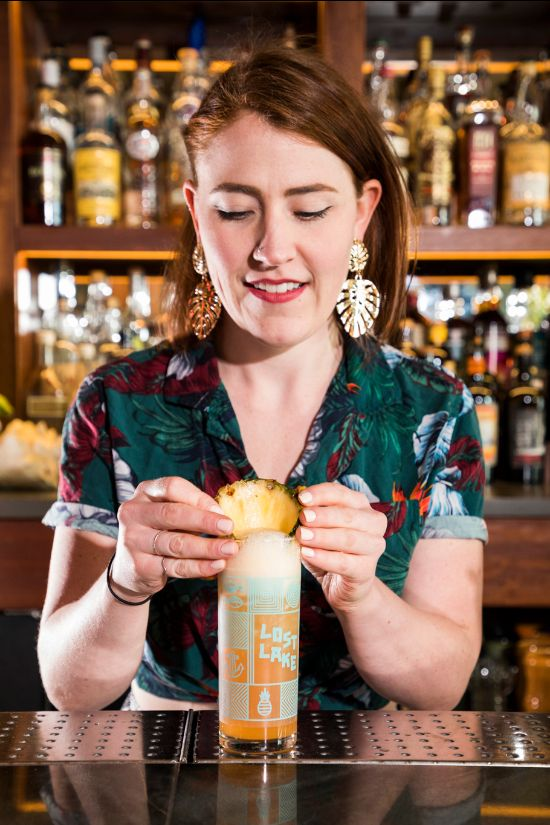
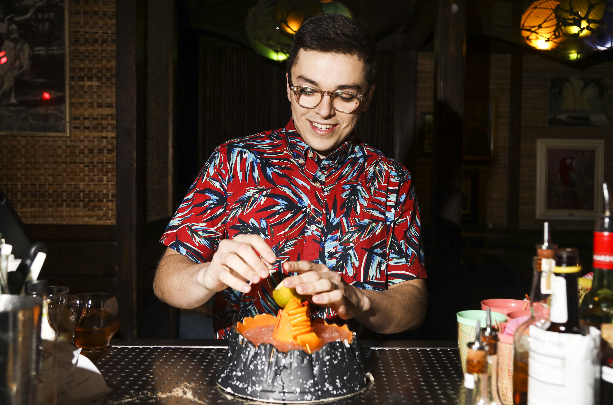
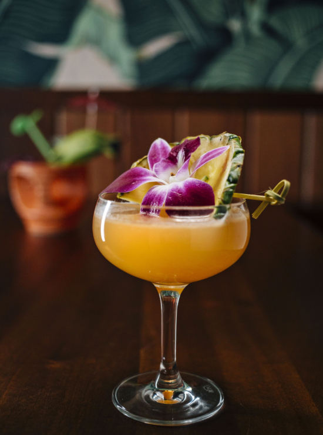

# Lost Lake Community Thread: Volume 14

*2020-05-05*

Hello, friends!!

Today is Tuesday, May 5th, and this here is the fourteenth newsletter! In this edition, Hannah talks Scotch and the classic Cocoanut Grove Cooler (spoiler: no coconut!), Alan muses on the unusual combos in current menu cocktail From Where to Where, and Paul teaches us how to make gardenia mix two different ways.

We had a big news day yesterday! Lost Lake is a James Beard Foundation Awards finalist for Outstanding Bar Program and a Tales of the Cocktail Spirited Awards semifinalist for Best American Bar Team! Pretty, pretty, pretty cool. Feels really, really, really nice.

A note on the future of the newsletter: I'll be sending a newsletter on Thursday as scheduled, but then next week I'm going to move to a once-weekly mailing. We're putting together a plan to safely bring some real Lost Lake drinks and food to you, and that's going to take up a bit more of my newsletter-writing time.

You can always access the archives [here](https://us19.campaign-archive.com/home/?u=e437b38f3870b08a9e1545937&id=763d0cd695), and please don't hesitate to reach out to me directly with any questions on recipes, supplies, techniques, and/or requests. Thank you so much for your support and understanding throughout all of this! I never thought we'd be closed for this long, and I definitely didn't anticipate how complicated it would be to fire up the machinery again in this weird new world we now live in. I'll keep you updated on new plans here, and on our Instagram.

love,
Shelby

## HANNAH AND THE COCOANUT GROVE COOLER

So I work at a rum bar. I love rum. It’s delicious. It’s history and production are fascinating. But when people ask me what my favorite spirit is, my response is invariably “I’m a scotch gal.” When we received a request for more info on our Cocoanut Grove Cooler, I got VERY excited. I get to talk about scotch! Wahoo!

Scotch is a fairly varied spirit with flavors ranging from delicate fruitiness (apple, pear, pineapple, guava) to strong burning tire-bandaid-petrol-deliciousness (otherwise known as peat). Its many nuances often pair beautifully with citrus, nuttiness, and baking spice — flavors that are extremely common in tiki drinks. And the smoke balances out some of the sweetness inherent in tropical fruits!

If it goes so well together, why aren’t there more scotch tiki drinks — or more classic scotch cocktails in general? It comes down to the fact the scotch is and has always been viewed primarily as a luxury commodity. It’s more expensive than other spirits and has always been so. It’s seen as something to be sipped by the elite, not chugged by the masses.

Maybe it was this side of the spirit that drew Tom Senger to include scotch in the first recipe of the Cocoanut Grove Cooler in 1962. By this point, the Ambassador Hotel in LA and it’s infamous Coconaut Grove nightclub were all the rage. The Grove was a true urban oasis, complete with papier-mâché trees from the set of a 1920s silent film and a navy blue ceiling studded with stars. The nightclub, like the hotel, was frequented by every celebrity worth noting — from Charlie Chaplin to Frank Sinatra to The Supremes. Perhaps Senger wanted to up the upper-class feel of his drink. Perhaps he just wanted to use a delicious spirit in a unique way. Whatever the reason, the Cocoanut Grove Cooler was a success. It was billed on their menu as “a tall and colorful thirst quencher; to see it is to feel refreshed.”

Our modern-day twist in a parrot fits the mold. For our LL version, we use a blended scotch as the base; it’s light fruitiness plays well with passion fruit and pineapple. The batavia arrack (a sugar cane spirit from Indonesia fermented with red rice) lends a little fruity smoke and funk of its own. Orange curaçao stands in for the orange juice in the original. Round things out with some homemade orgeat from newsletter 11 and you’re set to hob-knob with the LA elite!

We hope to see you back in our own little urban oasis soon. Till then, sip well and stay happy.

**COCOANUT GROVE COOLER**
1.5 oz Bank Note Scotch
.5 oz Batavia Arrack
.25 oz Laphroaig 10 year
.75 oz pineapple juice
.75 oz lemon juice
.5 oz passionfruit syrup
.5 oz Pierre Ferrand Dry Curaçao
.25 oz orgeat
.25 oz pomegranate syrup
*Combine all ingredients in a cocktail shaker with one cup crushed ice. (You can just bust up a bunch of freezer ice with a rolling pin!) Give it a good shake for about 5 seconds, then pour the entire contents into your cutest glass (we call that a 'dirty dump' lol). Top with more crushed ice, and garnish with tropical things!*

## ALAN ANSWERS THE REQUEST LINE: FROM WHERE TO WHERE

From Where to Where is one of Lost Lake's newest creations, and before we were all quarantined it was being featured on our menu. This cocktail is special because it brings together a variety of ingredients that are both unique and unusual. For those of you who have yet to try this concoction, let me give you a broad description: This cocktail is on the lighter and brighter side, but still a bit boozy, it’s going to have some floral notes along with coffee and a bit of baking spice on the finish. As the base, we are using Jamaican rum, mezcal, and tequila. We often blend tequila and mezcal in our cocktails but this one is a little unusual because calls for a healthy amount of Jamaican rum. This is only unusual because we haven’t really seen it before but hear us out!

The spirit blend is tied together by the rest of the ingredients. Along with a bit of lime juice and a couple dashes of absinthe we introduce a new ingredient, hibiscus grenadine. The hibiscus is going to give the cocktail a dry floral aspect. We mix this with a bit of coffee demerara syrup to help balance the hibiscus and add our house falernum to finish it off. The recipe for the Lost Lake Falernum is top secret but I *can* tell you that flavor wise it’s going to add the baking spice aspect to the cocktail. If it was to be compared to Velvet Falernum, one might say its drier and more spice forward, specifically clove. Almost as if we infused rum with baking spices…

Now this is a swizzled cocktail so, grab your favorite swizzle tool, a zombie glass, and some crushed Ice. Add all the ingredients into the glass plus 1 cup of crushed ice and begin to swizzle! Usually 10-15 seconds of swizzling is plenty. Top off with crushed ice and garnish with what you have available — mint and nutmeg is ideal but not necessary. Cheers!

**From Where to Where**
1 oz of Smith & Cross Overproof Jamaican Rum
.5 oz Corazon Blanco Tequila
.5 oz Bahnez Mezcal
.25 oz hibiscus grenadine
.25 oz falernum (you can use Velvet Falernum!)
.25 oz coffee demerara syrup
.75 oz lime juice
2 dashes of absinthe

## PAUL MAKES GARDENIA MIX

Don the Beachcomber’s cocktails are extremely influential to us at Lost Lake. These drinks were creative, thoughtful, and complex, and definitely not easy to recreate! As some of you already know, Don never published any written recipes and rarely even shared those recipes with the bartenders at his own establishments. Most of his bartenders only knew that a certain drink called for .5 oz of Don’s Mix #2 or Don’s Spices #4, not really knowing what was in these labeled bottles.

One of the most elusive syrup recipes is Gardenia Mix. Gardenia mix was used in Don’s Pearl Diver’s Punch, Coffee Grog and Mystery Gardenia — which all date back to 1937.

Thanks to tiki historian and author Jeff "Beachbum" Berry, we can approximate what he calls Don’s most groundbreaking and complicated syrups. In order to make gardenia mix, you’ll need to make cinnamon syrup and vanilla syrup ahead of time, but with these two on hand, you’ll also be able to make many other recipes (ahem, Don’s Mix #2 and Don’s Spices #4). We can share those recipes with you next time!

**TRADITIONAL GARDENIA MIX**
1 cup Honey
1 cup Unsalted butter, cubed
1.5 oz Cinnamon syrup
.75 oz St Elizabeth’s Allspice dram
.75 oz Vanilla Syrup
*Heat the honey in a saucepan over medium heat until it starts to thin. Add the cubed butter and whisk until melted and smooth. Add remaining ingredients and whisk until smooth. Refrigerate in between uses. Lasts 2 weeks.*

**Vanilla Syrup**
Add 1 tsp vanilla paste in a saucepan with 2 cups of sugar and 2 cups of water over medium heat until sugar is fully dissolved. Refrigerate. Lasts for 2 weeks.

**Cinnamon Syrup**
Crush 15 cinnamon sticks in a saucepan over medium heat and toast for a minute or two. Add 2 cups of sugar and 2 cups of water and heat until sugar is dissolved. Refrigerate for 24 hours and strain cinnamon sticks. Will last for 2 weeks.

During "service" (aka cocktail hour), bring the Gardenia Mix to room temperature — or do what they do at one of my favorite bars in the world, Dirty Dick in Paris, place some mix in a metal container above a candle to keep it nice and warm.

Depending on how you utilize Gardenia Mix in your cocktails, it will give you different results in mouthfeel and texture. At Lost Lake, we’ve prepared it two different ways: traditional gardenia mix and a fat washing technique where we incorporate the mix into a bottle of rum. If you would like to incorporate all of the flavors of gardenia mix but don’t want the thick texture, opt to use the fat washing technique. If you want the version that is basically a rich, cold buttered rum, use the traditional method.

**Fat Washing Method:**Empty a bottle of rum into a bowl or large deli container. Add ½ cup of gardenia mix and stir together for a minute or two. Place deli container or bowl into the freezer overnight. Pierce the layer of butter fat with a sharp object and strain the buttered rum through cheesecloth into your original rum bottle. Lasts until you run out.

**Mystery Gardenia (fat washed technique)**
2 oz Fat Washed Rum (Plantation 3 Stars or Eldorado 3 Year works well)
1 oz lime
.75 oz honey syrup
1 dash Angostura Bitters
*Add 5 ice cubes to shaker and shake for 10 seconds
Strain into a coupe glass*

**Pearl Diver’s Punch**
1 oz Plantation Xamayca Jamaican Rum
1 oz Eldorado 5 or 8 Year Guyanese Rum
1 oz Lime Juice
.75 oz Gardenia Mix
.5 oz Velvet Falernum
*Add 5 ice cubes to shaker and shake for 10 seconds
Strain into a tiki mug or collins glass filled with crushed ice
Garnish tropically*
