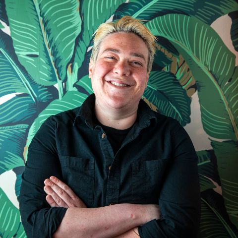
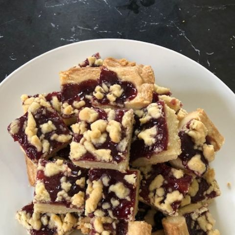
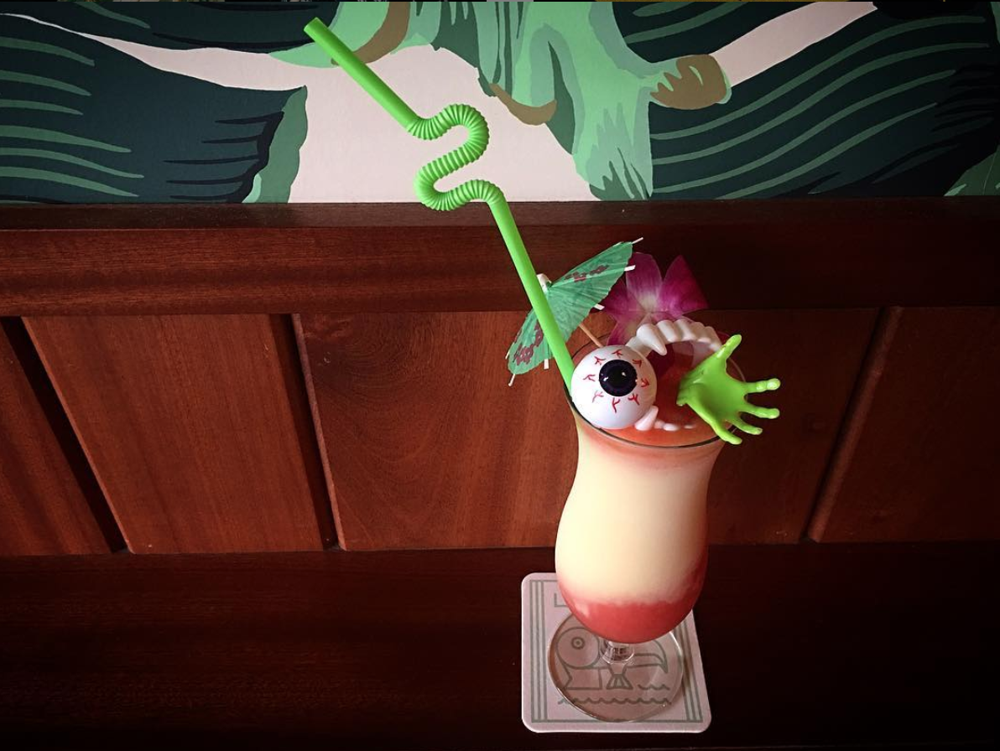
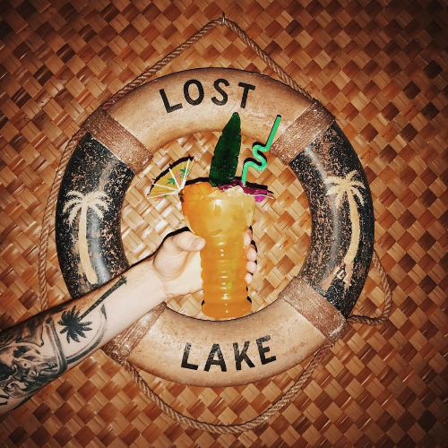
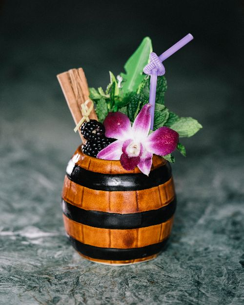
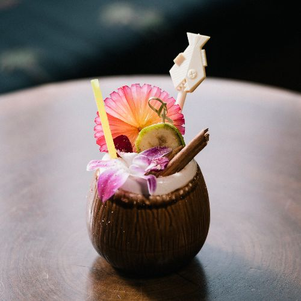

# Lost Lake Community Thread: Volume 15

*2020-05-07*

Hello to everyone!

Today is Thursday, May 7th — it's almost the weekend! Weekends! Remember those?!

In today's newsletter, Chef Dani has bestowed upon us a very special and previously top-secret recipe, Andy answers a call on the request line for a fun-as-hell spiritfree, Paul helps us use up some leftovers from Tuesday's newsletter, and we mix up two Lost Lake faves from our 2017 menu: Waikiki at Dusk Forever and Prawn's Own Grog!

Beginning next week I'll meet you in your inbox once a week — I think it will be on Thursdays. Please keep your requests and Instagram stories coming, please.

Love,
Shelby

## CHEF DANI'S JAM BARS

Maybe it’s the Midwestern kid in me, knowing that it would be impossible for me to show up to a gathering of any size empty-handed. Or maybe it’s just that — like most people on the face of this earth — I love a little something sweet. Either way, after making these jam bars for the last 20 years for any holiday, backyard barbecue, or average Sunday dinner, it has become just shy of a *demand* that I bring a plate or two of them with me. As the weather begins to break and the feeling grows of how much I miss all of my friends and loved ones, and all the celebrations and gatherings we have had to put aside for our safely and well-being, I am drawn back to this recipe and the look on peoples faces the first time they take a bite of one.

And perhaps for now while we all hunker down inside and wait for the day that we can gather once more, the best I can do is offer this once top secret recipe to you.

**Chef Dani's Jam Bars**
2 & 1/2 Cups All Propose Flour
1/2 Cup Sugar
1/8 tsp Kosher Salt
1 Cup (2 sticks) Unsalted Butter, Room Temp
1 Egg Yolk
1 Tbs Vanilla Extract
2 Tbs Almond Extract
1/2 Cup Seedless Raspberry Jam

Begin by preheating you over to 350 degrees. Next lightly oiling and lining an 8”x8” metal baking pan with parchment paper, making sure to leave two to three inches of overhang on the side.

In a mixing bowl, combine the flour, sugar, and salt. With your hands add in the butter, by rubbing it into the dry ingredients until a coarse sandy texture is achieved.

Add in the egg yolk, vanilla, and almond extract. Continue mixing with your hands until the mixture comes together and no streaks of egg yolk remain.

Put aside 1/4 Cup of the dough mixture and place it into the refrigerator.

Take the remaining dough and press it evenly into the bottom of you prepared pan. With the side of your finger press the edges of the dough up a 1/4” to create a boarder. Using a folk, prick the dough 12-15 times. Place the pan in the freezer for 15 minutes.

Remove the pan from the freezer. Evenly spread the raspberry jam on top.

Remove the reserved 1/4 Cup of dough from the refrigerator. Pinch off tiny crumbs and sprinkle them evenly over the jam topped dough.

Bake for 35-40 minutes, rotating the pan half way through, until the edges are golden brown and the jam is bubbling.

Allow to cool for 15 minutes in the pan. Using a knife, gently go around the sides of the pan that do not have parchment lining. Remove from the pan and leave at room temperature until cool. Cut into 2” squares. Enjoy!

## ANDY ANSWERS THE REQUEST LINE: NO TIPPLE MIAMI VICE!

the only photo I could find of a Miami Vice at Lost Lake is from Halloween 2016: *Miami Birdcage/The Rhythm is Gonna Get You* ¯\_(ツ)_/¯

*This request is from newsletter subscriber Erin, whose quarantine pregnancy has her looking for something pineapple-y, strawberry-ish, blended, and spirit-free. Our resident mocktologist Andy to the rescue:*

With the weather getting warmer, the mocktails need to get colder. The Piña Colada is a classic cocktail typically enjoyed on a beach or by the pool — in Chicago, the backyard will do just fine. We make a non-alcoholic version we call the Nada Colada. Super easy to make, so let's get after it!

**Nada Colada**
1 cup of fresh, juicy, ripe pineapple chunks
2 oz coconut cream (newsletter 1!)
1 oz pineapple juice
1 tablespoon of dry sugar
2 cups of crushed ice
*Put it all in a blender and get lost in the vibesssss — aka blend until smooth.*

If you are feeling extra wild you can make a Miami Vice! Traditionally that's half Piña Colada and half frozen strawberry daiquiri. We already have your non-alcoholic Piña Colada fresh outta the blender, now let's add some strawberry. We do frappe daiquiris daily but for this we will need to make our A-Frap. This N/A frappe got its name because former Lost Laker John was diagnosed with Atrial Fibrillation — aka A-Fib — and the doctors told him he had to stop drinking booze immediately. The frappe was one of his favorite drinks so we came up with the A-Frap.

**Strawberry A-Frap**
.75 oz lime
2 oz Topo Chico
1.5 oz tablespoon dry sugar mix (equal parts white and demerara sugars)
.25 oz demerara syrup
1 heaping teaspoon lime zest
1 cup partially thawed frozen strawberries
*Add all ingredients except strawberries to the blender and pulse a couple times. Add one cup of frozen strawberries that are just starting to thaw and blend until smooth. The strawberries are the ice AND the flavor!*

To make a true Miami Vice, you have to try to get these two drinks side-by-side in the same glass. The Nada Colada is a little heavier, so start with that. Pour the colada into a tall glass while holding it as horizontally as possible without spilling everywhere — fancy beer-style. Then immediately add the strawberry daiquiri on top, slowly tilting the glass vertically as it fills. Hopefully you nailed it — if not, don't worry because it's still gonna be delish and you can try again next time. Practice makes perfect!

## PAUL'S GONNA HELP YOU WITH THOSE LEFTOVERS

So, you made Gardenia Mix after Tuesday's newsletter and now you have some leftover cinnamon syrup and vanilla syrup. Continuing with Donn Beach's work, you can now make Don's Mix #2 and Don's Spices #4!

To create Don's Mix #2, simply add equal parts grapefruit juice to cinnamon syrup. One of my favorite simple cocktails to make with Don's Mix #2 is the Donga Punch.

**Donga Punch (1937)**
2 oz Aged Martinique Rum (JM Gold or Neisson Eleve Sous Bois work nicely)
1 oz Don's Mix #2
1 oz Fresh Lime Juice
*Add ingredients with 5 cubes to shaker and shake for 10 seconds.
Strain into a tiki mug or collins glass filled with crushed ice.
Garnish tropically*

If you have some other stuff lying around, you can also make Don's classic 1934 Zombie:\

**Zombie (1934)**
1 oz Aged Jamaican Rum (Plantation Xamayca)
1 oz Aged Spanish Rum (Don Q Anejo)
0.5 oz Overproof Rum (Plantation OFTD)
1 oz Fresh Lime Juice
1.5 oz Don's Mix #2
0.5 oz Velvet Falernum
.25 oz Pomegranate Syrup
2 dashes Angostura Bitters
2 dashes Absinthe
*Add ingredients with 5 cubes to shaker and shake for 10 seconds.
Strain into a tiki mug or collins glass filled with crushed ice.
Garnish tropically*

Ok, now onto Don's Spices #4 which is 2 parts vanilla syrup to 1 part St Elizabeth's Allspice Dram. Don's Spices #4 is best highlighted in Don's 1937 classic, the Nui Nui.

**Nui Nui (1937)**
2 oz Aged Guyanese Rum (Eldorado 5 Year)
1 oz Fresh Lime Juice
.5 oz Pierre Ferrand Dry Curacao
.5 oz Cinnamon Syrup
.5 oz Don's Spices #4
1 dash Angostura Bitters
*Add ingredients with 5 cubes to shaker and shake for 10 seconds.
Strain into a tiki mug or collins glass filled with crushed ice.
Garnish tropically*

## REQUEST LINE: PRAWN'S OWN GROG

We got a couple calls on the request line for Prawn's Own Grog from our 2017 menu. It's an unusual drink for Lost Lake because of how traditionally tiki it is — a heavy riff on Don's Own Grog, and named after Paul (Prawn is what we call Paul when he's in the weeds) (with love, of course). Prawn's Own Grog checks all the boxes for fans of Donn Beach and other historic tiki recipes: blend of funky rums, dark fruit, and baking spices. This cocktail will likely require a few new bottles for you, but St. Elizabeth's Allspice Dram is one that you'll probably be glad to have on hand — especially after having just read about Don's Spices #4!

**Prawn’s Own Grog**
0.75 oz Appleton Signature Reserve
0.5 oz Smith & Cross
0.75 oz Denizen Merchants Reserve
0.75 oz lime juice
0.25 oz Leopold Blackberry Dram
0.25 oz pomegranate grenadine
0.25 oz rich simple syrup
Barspoon St Elizabeth's Allspice Dram
1 dash Angostura Bitters
*Combine all ingredients in a cocktail shaker with one cup crushed ice. (You can just bust up a bunch of freezer ice with a rolling pin!) Give it a good shake for about 5 seconds, then pour the entire contents into your cutest glass. Top with more crushed ice, and garnish with tropical things! We like a blackberry, mint, and cinnamon for this guy.*

## REQUEST LINE: WAIKIKI AT DUSK FOREVER

It's another Shelbin + Elbin banger! Named for the way Martin Cate described the ambiance every tropical bar hopes to achieve, Waikiki at Dusk Forever is basically a banana-coffee-cinnamon painkiller. Don't be intimidated by the rums here — you can create your own blend of rums using what you have on hand, just make sure it's as dark and funky as possible. If you're in the market for a new bottle, the funky Jamaican Dr. Bird is a good one to add to your bar. We use it like we use mezcal and Laphroig — sparingly and as a modifier, pumpin' up our more affordable, workhorse bottles.

**Waikiki at Dusk Forever**
.5 oz Dr Bird
.5 oz Plantation OFTD
1 oz Angostura 7 Year
.75 oz half + half
.75 oz passionfruit syrup
.5 Giffard Creme de Banane
.5 oz cinnamon syrup
.5 oz cold brew coffee
*Combine all ingredients in a cocktail shaker with one cup crushed ice. (You can just bust up a bunch of freezer ice with a rolling pin!) Give it a good shake for about 5 seconds, then pour the entire contents into your cutest glass. Top with more crushed ice, and garnish with tropical things. We like freshly grated nutmeg and an orange expression here — and a little "banana coin" is cute, too!*
