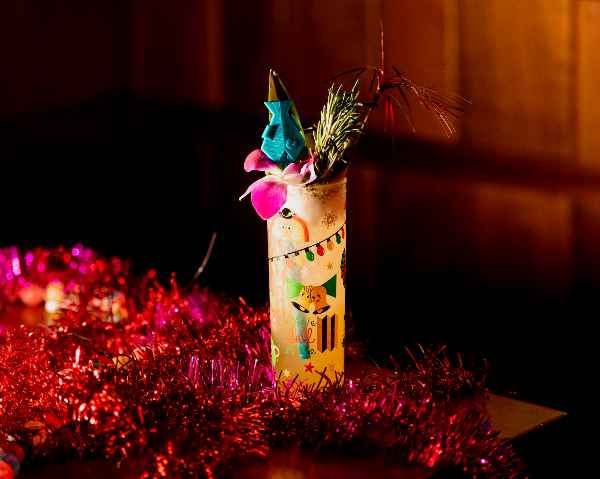
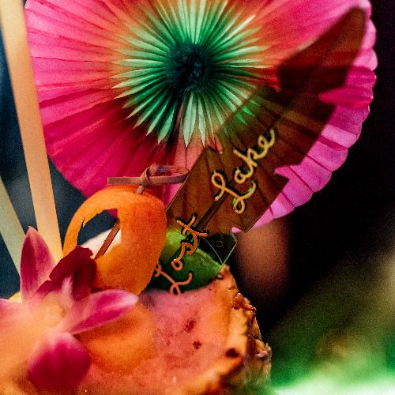
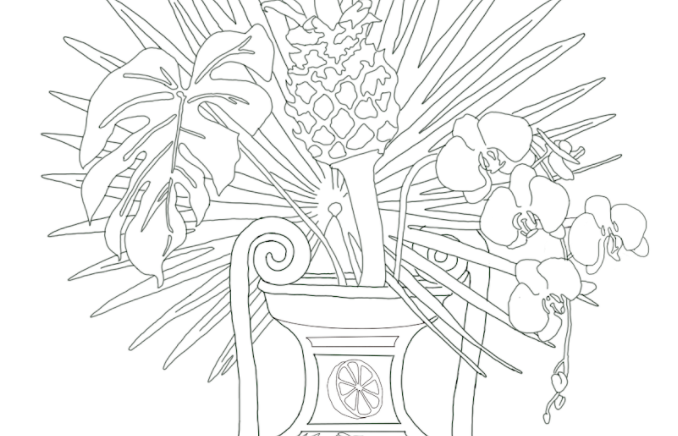
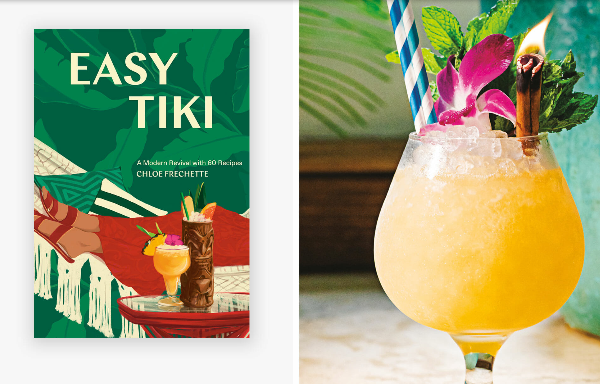
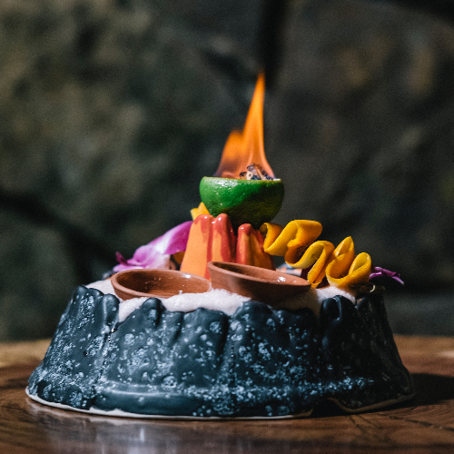

# Lost Lake Community Thread: Volume 16

*2020-05-15*

Hello, everyone!

Wow, it feels very weird not to have written to you all since Thursday! We're still working on getting our new delivery and pick-up options up and running, and I thank you for your patience with my tardy replies to Instagram DMs and emails. You guys will be the first to know when the details are set, and as extra thanks for your support we're gonna give you first dibs on some special private cask bottle pick-ups.

On to this week's newsletter! We're heading straight for the request line to answer calls for a Christmas cocktail and some agave recipes (you know you dialed the rum bar, right? 😹), do some very fancy coloring with Laura, check in on Paul and Chloe, and then BURN IT ALL! (Just kidding — please be very careful with that last one.)

I'm already looking forward to next week's newsletter. Please keep the request line ringing, and tag us on Instagram with your nice weather backyard cocktails!

Love,
Shelby

## REQUEST LINE: ON CHRISTMAS ISLAND

What month is it, anyway? Why *not* make a Christmas cocktail this weekend?!

On Christmas Island is a recipe that we developed for our first Christmas pop-up in 2017, which was a collaborative menu featuring drinks from [Boilermaker](https://www.instagram.com/boilermakernyc/) in NYC and [Latitude 29](https://www.instagram.com/latitude29nola/) in New Orleans. Four cocktails from that menu have made appearances at every holiday party we've had since then: Don & Victor (a Tom & Jerry riff from Latitude 29), Lil Saint Nog (our mini eggnog), ...And a Parrot in a Palm Tree, and On Christmas Island!

I love this recipe because it's not actually very Christmassy — but when you sip it from a reindeer mug under a pile of hot pink tinsel tangled in a mile of twinkly lights, it starts to taste like a tropical gingerbread cookie. A real testament to the power a bar's environment and ambiance can have on a cocktail!

**On Christmas Island**
1 oz El Dorado 8 Year
.5 oz Smith & Cross Overproof Jamaican Rum
.5 oz Plantation O.F.T.D.
.5 oz ginger syrup
.5 oz Don's Spices #2
.5 oz passionfruit syrup (we love Small Hand Foods or BG Reynolds)
.75 oz fresh lemon juice
*Combine all ingredients in a cocktail shaker with one cup crushed ice. (You can just bust up a bunch of freezer ice with a rolling pin!) Give it a good shake for about 5 seconds, then pour the entire contents into your cutest glass — preferably a weird holiday coffee mug. Top with more crushed ice, and garnish with tropical things!*

## REQUEST LINE: AGAVE!

Something I've learned about Lost Lake guests over the last few years: you guys LOVE tequila! It shouldn't come as a surprise — rum bridges so many flavors, uniting bourbon lovers on one side and agave lovers on the other. Here are three classic rum cocktails you can make with tequila or mezcal instead:

**Saturn**
2 oz blanco tequila
1 oz fresh lemon juice
.75 oz passionfruit syrup
.25 oz orgeat
.25 oz John Taylor Velvet Falernum
*Combine all ingredients in a cocktail shaker with one cup crushed ice. (You can just bust up a bunch of freezer ice with a rolling pin!) Give it a good shake for about 5 seconds, then pour the entire contents into your cutest glass. Top with more crushed ice, and garnish with tropical things!*

**Jet Pilot**
2 oz reposado tequila
.5 oz mezcal
1 oz lime juice
.75 oz grapefruit juice
.75 oz cinnamon syrup
.5 oz John Taylor Velvet Falernum
2 dashes Angostura Bitters
1 dash absinthe
*Combine all ingredients in a cocktail shaker with one cup crushed ice. (You can just bust up a bunch of freezer ice with a rolling pin!) Give it a good shake for about 5 seconds, then pour the entire contents into your cutest glass. Top with more crushed ice, and garnish with tropical things!*

**Mai Tai**
2 oz reposado tequila
1 oz lime juice
.75 oz orgeat
.5 oz Pierre Ferrand Dry Curaçao
.25 oz demerara syrup
*Combine all ingredients in a cocktail shaker. After squeezing lime juice, drop one half of the spent hull into the shaker, too. Add cubed ice and shake the living daylights out of this thing. Your motto should be “Too cold to hold!” Dump the entire contents into your cutest double old fashioned glass, and top with some crushed ice (or busted up freezer ice). Garnish with an orange peel and a spanked (fun!) mint bouquet.*

## LAURA'S COLORING PAGE

Another work of tropical elegance from Lost Laker Laura! You can download her coloring page [here](https://drive.google.com/open?id=1_LrzQdoDKzDwqiiNUvBnHEqxtutE4ZfL).

## CHLOE MAKES TIKI EASY!

Lost Laker Paul is quarantined in New York with [Chloe Frechette](https://www.instagram.com/chloefrechette/), author of the beautiful brand new cocktail book [*Easy Tiki*](https://www.penguinrandomhouse.com/books/606720/easy-tiki-by-chloe-frechette/)!

They were live from the living room on [Country Living Magazine's Instagram](https://www.instagram.com/p/CAJIjXdHkAN/) series "Couped Up Cocktails" talking about what constitutes a tiki cocktail — from the recipe itself to the feeling the first sip gives you — and Paul makes one of the classics featured in Chloe's book.

Congratulations, Chloe!

## SET YOUR DRINK ON FIRE!

Set ALL your drinks on fire at home! Cocktails! Smoothies! Coffee! Soup! Your salad! Your sandwich!

Martin Cate of [Smuggler's Cove](https://www.instagram.com/smugglerscovesf/) clued us in on the real trick to setting cocktails aflame: THE CROUTON. Before, when lighting some 151 rum on fire, I was always bummed out by the dinky little blue flame. Wah wah. Where's the excitement in that?! Then came the crouton — and along with it, a big bright yellow ribbon of fire! SO MUCH BETTER!!!

**Cocktail Fire!**
one spent lime hull
one 1" x 1" chunk of toasted bread, plain
an overproof rum with some good sugar content (we use Hamilton 151)
*After juicing your lime, take something pointy (we use an ice pick — you could use tweezers, a meat thermometer, etc etc etc) and carefully separate the flesh of the fruit from the rind. Go all the way around the circumference, poking and peeling out all the flesh. Now you have a little lime cup! Put the crouton in, and soak with rum. Light it! Be very careful, okay?? I usually tell people to take a photo for Instagram and then blow it out. Flaming cocktails are not compatible with bangs, paper garnishes, children, or drunk adults.*

If you're feeling even more adventurous, you can go full [Hale Pele](https://www.instagram.com/p/B_JRaq7gE31/) and sprinkle cinnamon over your flame for a wonderfully aromatic sparkly fireworks show. (We don't do that at Lost Lake on account of the fact that we actually almost burned all the way down a few years ago, and I still feel very nervous every time we do The Crouton.)
