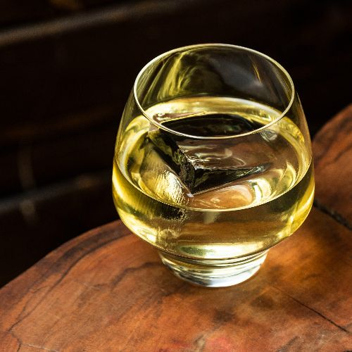
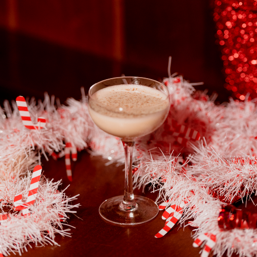
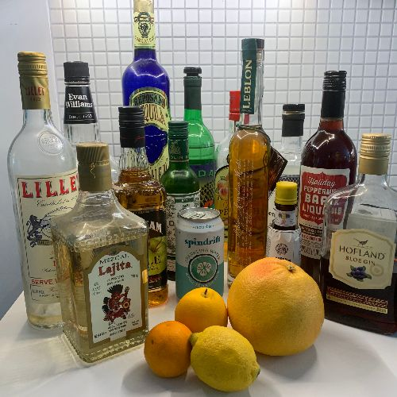
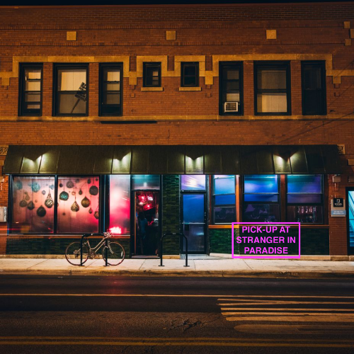

# Lost Lake Community Thread: Volume 17

*2020-05-22*

Hello, all of you all!

In today's newsletter, Paul teaches us how to make a clarified Corn N Oil, we make some egg nog and listen to tropical holiday music while I tell you why I used to secretly hate Christmas at Lost Lake, we try to make some tasty drinks at one subscriber's mish-mash home bar, and we give you a couple updates on life at Lost Lake!

Your GoFundMe tips are still so, so helpful to our laid-off Lost Lakers. Every time you share a photo of the newsletter recipes you're making at home, we get a few new donors! Thank you so much for your continued support, and for helping us spread the word. We have a long road ahead of us, and knowing all of you are cheering us on is genuinely so motivating.

See you next week!

Love,
Shelby

## PAUL CLARIFIES A CORN N' OIL

A little history of the clarified milk punch can be found [here](https://www.atlasobscura.com/foods/clarified-milk-punch), but the TL;DR version is that clarifying a punch is great for two things: a) preserving it for a long period of time and b) looking cool. Making it is not *too* laborious, but you will have to “pack your patience” as it can take hours to strain — a process that is worth the trouble to me.

First thing I did was determine which drink would be a good candidate. The Corn N Oil cocktail hailing from Barbados is such a favorite of ours at Lost Lake, but our version differs from the traditional recipe quite a bit — we add more lime juice, shake it and serve it over a big rock. Our version is a delicious drink but I wanted to create something more like the original (even if I do choose a custom blend of rums). I’ve never made a clarified milk punch before so I searched YouTube for some helpful tips on making clarified milk punches like a pro. Most videos weren’t very helpful and didn’t factor in how much milk to add, they were just “make your punch and pour it over some milk, strain and voila, a super clarified milk punch!” It took lots of time and trial and error to not only get the proper balance, texture and dilution of the punch just right. Most milk punches I’ve had at bars and restaurants tended to be a little sweet for my taste and I wanted to know why. It seems the fats from the milk add a bit of roundness (sweetness) to the punch, so I like to bump up the citrus a bit. Also, the amount of milk — or half and half in this case — really matters. Sure, you are straining through the layer of milk fats, but the liquid from the milk will also dilute your punch and there is nothing worse than over diluted punch.

Ok, ok, let’s get to it.

**CLARIFIED CORN N OIL**
In an 8 quart container, add:
375ml (½ bottle) Clement Select Barrel Rhum Agricole
375 ml (½ bottle) Real McCoy 5 Year Barbados Rum
375 ml (½ bottle) Velvet Falernum
100 ml lime juice
50 ml Cruzan Blackstrap Rum
50 ml water
4 dashes Angostura Bitters
Mix ingredients together.

In a separate 8 quart container, add:
4 oz Half and Half

Pour the entire cocktail mixture over the Half and Half and let sit for 30 minutes. You should see the punch curdle — this is a good thing.

Next, line a fine mesh strainer with a damp cloth napkin or cheese cloth, and place strainer over a large container (a stock pot would work well!), and slowly pour about 8 oz of the mixture through the cloth. The first liquid coming through will be a bit hazy so you can discard that. Continue slowly, gradually pouring more of the mixture through the strainer. The finished process will yield around 64 oz.

Store punch in refrigerator. When you're ready for a cocktail, just pour 3-4 oz over a big ice cube!

## LIL SAINT NOG ON THE REQUEST LINE

Christmas at Lost Lake is a really weird (but wonderful) time. We spend twelve hours with a full team of amateur decorators (us) making the bar look absolutely bonkers — transforming from Lost Lake into Jingle Bell Square with thousands of feet of the neon pink garland and twinkling lights, hundreds of elves, giant honeycomb fruit ornaments... We push our electrical capacity to the brink, and our staff, too.

It's a very busy and lucrative month for everyone, but it's also stressful. We don't see our regulars (you have no idea how great it is to see regulars — and how it can really bolster your morale to see a friendly face on a busy night), and it can sometimes seems like the people who do come in are less patient, not as nice, less than adventurous.

We spend a lot of time creating a holiday menu that has some approachable Christmas cocktails along with recipes that interest and excited us as well. To be honest, I never ever thought that people really appreciated our Jingle Bell Square cocktails. But! You, the subscribers of this newsletter, have totally changed my mind! I can't believe how many Jingle Bell Square recipes have popped up on the request line — and it truly warms the cockles of my Christmas heart. Thank you!

So, here's another big batched n' bottled cocktail to keep in your fridge for any moment a holiday mood strikes you. [And here's a playlist to make while you mix/sip.](https://open.spotify.com/user/foureyed/playlist/4T5lfVujeFTFmzNlVqvPHD?si=xi6hA7qJQnic9BChj6ybqQ) (As my boyfriend will tell you, I love a Christmas song *any* month of the year. Though I would prefer an October start/February finish, when it comes to holiday music I'm sadly limited to Thanksgiving-New Years on the speaker at home.)

**LIL SAINT NOG**
3 eggs
4.5 oz spiced demerara syrup
6 oz whole milk
6 oz heavy whipping cream
1.5 oz Botran Reserva
2.25 oz cold brew coffee
2.25 oz Plantation O.F.T.D.
2.25 oz Maison Ferrand 1840 Cognac
*Mix everything with an electric mixer, starting with the eggs and sugar, then slowly adding the rest of the ingredients. Bottle up and refrigerate next to your Twinkies because this guy lasts*forever*.*

Okay, for the spiced demerara syrup, our recipe is LARGE (cuz we make soooo much Nog). Take a look at it, and then just go for a smaller version of your own! All you need is demerara sugar and a bunch of baking spices — and time to let it steep. No matter what, you're going to end up with a delish, spicy-sweet sugar syrup.

**Lost Lake Spiced Demerara Syrup**
*To a large pot add:*
1 teaspoon fresh ground nutmeg
2 teaspoons whole cloves
2 teaspoons allspice berries
*Crush allspice berries and cloves with a muddler at bottom of pot*
45 grams Saigon cinnamon bark, broken into pieces
2 teaspoon Nielsen-Massey Madagascar Pure Vanilla Bean Paste
2 quarts water
4 quarts demerara sugar
*Set pot over medium heat, stirring occasionally until sugar is dissolved. Remove from heat, cover the pot with lid and let sit for 12 hours. After 12 hours, strain the syrup through a fine mesh strainer or chinois. Refrigerate syrup up to 2 weeks.*

## HOME BAR HELP!

I got a message from newsletter subscriber Morgan in California:

*I can't wait to butcher these cocktails with the hodge-podge of liquor we have. Idea: a Bartenders' Challenge where I send you a picture of the trash liquor I have and you guys tell me something not disgusting to make. Good luck, I only have disgusting things! It's a trap!*

Challenge accepted, Morgan! While I can't use all these bottles (let's touch base in December regarding that Peppermint Bark Liqueur and Jim Beam Apple), I do think we can make some tasty drinks with most of them. Not pictured: an amazing array of herbs Morgan grows in her yard year-round — in addition to that gorgeous citrus — because she lives in "California" (never heard of it).

First up, mojito time!! One of my favorite drinks of all time — ALL. TIME. — is the Mojito Caballito. Usually made with equal parts Cuban-style rum and dry vermouth, we're going to reach for that Leblon Cachaça instead. (Morgan, you need some rum.)

**Morgan's Mish-Mash Mojito Caballito**
1.5 oz white Cuban-style rum **(Leblon Caçhaca instead!)**
.5 dry vermouth **(that's your Dolin Dry Vermouth!)
.**5 tbsp white sugar
**.**5 tbsp demerara sugar
1 oz bubbly water
**.**5 lime juice **(a medley of backyard citrus!)**
2 lime wedges **(a medley of backyard citrus!)**
6 mint leaves
*Roll mint leaves between your palms, drop into bottom of a collins glass. Scoop both sugars in, followed by citrus juice and wedges and then bubbly water. Muddle, with the wedges protecting the mint leaves. Add spirits, then stir with bar spoon to incorporate. Top with ice, stir again, top with more ice. Garnish with spanked mint bouquet! THE MOJITO GOLDEN RULE: Try not to drink your mojito in less time than it took the bartender (you) to make it. It's hard, I know.*

**Morgan's 50/50 Backyard Herb Martini**
1.5 oz Gin (33 Portland Dry Gin)
.75 oz Lillet Blanc
.75 oz Dolin Dry Vermouth
One drop herb-infused olive oil
Lemon swath
*Make herb-infused olive oil: Stir 1/4 cup olive oil with savory backyard herbs (rosemary, dill, thyme, etc) over medium heat for a few minutes, turn down heat and let steep until very fragrant. Strain out herbs and let oil cool.

In a mixing glass (a pint glass will do), add gin, Lillet, and vermouth with ice. Stir for ten seconds. Strain into a chilled cocktail coupe, and express a lemon rind overtop then discard. Add one teeny, tiny drop of your herb-infused olive oil to the top.*

**Morgan's Oaxacan Old Fashioned**
2 oz reposado tequila
.5 oz mezcal
.25 oz demerara syrup
3 dashes Angostura Bitters
*In a mixing glass (a pint glass will do), add all ingredients along with ice. Stir for ten seconds. Strain over fresh ice cube, garnish with an expressed grapefruit peel.*

Do YOU have a kinda-trashy smorgasbord of weird bottles in your home bar? Send me a photo for a chance to get your liquor cabinet virtually raided by a Lost Lake bartender!

## UPDATES FOR NEXT WEEK!

On **Tuesday 5/26**, at 3:59pm CST, I'm going to be on [Esquire's Instagram](https://www.instagram.com/esquire/) Live series "4:59" making Loving Makes Love from our current menu. If you'd like to make the cocktail along with me, you'll need a blender, ice, London dry gin, fino sherry, amontillado sherry, dry vermouth, limes, and Lost Lake's coconut cream from newsletter #1.

Good news: Fred made a pizza for his bud Perry, executive chef at [avec](http://www.avecrestaurant.com/)! Better news: we can eat it!! On **Wednesday 5/27**, head over to their [Tok page](https://www.exploretock.com/avec/) and look for *Pizza Party with Lost Lake: Carryout Edition!*I asked Fred what his inspiration for this pizza was, and he told me it's what Pizza Hut tastes like in Thailand. Cool!

On **Thursday 5/28**, we're going to launch a new delivery menu at Lost Lake! It's one part AFC (remember Fred's [Asians Fry Chicken pop-up](https://www.instagram.com/p/B4K40AABjdD/)??) and one part cocktail pantry. We'll be open Thursday-Sunday, from 4-9pm, offering delivery and pick-up through ChowNow (it'll be a button on our website and Instagram), as well as Caviar and DoorDash.
